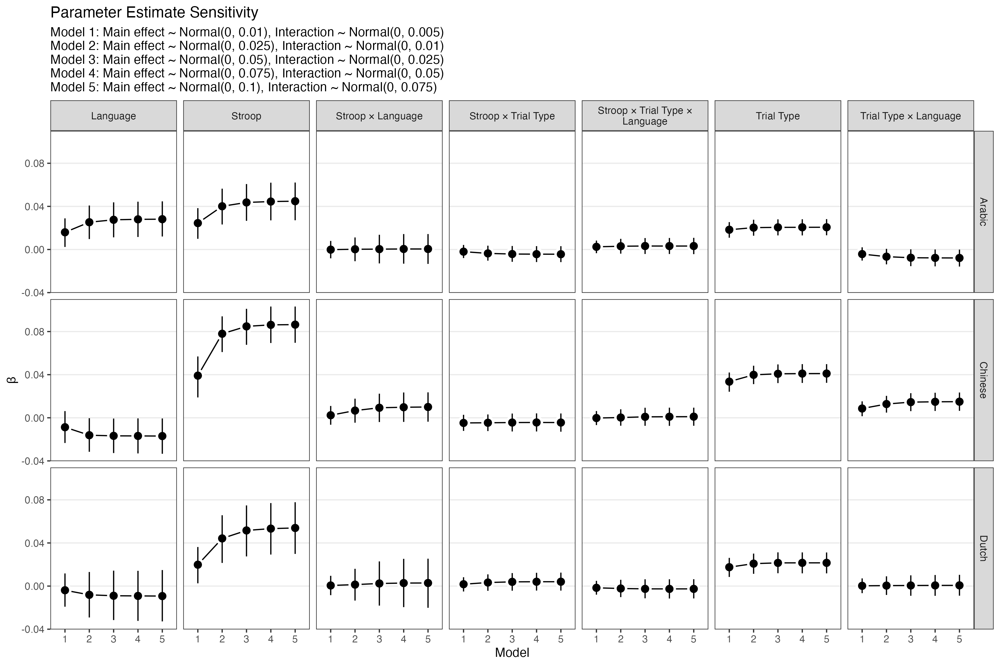
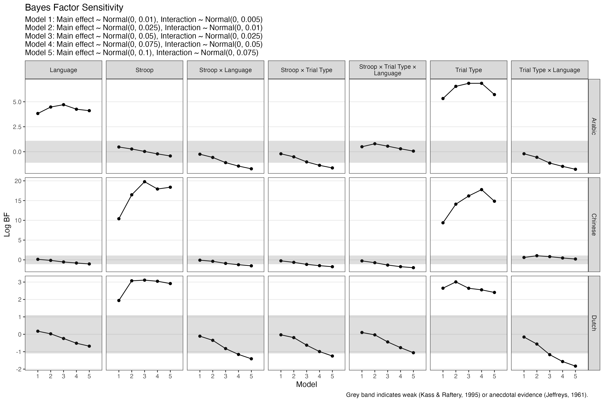

Results
================
Dr Glenn Williams

- <a href="#experiment-1" id="toc-experiment-1">Experiment 1</a>
  - <a href="#participants" id="toc-participants">Participants</a>
  - <a href="#analysis" id="toc-analysis">Analysis</a>
    - <a href="#response-time" id="toc-response-time">Response Time</a>
    - <a href="#accuracy" id="toc-accuracy">Accuracy</a>
- <a href="#experiment-2" id="toc-experiment-2">Experiment 2</a>
  - <a href="#participants-1" id="toc-participants-1">Participants</a>
    - <a href="#response-time-1" id="toc-response-time-1">Response Time</a>
    - <a href="#accuracy-1" id="toc-accuracy-1">Accuracy</a>
- <a href="#experiment-3" id="toc-experiment-3">Experiment 3</a>
  - <a href="#participants-2" id="toc-participants-2">Participants</a>
    - <a href="#response-time-2" id="toc-response-time-2">Response Time</a>
    - <a href="#accuracy-2" id="toc-accuracy-2">Accuracy</a>
- <a href="#references" id="toc-references">References</a>
- <a href="#appendices" id="toc-appendices">Appendices</a>
  - <a href="#appendix-a.-frequentist-model-specification"
    id="toc-appendix-a.-frequentist-model-specification">Appendix A.
    Frequentist Model Specification</a>
    - <a href="#experiment-1-1" id="toc-experiment-1-1">Experiment 1</a>
    - <a href="#experiment-2-1" id="toc-experiment-2-1">Experiment 2</a>
    - <a href="#experiment-3-1" id="toc-experiment-3-1">Experiment 3</a>
  - <a href="#appendix-b.-bayesian-model-specification"
    id="toc-appendix-b.-bayesian-model-specification">Appendix B. Bayesian
    Model Specification</a>
    - <a href="#model-priors" id="toc-model-priors">Model Priors</a>
    - <a href="#sensitivity-of-parameter-estimates"
      id="toc-sensitivity-of-parameter-estimates">Sensitivity of Parameter
      Estimates</a>
    - <a href="#sensitivity-of-bayes-factors"
      id="toc-sensitivity-of-bayes-factors">Sensitivity of Bayes Factors</a>

<details>
<summary>Code</summary>

``` r
# load packages ----

library(tidyverse)
library(here)
library(gt)
library(english)

# set options ----

options(scipen = 999)

# functions ----

list.files(here("R", "00_load-functions"), full.names = TRUE) |> 
  purrr::walk(source)

# process data ----

# data summaries
performance_exclusions <- read_csv(here("01_data", "01_raw", "performance_exclusions.csv"))
data_checks <- map_files_to_list(here("04_analysis", "01_data-checks"), file_type = ".csv")
descriptives <- map_files_to_list(here("04_analysis", "02_descriptives"), file_type = ".csv")

# models and model products
freq_results <- map_files_to_list(
  here("04_analysis", "04_model-predictions", "01_frequentist"),
  file_type = ".csv"
)

# add indicator of consistent results for ANOVA and mixed models
freq_results$rt_mixed_freq_table_est <- left_join(
  freq_results$rt_mixed_freq_table_est,
  freq_results$rt_anova_freq_table |> 
  select(Study, Parameter, p_value) |> 
  rename(p_anova = p_value),
  by = c("Study", "Parameter")
) |> 
  mutate(
    p_inconsistent = case_when(
      is.na(p_anova) ~ NA, # not in ANOVA model
      p_value & p_anova < .05 ~ FALSE, # consistent
      p_value & p_anova > .05 ~ FALSE, # consistent
      TRUE ~ TRUE # default, inconsistent
    )
  ) |> 
  select(-p_anova)

freq_results$accuracy_mixed_freq_table_est <- left_join(
  freq_results$accuracy_mixed_freq_table_est,
  freq_results$accuracy_anova_freq_table |> 
  select(Study, Parameter, p_value) |> 
  rename(p_anova = p_value),
  by = c("Study", "Parameter")
) |> 
  mutate(
    p_inconsistent = case_when(
      is.na(p_anova) ~ NA, # not in ANOVA model
      p_value < .05 & p_anova < .05 ~ FALSE, # consistent
      p_value > .05 & p_anova > .05 ~ FALSE, # consistent
      TRUE ~ TRUE # default, inconsistent
    )
  ) |> 
  select(-p_anova)

# make df into a single column for ANOVA tables
freq_results[c(
  "accuracy_anova_freq_table", 
  "rt_anova_freq_table",
  "rt_mixed_freq_table_anova"
)] <- freq_results[c(
  "accuracy_anova_freq_table", 
  "rt_anova_freq_table",
  "rt_mixed_freq_table_anova"
)] |>
  map( 
    ~ .x |> 
      mutate(df = paste0("[", num_df, ", ", round(den_df), "]")) |> 
      select(-c(num_df, den_df))
  )

# make df label consistent across all tables
freq_results["accuracy_mixed_freq_table_anova"] <- 
  freq_results["accuracy_mixed_freq_table_anova"] |>
  map( 
    ~ .x |> 
      mutate(df = as.character(chi_df)) |> 
      select(-chi_df)
  )

# make all parameter names consistent
# fix printing of p-values for APA formatting
freq_results <- freq_results |> 
  map( 
    ~ .x |> 
      mutate(p_value = papa(p_value, asterisk = FALSE)) |> 
      mutate_if(is.numeric, round_pad) |> 
      mutate( # fix inconsistent ordering
       Parameter = case_when(
          Parameter == "(Intercept)" ~ "Intercept",
          Parameter == "Trial Type × Language" ~ "Language × Trial Type",
          Parameter == "Stroop × Trial Type × Language" ~ "Stroop × Language × Trial Type",
          TRUE ~ Parameter
        )
      ) |> 
      arrange( # sort to specific order across data sets
        Study,
        Measure,
        factor(
          Parameter,
          levels = c(
            "Intercept",
            "Stroop",
            "Language",
            "Trial Type",
            "Stroop × Language",
            "Stroop × Trial Type",
            "Language × Trial Type",
            "Stroop × Language × Trial Type"
          ))
      )
  )

# load bayesian data
bayes_results <- map_files_to_list(
  here("04_analysis", "04_model-predictions", "02_bayesian"),
  file_type = ".csv"
)

# compute bayes factors in support of the null hypothesis
# find when bayes factors are inconsistent across models 3-5
# due to prior sensitivity
# fix printing of Bayes factors to limit max values
# fix printing of parameter names for consistency
bayes_results[grep('bayes-factors', names(bayes_results))] <- 
  bayes_results[grep('bayes-factors', names(bayes_results))] |> 
  map(
    ~ .x |> 
      mutate(BF = 1/BF) |> # make BF into evidence for null
      rename(BF_01 = BF) |> # rename to make this clear
      select(Study, Prior_Model, Parameter, BF_01) |> 
      pivot_wider(names_from = Prior_Model, values_from = BF_01) |> 
      mutate(
        prior_sensitive = case_when(
          `3` <= 1/3 & `4` <= 1/3 & `5` <= 1/3 ~ FALSE, # all negative
          `3` >= 3 & `4` >= 3 & `5` >= 3 ~ FALSE, # all positive
          `3` <= 3 & `3` >= 1/3 & `4` <= 3 & `3` >= 1/3 & `4` <= 3 & `5` >= 1/3 ~ FALSE, # all insensitive
        TRUE ~ TRUE
        )
      ) |> 
      rename(BF_01 = `4`) |>  # keep model 4
      select(Study, Parameter, BF_01, prior_sensitive) |> 
      mutate(
        BF_01 = case_when(
          BF_01 > 1000 ~ ">1000",
          BF_01 < 1/1000 ~ "<0.001",
          TRUE ~ round_pad(BF_01, digits = 3, nsmall = 2)
        ),
        Parameter = case_when(
          Parameter == "Trial Type × Language" ~ "Language × Trial Type",
          Parameter == "Stroop × Trial Type × Language" ~ "Stroop × Language × Trial Type",
          TRUE ~ Parameter
        )
      ) |> 
      mutate_if(is.numeric, round_pad) 
  )

# fix printing for all values
bayes_results <- bayes_results |> 
    map( ~ .x |>  mutate_if(is.numeric, round_pad))

# get pairwise tests, fix p-values for printing, round numbers
pairwise_tests <- map_files_to_list(
  here("04_analysis", "05_pairwise-tests"),
  file_type = ".csv"
) 

pairwise_tests_plots <- pairwise_tests

# fix printing of pairwise tests
pairwise_tests[grep('pairs', names(pairwise_tests))] <- 
  pairwise_tests[grep('pairs', names(pairwise_tests))] |> 
    map( 
    ~ .x |> 
      rename(p_value = p.value) |> 
      mutate(p_value = papa(p_value, asterisk = FALSE))
  )

pairwise_tests <- pairwise_tests |> 
  map( ~ .x |> mutate_if(is.numeric, round_pad))
```

</details>

# Experiment 1

## Participants

Forty-eight Dutch-English bilinguals were recruited. One participant was
excluded due to a recording failure and 1 participant was removed due to
being under-age, leaving 46 (33 female, 13 male) participants with a
mean age of 23.348 (*SD* = 5.61). Following the experiment, participants
were asked to complete a language background questionnaire (cf. Kirk et
al., 2018), and English and Dutch vocabulary tests based on lexical
decision tasks (i.e., LexTale, Lemhöfer & Broersma, 2012, see
**?@tbl-dutch-demo**).

<details>
<summary>Code</summary>

``` r
descriptives$demo_summary |> 
  filter(
    study == "dutch_stroop", 
    str_detect(parameter, "current_percent|lex_tale"), 
    statistic %in% c("mean", "sd")
  ) |> 
  pivot_wider(names_from = statistic, values_from = value) |> 
  mutate_if(is.numeric, round_pad) |> 
  mutate(
    Parameter = case_when(
      parameter == "current_percent_english" ~ "English Current Use",
      parameter == "current_percent_english_pair" ~ "Dutch Current Use",
      parameter == "lex_tale_english" ~ "English LexTale",
      parameter == "lex_tale_english_pair" ~ "Dutch LexTale"
    ),
    Score = paste0(mean, " (", sd, ")")
  ) |> 
  select(Parameter, Score) |> 
  apa_gt()
```

</details>
<div id="ntmaaylhbp" style="overflow-x:auto;overflow-y:auto;width:auto;height:auto;">
<style>html {
  font-family: -apple-system, BlinkMacSystemFont, 'Segoe UI', Roboto, Oxygen, Ubuntu, Cantarell, 'Helvetica Neue', 'Fira Sans', 'Droid Sans', Arial, sans-serif;
}

#ntmaaylhbp .gt_table {
  display: table;
  border-collapse: collapse;
  margin-left: auto;
  margin-right: auto;
  color: #333333;
  font-size: 16px;
  font-weight: normal;
  font-style: normal;
  background-color: #FFFFFF;
  width: 100%;
  border-top-style: solid;
  border-top-width: 2px;
  border-top-color: #FFFFFF;
  border-right-style: none;
  border-right-width: 2px;
  border-right-color: #D3D3D3;
  border-bottom-style: solid;
  border-bottom-width: 2px;
  border-bottom-color: #FFFFFF;
  border-left-style: none;
  border-left-width: 2px;
  border-left-color: #D3D3D3;
}

#ntmaaylhbp .gt_heading {
  background-color: #FFFFFF;
  text-align: center;
  border-bottom-color: #FFFFFF;
  border-left-style: none;
  border-left-width: 1px;
  border-left-color: #D3D3D3;
  border-right-style: none;
  border-right-width: 1px;
  border-right-color: #D3D3D3;
}

#ntmaaylhbp .gt_title {
  color: #333333;
  font-size: 16px;
  font-weight: initial;
  padding-top: 4px;
  padding-bottom: 4px;
  padding-left: 5px;
  padding-right: 5px;
  border-bottom-color: #FFFFFF;
  border-bottom-width: 0;
}

#ntmaaylhbp .gt_subtitle {
  color: #333333;
  font-size: 85%;
  font-weight: initial;
  padding-top: 0;
  padding-bottom: 6px;
  padding-left: 5px;
  padding-right: 5px;
  border-top-color: #FFFFFF;
  border-top-width: 0;
}

#ntmaaylhbp .gt_bottom_border {
  border-bottom-style: solid;
  border-bottom-width: 2px;
  border-bottom-color: #D3D3D3;
}

#ntmaaylhbp .gt_col_headings {
  border-top-style: solid;
  border-top-width: 3px;
  border-top-color: #000000;
  border-bottom-style: solid;
  border-bottom-width: 3px;
  border-bottom-color: #000000;
  border-left-style: none;
  border-left-width: 1px;
  border-left-color: #D3D3D3;
  border-right-style: none;
  border-right-width: 1px;
  border-right-color: #D3D3D3;
}

#ntmaaylhbp .gt_col_heading {
  color: #333333;
  background-color: #FFFFFF;
  font-size: 100%;
  font-weight: normal;
  text-transform: inherit;
  border-left-style: none;
  border-left-width: 1px;
  border-left-color: #D3D3D3;
  border-right-style: none;
  border-right-width: 1px;
  border-right-color: #D3D3D3;
  vertical-align: bottom;
  padding-top: 5px;
  padding-bottom: 6px;
  padding-left: 5px;
  padding-right: 5px;
  overflow-x: hidden;
}

#ntmaaylhbp .gt_column_spanner_outer {
  color: #333333;
  background-color: #FFFFFF;
  font-size: 100%;
  font-weight: normal;
  text-transform: inherit;
  padding-top: 0;
  padding-bottom: 0;
  padding-left: 4px;
  padding-right: 4px;
}

#ntmaaylhbp .gt_column_spanner_outer:first-child {
  padding-left: 0;
}

#ntmaaylhbp .gt_column_spanner_outer:last-child {
  padding-right: 0;
}

#ntmaaylhbp .gt_column_spanner {
  border-bottom-style: solid;
  border-bottom-width: 3px;
  border-bottom-color: #000000;
  vertical-align: bottom;
  padding-top: 5px;
  padding-bottom: 5px;
  overflow-x: hidden;
  display: inline-block;
  width: 100%;
}

#ntmaaylhbp .gt_group_heading {
  padding-top: 8px;
  padding-bottom: 8px;
  padding-left: 5px;
  padding-right: 5px;
  color: #333333;
  background-color: #FFFFFF;
  font-size: 100%;
  font-weight: initial;
  text-transform: inherit;
  border-top-style: solid;
  border-top-width: 2px;
  border-top-color: #D3D3D3;
  border-bottom-style: solid;
  border-bottom-width: 2px;
  border-bottom-color: #D3D3D3;
  border-left-style: none;
  border-left-width: 1px;
  border-left-color: #D3D3D3;
  border-right-style: none;
  border-right-width: 1px;
  border-right-color: #D3D3D3;
  vertical-align: middle;
}

#ntmaaylhbp .gt_empty_group_heading {
  padding: 0.5px;
  color: #333333;
  background-color: #FFFFFF;
  font-size: 100%;
  font-weight: initial;
  border-top-style: solid;
  border-top-width: 2px;
  border-top-color: #D3D3D3;
  border-bottom-style: solid;
  border-bottom-width: 2px;
  border-bottom-color: #D3D3D3;
  vertical-align: middle;
}

#ntmaaylhbp .gt_from_md > :first-child {
  margin-top: 0;
}

#ntmaaylhbp .gt_from_md > :last-child {
  margin-bottom: 0;
}

#ntmaaylhbp .gt_row {
  padding-top: 8px;
  padding-bottom: 8px;
  padding-left: 5px;
  padding-right: 5px;
  margin: 10px;
  border-top-style: solid;
  border-top-width: 1px;
  border-top-color: #D3D3D3;
  border-left-style: none;
  border-left-width: 1px;
  border-left-color: #D3D3D3;
  border-right-style: none;
  border-right-width: 1px;
  border-right-color: #D3D3D3;
  vertical-align: middle;
  overflow-x: hidden;
}

#ntmaaylhbp .gt_stub {
  color: #333333;
  background-color: #FFFFFF;
  font-size: 100%;
  font-weight: initial;
  text-transform: inherit;
  border-right-style: solid;
  border-right-width: 2px;
  border-right-color: #D3D3D3;
  padding-left: 5px;
  padding-right: 5px;
}

#ntmaaylhbp .gt_stub_row_group {
  color: #333333;
  background-color: #FFFFFF;
  font-size: 100%;
  font-weight: initial;
  text-transform: inherit;
  border-right-style: solid;
  border-right-width: 2px;
  border-right-color: #D3D3D3;
  padding-left: 5px;
  padding-right: 5px;
  vertical-align: top;
}

#ntmaaylhbp .gt_row_group_first td {
  border-top-width: 2px;
}

#ntmaaylhbp .gt_summary_row {
  color: #333333;
  background-color: #FFFFFF;
  text-transform: inherit;
  padding-top: 8px;
  padding-bottom: 8px;
  padding-left: 5px;
  padding-right: 5px;
}

#ntmaaylhbp .gt_first_summary_row {
  border-top-style: solid;
  border-top-color: #D3D3D3;
}

#ntmaaylhbp .gt_first_summary_row.thick {
  border-top-width: 2px;
}

#ntmaaylhbp .gt_last_summary_row {
  padding-top: 8px;
  padding-bottom: 8px;
  padding-left: 5px;
  padding-right: 5px;
  border-bottom-style: solid;
  border-bottom-width: 2px;
  border-bottom-color: #D3D3D3;
}

#ntmaaylhbp .gt_grand_summary_row {
  color: #333333;
  background-color: #FFFFFF;
  text-transform: inherit;
  padding-top: 8px;
  padding-bottom: 8px;
  padding-left: 5px;
  padding-right: 5px;
}

#ntmaaylhbp .gt_first_grand_summary_row {
  padding-top: 8px;
  padding-bottom: 8px;
  padding-left: 5px;
  padding-right: 5px;
  border-top-style: double;
  border-top-width: 6px;
  border-top-color: #D3D3D3;
}

#ntmaaylhbp .gt_striped {
  background-color: rgba(128, 128, 128, 0.05);
}

#ntmaaylhbp .gt_table_body {
  border-top-style: solid;
  border-top-width: 2px;
  border-top-color: #D3D3D3;
  border-bottom-style: solid;
  border-bottom-width: 2px;
  border-bottom-color: #000000;
}

#ntmaaylhbp .gt_footnotes {
  color: #333333;
  background-color: #FFFFFF;
  border-bottom-style: none;
  border-bottom-width: 2px;
  border-bottom-color: #D3D3D3;
  border-left-style: none;
  border-left-width: 2px;
  border-left-color: #D3D3D3;
  border-right-style: none;
  border-right-width: 2px;
  border-right-color: #D3D3D3;
}

#ntmaaylhbp .gt_footnote {
  margin: 0px;
  font-size: 90%;
  padding-left: 4px;
  padding-right: 4px;
  padding-left: 5px;
  padding-right: 5px;
}

#ntmaaylhbp .gt_sourcenotes {
  color: #333333;
  background-color: #FFFFFF;
  border-bottom-style: none;
  border-bottom-width: 2px;
  border-bottom-color: #D3D3D3;
  border-left-style: none;
  border-left-width: 2px;
  border-left-color: #D3D3D3;
  border-right-style: none;
  border-right-width: 2px;
  border-right-color: #D3D3D3;
}

#ntmaaylhbp .gt_sourcenote {
  font-size: 90%;
  padding-top: 4px;
  padding-bottom: 4px;
  padding-left: 5px;
  padding-right: 5px;
}

#ntmaaylhbp .gt_left {
  text-align: left;
}

#ntmaaylhbp .gt_center {
  text-align: center;
}

#ntmaaylhbp .gt_right {
  text-align: right;
  font-variant-numeric: tabular-nums;
}

#ntmaaylhbp .gt_font_normal {
  font-weight: normal;
}

#ntmaaylhbp .gt_font_bold {
  font-weight: bold;
}

#ntmaaylhbp .gt_font_italic {
  font-style: italic;
}

#ntmaaylhbp .gt_super {
  font-size: 65%;
}

#ntmaaylhbp .gt_footnote_marks {
  font-style: italic;
  font-weight: normal;
  font-size: 75%;
  vertical-align: 0.4em;
}

#ntmaaylhbp .gt_asterisk {
  font-size: 100%;
  vertical-align: 0;
}

#ntmaaylhbp .gt_indent_1 {
  text-indent: 5px;
}

#ntmaaylhbp .gt_indent_2 {
  text-indent: 10px;
}

#ntmaaylhbp .gt_indent_3 {
  text-indent: 15px;
}

#ntmaaylhbp .gt_indent_4 {
  text-indent: 20px;
}

#ntmaaylhbp .gt_indent_5 {
  text-indent: 25px;
}
</style>
<table class="gt_table">
  
  <thead class="gt_col_headings">
    <tr>
      <th class="gt_col_heading gt_columns_bottom_border gt_center" rowspan="1" colspan="1" scope="col">Parameter</th>
      <th class="gt_col_heading gt_columns_bottom_border gt_center" rowspan="1" colspan="1" scope="col">Score</th>
    </tr>
  </thead>
  <tbody class="gt_table_body">
    <tr><td class="gt_row gt_center" style="border-top-width: 1px; border-top-style: solid; border-top-color: white; border-bottom-width: 1px; border-bottom-style: solid; border-bottom-color: white; text-align: center; background-color: #FFFFFF;">English Current Use</td>
<td class="gt_row gt_center" style="border-top-width: 1px; border-top-style: solid; border-top-color: white; border-bottom-width: 1px; border-bottom-style: solid; border-bottom-color: white; text-align: center; background-color: #FFFFFF;">30.52 (20.00)</td></tr>
    <tr><td class="gt_row gt_center" style="border-top-width: 1px; border-top-style: solid; border-top-color: white; border-bottom-width: 1px; border-bottom-style: solid; border-bottom-color: white; text-align: center; background-color: #FFFFFF;">Dutch Current Use</td>
<td class="gt_row gt_center" style="border-top-width: 1px; border-top-style: solid; border-top-color: white; border-bottom-width: 1px; border-bottom-style: solid; border-bottom-color: white; text-align: center; background-color: #FFFFFF;">66.85 (23.23)</td></tr>
    <tr><td class="gt_row gt_center" style="border-top-width: 1px; border-top-style: solid; border-top-color: white; border-bottom-width: 1px; border-bottom-style: solid; border-bottom-color: white; text-align: center; background-color: #FFFFFF;">English LexTale</td>
<td class="gt_row gt_center" style="border-top-width: 1px; border-top-style: solid; border-top-color: white; border-bottom-width: 1px; border-bottom-style: solid; border-bottom-color: white; text-align: center; background-color: #FFFFFF;">80.57 (11.44)</td></tr>
    <tr><td class="gt_row gt_center" style="border-top-width: 1px; border-top-style: solid; border-top-color: white; border-bottom-width: 1px; border-bottom-style: solid; border-bottom-color: white; text-align: center; background-color: #FFFFFF;">Dutch LexTale</td>
<td class="gt_row gt_center" style="border-top-width: 1px; border-top-style: solid; border-top-color: white; border-bottom-width: 1px; border-bottom-style: solid; border-bottom-color: white; text-align: center; background-color: #FFFFFF;">87.06 ( 7.79)</td></tr>
  </tbody>
  
  
</table>
</div>

## Analysis

We used R (R Core Team, 2022) and the R-packages tidyverse (Wickham et
al., 2019), here (Müller, 2020), and bayesplot (Gabry et al., 2019;
Gabry & Mahr, 2022) for data preparation, analysis, and presentation. A

For accuracy and reaction time analyses, the first trial in each block
and “recovery” trials following an error were excluded from the
analyses. For reaction time analyses only, reaction times under 150ms,
or reaction times over 2500ms or more than three standard deviations
above the participant mean were discarded as outliers. Taking these
criteria into account, a total of 9.95% and 24.09% of trials were
excluded from the accuracy and reaction time analyses respectively.

For each study we performed separate frequentist and Bayesian analyses
for both the accuracy and response time dependent variables. For the
frequentist analyses, we modelled the data with linear mixed effects
models fitted using the lme4 R-package (Bates et al., 2015). We used the
afex R-package (Singmann et al., 2022) to fit models with nested fixed
effects, evaluating the statistical significance of main effects and
interactions using likelihood-ratio tests. For the parameter estimates
of each model, statistical significance is evaluated using *p*-values
approximated using the Satterthwaite method implemented in the lmerTest
R-package (Kuznetsova et al., 2017). Significant interactions were
further investigated using estimated marginal means and pairwise tests
calculated using the emmeans R-package (Lenth, 2022). We fitted Bayesian
equivalents to the frequentist multilevel models using the brms
R-package (Bürkner, 2017, 2018). Bayes Factors were calculated using the
Savage-Dickey approximation using the bayestestR R-package (Makowski et
al., 2019).

Given the lower bound and skewed nature of response times, this outcome
was modelled using linear mixed effects models assuming a log-normal
distribution[^1]. Given accuracy scores are binary, this outcome were
modelled using generalised linear mixed effects models assuming a
binomial distribution with a logit link function.

All models used sum-coded (-1, 1) fixed effects of Stroop Block (Neutral
or Incongruent), Trial Type (Repetition or Switch), and Language
(English or Dutch). Models contained crossed random effects of
participants and items, using the maximal random effects structure
justified by the design that allows for model convergence (Barr et al.,
2013). One advantage of Bayesian analyses is that with relatively
informative priors the maximal random effects structure can be fitted
without convergence problems (Nicenboim & Vasishth, 2016; Vasishth &
Nicenboim, 2016), meaning that no simplification to random effects was
needed. For a description of the random effects in each frequentist
model, see Appendix A. For a description of priors in each Bayesian
model and how these affect parameter estimates and Bayes factors, see
Appendix B. Finally, while the mixed effects models form the basis of
our conclusions, for direct comparison to Liu et al. (2019), we also
analysed the data aggregated by participant using ANOVAs. Unless
otherwise stated, Bayes factors are consistent across different prior
specifications from the prior sensitivity analysis. Similarly, unless
otherwise stated *p*-values are consistent across across mixed-effects
models and by-participants ANOVAs.

### Response Time

Fixed effects parameter estimates for response time models are shown in
**?@tbl-param-dutch-rt**.

<details>
<summary>Code</summary>

``` r
bind_parameters_rt(
  freq_results$rt_mixed_freq_table_est,
  bayes_results$`rt_bayes-factors`,
  "Dutch"
) |> 
  parameters_rt_gt()
```

</details>
<div id="pwwtskfyxi" style="overflow-x:auto;overflow-y:auto;width:auto;height:auto;">
<style>html {
  font-family: -apple-system, BlinkMacSystemFont, 'Segoe UI', Roboto, Oxygen, Ubuntu, Cantarell, 'Helvetica Neue', 'Fira Sans', 'Droid Sans', Arial, sans-serif;
}

#pwwtskfyxi .gt_table {
  display: table;
  border-collapse: collapse;
  margin-left: auto;
  margin-right: auto;
  color: #333333;
  font-size: 16px;
  font-weight: normal;
  font-style: normal;
  background-color: #FFFFFF;
  width: 100%;
  border-top-style: solid;
  border-top-width: 2px;
  border-top-color: #FFFFFF;
  border-right-style: none;
  border-right-width: 2px;
  border-right-color: #D3D3D3;
  border-bottom-style: solid;
  border-bottom-width: 2px;
  border-bottom-color: #FFFFFF;
  border-left-style: none;
  border-left-width: 2px;
  border-left-color: #D3D3D3;
}

#pwwtskfyxi .gt_heading {
  background-color: #FFFFFF;
  text-align: center;
  border-bottom-color: #FFFFFF;
  border-left-style: none;
  border-left-width: 1px;
  border-left-color: #D3D3D3;
  border-right-style: none;
  border-right-width: 1px;
  border-right-color: #D3D3D3;
}

#pwwtskfyxi .gt_title {
  color: #333333;
  font-size: 16px;
  font-weight: initial;
  padding-top: 4px;
  padding-bottom: 4px;
  padding-left: 5px;
  padding-right: 5px;
  border-bottom-color: #FFFFFF;
  border-bottom-width: 0;
}

#pwwtskfyxi .gt_subtitle {
  color: #333333;
  font-size: 85%;
  font-weight: initial;
  padding-top: 0;
  padding-bottom: 6px;
  padding-left: 5px;
  padding-right: 5px;
  border-top-color: #FFFFFF;
  border-top-width: 0;
}

#pwwtskfyxi .gt_bottom_border {
  border-bottom-style: solid;
  border-bottom-width: 2px;
  border-bottom-color: #D3D3D3;
}

#pwwtskfyxi .gt_col_headings {
  border-top-style: solid;
  border-top-width: 3px;
  border-top-color: #000000;
  border-bottom-style: solid;
  border-bottom-width: 3px;
  border-bottom-color: #000000;
  border-left-style: none;
  border-left-width: 1px;
  border-left-color: #D3D3D3;
  border-right-style: none;
  border-right-width: 1px;
  border-right-color: #D3D3D3;
}

#pwwtskfyxi .gt_col_heading {
  color: #333333;
  background-color: #FFFFFF;
  font-size: 100%;
  font-weight: normal;
  text-transform: inherit;
  border-left-style: none;
  border-left-width: 1px;
  border-left-color: #D3D3D3;
  border-right-style: none;
  border-right-width: 1px;
  border-right-color: #D3D3D3;
  vertical-align: bottom;
  padding-top: 5px;
  padding-bottom: 6px;
  padding-left: 5px;
  padding-right: 5px;
  overflow-x: hidden;
}

#pwwtskfyxi .gt_column_spanner_outer {
  color: #333333;
  background-color: #FFFFFF;
  font-size: 100%;
  font-weight: normal;
  text-transform: inherit;
  padding-top: 0;
  padding-bottom: 0;
  padding-left: 4px;
  padding-right: 4px;
}

#pwwtskfyxi .gt_column_spanner_outer:first-child {
  padding-left: 0;
}

#pwwtskfyxi .gt_column_spanner_outer:last-child {
  padding-right: 0;
}

#pwwtskfyxi .gt_column_spanner {
  border-bottom-style: solid;
  border-bottom-width: 3px;
  border-bottom-color: #000000;
  vertical-align: bottom;
  padding-top: 5px;
  padding-bottom: 5px;
  overflow-x: hidden;
  display: inline-block;
  width: 100%;
}

#pwwtskfyxi .gt_group_heading {
  padding-top: 8px;
  padding-bottom: 8px;
  padding-left: 5px;
  padding-right: 5px;
  color: #333333;
  background-color: #FFFFFF;
  font-size: 100%;
  font-weight: initial;
  text-transform: inherit;
  border-top-style: solid;
  border-top-width: 2px;
  border-top-color: #D3D3D3;
  border-bottom-style: solid;
  border-bottom-width: 2px;
  border-bottom-color: #D3D3D3;
  border-left-style: none;
  border-left-width: 1px;
  border-left-color: #D3D3D3;
  border-right-style: none;
  border-right-width: 1px;
  border-right-color: #D3D3D3;
  vertical-align: middle;
}

#pwwtskfyxi .gt_empty_group_heading {
  padding: 0.5px;
  color: #333333;
  background-color: #FFFFFF;
  font-size: 100%;
  font-weight: initial;
  border-top-style: solid;
  border-top-width: 2px;
  border-top-color: #D3D3D3;
  border-bottom-style: solid;
  border-bottom-width: 2px;
  border-bottom-color: #D3D3D3;
  vertical-align: middle;
}

#pwwtskfyxi .gt_from_md > :first-child {
  margin-top: 0;
}

#pwwtskfyxi .gt_from_md > :last-child {
  margin-bottom: 0;
}

#pwwtskfyxi .gt_row {
  padding-top: 8px;
  padding-bottom: 8px;
  padding-left: 5px;
  padding-right: 5px;
  margin: 10px;
  border-top-style: solid;
  border-top-width: 1px;
  border-top-color: #D3D3D3;
  border-left-style: none;
  border-left-width: 1px;
  border-left-color: #D3D3D3;
  border-right-style: none;
  border-right-width: 1px;
  border-right-color: #D3D3D3;
  vertical-align: middle;
  overflow-x: hidden;
}

#pwwtskfyxi .gt_stub {
  color: #333333;
  background-color: #FFFFFF;
  font-size: 100%;
  font-weight: initial;
  text-transform: inherit;
  border-right-style: solid;
  border-right-width: 2px;
  border-right-color: #D3D3D3;
  padding-left: 5px;
  padding-right: 5px;
}

#pwwtskfyxi .gt_stub_row_group {
  color: #333333;
  background-color: #FFFFFF;
  font-size: 100%;
  font-weight: initial;
  text-transform: inherit;
  border-right-style: solid;
  border-right-width: 2px;
  border-right-color: #D3D3D3;
  padding-left: 5px;
  padding-right: 5px;
  vertical-align: top;
}

#pwwtskfyxi .gt_row_group_first td {
  border-top-width: 2px;
}

#pwwtskfyxi .gt_summary_row {
  color: #333333;
  background-color: #FFFFFF;
  text-transform: inherit;
  padding-top: 8px;
  padding-bottom: 8px;
  padding-left: 5px;
  padding-right: 5px;
}

#pwwtskfyxi .gt_first_summary_row {
  border-top-style: solid;
  border-top-color: #D3D3D3;
}

#pwwtskfyxi .gt_first_summary_row.thick {
  border-top-width: 2px;
}

#pwwtskfyxi .gt_last_summary_row {
  padding-top: 8px;
  padding-bottom: 8px;
  padding-left: 5px;
  padding-right: 5px;
  border-bottom-style: solid;
  border-bottom-width: 2px;
  border-bottom-color: #D3D3D3;
}

#pwwtskfyxi .gt_grand_summary_row {
  color: #333333;
  background-color: #FFFFFF;
  text-transform: inherit;
  padding-top: 8px;
  padding-bottom: 8px;
  padding-left: 5px;
  padding-right: 5px;
}

#pwwtskfyxi .gt_first_grand_summary_row {
  padding-top: 8px;
  padding-bottom: 8px;
  padding-left: 5px;
  padding-right: 5px;
  border-top-style: double;
  border-top-width: 6px;
  border-top-color: #D3D3D3;
}

#pwwtskfyxi .gt_striped {
  background-color: rgba(128, 128, 128, 0.05);
}

#pwwtskfyxi .gt_table_body {
  border-top-style: solid;
  border-top-width: 2px;
  border-top-color: #D3D3D3;
  border-bottom-style: solid;
  border-bottom-width: 2px;
  border-bottom-color: #000000;
}

#pwwtskfyxi .gt_footnotes {
  color: #333333;
  background-color: #FFFFFF;
  border-bottom-style: none;
  border-bottom-width: 2px;
  border-bottom-color: #D3D3D3;
  border-left-style: none;
  border-left-width: 2px;
  border-left-color: #D3D3D3;
  border-right-style: none;
  border-right-width: 2px;
  border-right-color: #D3D3D3;
}

#pwwtskfyxi .gt_footnote {
  margin: 0px;
  font-size: 90%;
  padding-left: 4px;
  padding-right: 4px;
  padding-left: 5px;
  padding-right: 5px;
}

#pwwtskfyxi .gt_sourcenotes {
  color: #333333;
  background-color: #FFFFFF;
  border-bottom-style: none;
  border-bottom-width: 2px;
  border-bottom-color: #D3D3D3;
  border-left-style: none;
  border-left-width: 2px;
  border-left-color: #D3D3D3;
  border-right-style: none;
  border-right-width: 2px;
  border-right-color: #D3D3D3;
}

#pwwtskfyxi .gt_sourcenote {
  font-size: 90%;
  padding-top: 4px;
  padding-bottom: 4px;
  padding-left: 5px;
  padding-right: 5px;
}

#pwwtskfyxi .gt_left {
  text-align: left;
}

#pwwtskfyxi .gt_center {
  text-align: center;
}

#pwwtskfyxi .gt_right {
  text-align: right;
  font-variant-numeric: tabular-nums;
}

#pwwtskfyxi .gt_font_normal {
  font-weight: normal;
}

#pwwtskfyxi .gt_font_bold {
  font-weight: bold;
}

#pwwtskfyxi .gt_font_italic {
  font-style: italic;
}

#pwwtskfyxi .gt_super {
  font-size: 65%;
}

#pwwtskfyxi .gt_footnote_marks {
  font-style: italic;
  font-weight: normal;
  font-size: 75%;
  vertical-align: 0.4em;
}

#pwwtskfyxi .gt_asterisk {
  font-size: 100%;
  vertical-align: 0;
}

#pwwtskfyxi .gt_indent_1 {
  text-indent: 5px;
}

#pwwtskfyxi .gt_indent_2 {
  text-indent: 10px;
}

#pwwtskfyxi .gt_indent_3 {
  text-indent: 15px;
}

#pwwtskfyxi .gt_indent_4 {
  text-indent: 20px;
}

#pwwtskfyxi .gt_indent_5 {
  text-indent: 25px;
}
</style>
<table class="gt_table">
  
  <thead class="gt_col_headings">
    <tr>
      <th class="gt_col_heading gt_columns_bottom_border gt_center" rowspan="1" colspan="1" scope="col">Parameter</th>
      <th class="gt_col_heading gt_columns_bottom_border gt_center" rowspan="1" colspan="1" scope="col">&beta;</th>
      <th class="gt_col_heading gt_columns_bottom_border gt_center" rowspan="1" colspan="1" scope="col"><em>SE</em></th>
      <th class="gt_col_heading gt_columns_bottom_border gt_center" rowspan="1" colspan="1" scope="col"><em>t</em></th>
      <th class="gt_col_heading gt_columns_bottom_border gt_center" rowspan="1" colspan="1" scope="col">df</th>
      <th class="gt_col_heading gt_columns_bottom_border gt_center" rowspan="1" colspan="1" scope="col"><em>p</em></th>
      <th class="gt_col_heading gt_columns_bottom_border gt_center" rowspan="1" colspan="1" scope="col">BF<sub>01</sub></th>
    </tr>
  </thead>
  <tbody class="gt_table_body">
    <tr><td class="gt_row gt_center" style="border-top-width: 1px; border-top-style: solid; border-top-color: white; border-bottom-width: 1px; border-bottom-style: solid; border-bottom-color: white; text-align: center; background-color: #FFFFFF;">Intercept</td>
<td class="gt_row gt_center" style="border-top-width: 1px; border-top-style: solid; border-top-color: white; border-bottom-width: 1px; border-bottom-style: solid; border-bottom-color: white; text-align: center; background-color: #FFFFFF;"> 7.08</td>
<td class="gt_row gt_center" style="border-top-width: 1px; border-top-style: solid; border-top-color: white; border-bottom-width: 1px; border-bottom-style: solid; border-bottom-color: white; text-align: center; background-color: #FFFFFF;">0.02</td>
<td class="gt_row gt_center" style="border-top-width: 1px; border-top-style: solid; border-top-color: white; border-bottom-width: 1px; border-bottom-style: solid; border-bottom-color: white; text-align: center; background-color: #FFFFFF;">293.39</td>
<td class="gt_row gt_center" style="border-top-width: 1px; border-top-style: solid; border-top-color: white; border-bottom-width: 1px; border-bottom-style: solid; border-bottom-color: white; text-align: center; background-color: #FFFFFF;">61.90</td>
<td class="gt_row gt_center" style="border-top-width: 1px; border-top-style: solid; border-top-color: white; border-bottom-width: 1px; border-bottom-style: solid; border-bottom-color: white; text-align: center; background-color: #FFFFFF;">&lt;.001</td>
<td class="gt_row gt_center" style="border-top-width: 1px; border-top-style: solid; border-top-color: white; border-bottom-width: 1px; border-bottom-style: solid; border-bottom-color: white; text-align: center; background-color: #FFFFFF;">&lt;0.001</td></tr>
    <tr><td class="gt_row gt_center" style="border-top-width: 1px; border-top-style: solid; border-top-color: white; border-bottom-width: 1px; border-bottom-style: solid; border-bottom-color: white; text-align: center; background-color: #FFFFFF;">Stroop</td>
<td class="gt_row gt_center" style="border-top-width: 1px; border-top-style: solid; border-top-color: white; border-bottom-width: 1px; border-bottom-style: solid; border-bottom-color: white; text-align: center; background-color: #FFFFFF;"> 0.06</td>
<td class="gt_row gt_center" style="border-top-width: 1px; border-top-style: solid; border-top-color: white; border-bottom-width: 1px; border-bottom-style: solid; border-bottom-color: white; text-align: center; background-color: #FFFFFF;">0.01</td>
<td class="gt_row gt_center" style="border-top-width: 1px; border-top-style: solid; border-top-color: white; border-bottom-width: 1px; border-bottom-style: solid; border-bottom-color: white; text-align: center; background-color: #FFFFFF;">  4.77</td>
<td class="gt_row gt_center" style="border-top-width: 1px; border-top-style: solid; border-top-color: white; border-bottom-width: 1px; border-bottom-style: solid; border-bottom-color: white; text-align: center; background-color: #FFFFFF;">33.43</td>
<td class="gt_row gt_center" style="border-top-width: 1px; border-top-style: solid; border-top-color: white; border-bottom-width: 1px; border-bottom-style: solid; border-bottom-color: white; text-align: center; background-color: #FFFFFF;">&lt;.001</td>
<td class="gt_row gt_center" style="border-top-width: 1px; border-top-style: solid; border-top-color: white; border-bottom-width: 1px; border-bottom-style: solid; border-bottom-color: white; text-align: center; background-color: #FFFFFF;"> 0.003</td></tr>
    <tr><td class="gt_row gt_center" style="border-top-width: 1px; border-top-style: solid; border-top-color: white; border-bottom-width: 1px; border-bottom-style: solid; border-bottom-color: white; text-align: center; background-color: #FFFFFF;">Language</td>
<td class="gt_row gt_center" style="border-top-width: 1px; border-top-style: solid; border-top-color: white; border-bottom-width: 1px; border-bottom-style: solid; border-bottom-color: white; text-align: center; background-color: #FFFFFF;">-0.01</td>
<td class="gt_row gt_center" style="border-top-width: 1px; border-top-style: solid; border-top-color: white; border-bottom-width: 1px; border-bottom-style: solid; border-bottom-color: white; text-align: center; background-color: #FFFFFF;">0.01</td>
<td class="gt_row gt_center" style="border-top-width: 1px; border-top-style: solid; border-top-color: white; border-bottom-width: 1px; border-bottom-style: solid; border-bottom-color: white; text-align: center; background-color: #FFFFFF;"> -0.83</td>
<td class="gt_row gt_center" style="border-top-width: 1px; border-top-style: solid; border-top-color: white; border-bottom-width: 1px; border-bottom-style: solid; border-bottom-color: white; text-align: center; background-color: #FFFFFF;">29.27</td>
<td class="gt_row gt_center" style="border-top-width: 1px; border-top-style: solid; border-top-color: white; border-bottom-width: 1px; border-bottom-style: solid; border-bottom-color: white; text-align: center; background-color: #FFFFFF;">.415</td>
<td class="gt_row gt_center" style="border-top-width: 1px; border-top-style: solid; border-top-color: white; border-bottom-width: 1px; border-bottom-style: solid; border-bottom-color: white; text-align: center; background-color: #FFFFFF;"> 4.851</td></tr>
    <tr><td class="gt_row gt_center" style="border-top-width: 1px; border-top-style: solid; border-top-color: white; border-bottom-width: 1px; border-bottom-style: solid; border-bottom-color: white; text-align: center; background-color: #FFFFFF;">Trial Type</td>
<td class="gt_row gt_center" style="border-top-width: 1px; border-top-style: solid; border-top-color: white; border-bottom-width: 1px; border-bottom-style: solid; border-bottom-color: white; text-align: center; background-color: #FFFFFF;"> 0.02</td>
<td class="gt_row gt_center" style="border-top-width: 1px; border-top-style: solid; border-top-color: white; border-bottom-width: 1px; border-bottom-style: solid; border-bottom-color: white; text-align: center; background-color: #FFFFFF;">0.00</td>
<td class="gt_row gt_center" style="border-top-width: 1px; border-top-style: solid; border-top-color: white; border-bottom-width: 1px; border-bottom-style: solid; border-bottom-color: white; text-align: center; background-color: #FFFFFF;">  4.67</td>
<td class="gt_row gt_center" style="border-top-width: 1px; border-top-style: solid; border-top-color: white; border-bottom-width: 1px; border-bottom-style: solid; border-bottom-color: white; text-align: center; background-color: #FFFFFF;">37.03</td>
<td class="gt_row gt_center" style="border-top-width: 1px; border-top-style: solid; border-top-color: white; border-bottom-width: 1px; border-bottom-style: solid; border-bottom-color: white; text-align: center; background-color: #FFFFFF;">&lt;.001</td>
<td class="gt_row gt_center" style="border-top-width: 1px; border-top-style: solid; border-top-color: white; border-bottom-width: 1px; border-bottom-style: solid; border-bottom-color: white; text-align: center; background-color: #FFFFFF;"> 0.005</td></tr>
    <tr><td class="gt_row gt_center" style="border-top-width: 1px; border-top-style: solid; border-top-color: white; border-bottom-width: 1px; border-bottom-style: solid; border-bottom-color: white; text-align: center; background-color: #FFFFFF;">Stroop × Language</td>
<td class="gt_row gt_center" style="border-top-width: 1px; border-top-style: solid; border-top-color: white; border-bottom-width: 1px; border-bottom-style: solid; border-bottom-color: white; text-align: center; background-color: #FFFFFF;"> 0.00</td>
<td class="gt_row gt_center" style="border-top-width: 1px; border-top-style: solid; border-top-color: white; border-bottom-width: 1px; border-bottom-style: solid; border-bottom-color: white; text-align: center; background-color: #FFFFFF;">0.01</td>
<td class="gt_row gt_center" style="border-top-width: 1px; border-top-style: solid; border-top-color: white; border-bottom-width: 1px; border-bottom-style: solid; border-bottom-color: white; text-align: center; background-color: #FFFFFF;">  0.22</td>
<td class="gt_row gt_center" style="border-top-width: 1px; border-top-style: solid; border-top-color: white; border-bottom-width: 1px; border-bottom-style: solid; border-bottom-color: white; text-align: center; background-color: #FFFFFF;">27.41</td>
<td class="gt_row gt_center" style="border-top-width: 1px; border-top-style: solid; border-top-color: white; border-bottom-width: 1px; border-bottom-style: solid; border-bottom-color: white; text-align: center; background-color: #FFFFFF;">.829</td>
<td class="gt_row gt_center" style="border-top-width: 1px; border-top-style: solid; border-top-color: white; border-bottom-width: 1px; border-bottom-style: solid; border-bottom-color: white; text-align: center; background-color: #FFFFFF;"> 4.297<sup class="gt_footnote_marks">1</sup></td></tr>
    <tr><td class="gt_row gt_center" style="border-top-width: 1px; border-top-style: solid; border-top-color: white; border-bottom-width: 1px; border-bottom-style: solid; border-bottom-color: white; text-align: center; background-color: #FFFFFF;">Stroop × Trial Type</td>
<td class="gt_row gt_center" style="border-top-width: 1px; border-top-style: solid; border-top-color: white; border-bottom-width: 1px; border-bottom-style: solid; border-bottom-color: white; text-align: center; background-color: #FFFFFF;"> 0.00</td>
<td class="gt_row gt_center" style="border-top-width: 1px; border-top-style: solid; border-top-color: white; border-bottom-width: 1px; border-bottom-style: solid; border-bottom-color: white; text-align: center; background-color: #FFFFFF;">0.00</td>
<td class="gt_row gt_center" style="border-top-width: 1px; border-top-style: solid; border-top-color: white; border-bottom-width: 1px; border-bottom-style: solid; border-bottom-color: white; text-align: center; background-color: #FFFFFF;">  1.02</td>
<td class="gt_row gt_center" style="border-top-width: 1px; border-top-style: solid; border-top-color: white; border-bottom-width: 1px; border-bottom-style: solid; border-bottom-color: white; text-align: center; background-color: #FFFFFF;">25.26</td>
<td class="gt_row gt_center" style="border-top-width: 1px; border-top-style: solid; border-top-color: white; border-bottom-width: 1px; border-bottom-style: solid; border-bottom-color: white; text-align: center; background-color: #FFFFFF;">.319</td>
<td class="gt_row gt_center" style="border-top-width: 1px; border-top-style: solid; border-top-color: white; border-bottom-width: 1px; border-bottom-style: solid; border-bottom-color: white; text-align: center; background-color: #FFFFFF;"> 7.399</td></tr>
    <tr><td class="gt_row gt_center" style="border-top-width: 1px; border-top-style: solid; border-top-color: white; border-bottom-width: 1px; border-bottom-style: solid; border-bottom-color: white; text-align: center; background-color: #FFFFFF;">Language × Trial Type</td>
<td class="gt_row gt_center" style="border-top-width: 1px; border-top-style: solid; border-top-color: white; border-bottom-width: 1px; border-bottom-style: solid; border-bottom-color: white; text-align: center; background-color: #FFFFFF;"> 0.00</td>
<td class="gt_row gt_center" style="border-top-width: 1px; border-top-style: solid; border-top-color: white; border-bottom-width: 1px; border-bottom-style: solid; border-bottom-color: white; text-align: center; background-color: #FFFFFF;">0.00</td>
<td class="gt_row gt_center" style="border-top-width: 1px; border-top-style: solid; border-top-color: white; border-bottom-width: 1px; border-bottom-style: solid; border-bottom-color: white; text-align: center; background-color: #FFFFFF;">  0.08</td>
<td class="gt_row gt_center" style="border-top-width: 1px; border-top-style: solid; border-top-color: white; border-bottom-width: 1px; border-bottom-style: solid; border-bottom-color: white; text-align: center; background-color: #FFFFFF;">36.91</td>
<td class="gt_row gt_center" style="border-top-width: 1px; border-top-style: solid; border-top-color: white; border-bottom-width: 1px; border-bottom-style: solid; border-bottom-color: white; text-align: center; background-color: #FFFFFF;">.940</td>
<td class="gt_row gt_center" style="border-top-width: 1px; border-top-style: solid; border-top-color: white; border-bottom-width: 1px; border-bottom-style: solid; border-bottom-color: white; text-align: center; background-color: #FFFFFF;">10.300</td></tr>
    <tr><td class="gt_row gt_center" style="border-top-width: 1px; border-top-style: solid; border-top-color: white; border-bottom-width: 1px; border-bottom-style: solid; border-bottom-color: white; text-align: center; background-color: #FFFFFF;">Stroop × Language × Trial Type</td>
<td class="gt_row gt_center" style="border-top-width: 1px; border-top-style: solid; border-top-color: white; border-bottom-width: 1px; border-bottom-style: solid; border-bottom-color: white; text-align: center; background-color: #FFFFFF;"> 0.00</td>
<td class="gt_row gt_center" style="border-top-width: 1px; border-top-style: solid; border-top-color: white; border-bottom-width: 1px; border-bottom-style: solid; border-bottom-color: white; text-align: center; background-color: #FFFFFF;">0.00</td>
<td class="gt_row gt_center" style="border-top-width: 1px; border-top-style: solid; border-top-color: white; border-bottom-width: 1px; border-bottom-style: solid; border-bottom-color: white; text-align: center; background-color: #FFFFFF;"> -0.68</td>
<td class="gt_row gt_center" style="border-top-width: 1px; border-top-style: solid; border-top-color: white; border-bottom-width: 1px; border-bottom-style: solid; border-bottom-color: white; text-align: center; background-color: #FFFFFF;">25.25</td>
<td class="gt_row gt_center" style="border-top-width: 1px; border-top-style: solid; border-top-color: white; border-bottom-width: 1px; border-bottom-style: solid; border-bottom-color: white; text-align: center; background-color: #FFFFFF;">.500</td>
<td class="gt_row gt_center" style="border-top-width: 1px; border-top-style: solid; border-top-color: white; border-bottom-width: 1px; border-bottom-style: solid; border-bottom-color: white; text-align: center; background-color: #FFFFFF;"> 9.385</td></tr>
  </tbody>
  
  <tfoot class="gt_footnotes">
    <tr>
      <td class="gt_footnote" colspan="7"><sup class="gt_footnote_marks">1</sup> Indicates Bayes factors where conclusions are sensitive to prior specification.</td>
    </tr>
  </tfoot>
</table>
</div>

There was a significant main effect of Stroop Block with faster response
times in the Neutral condition (M = 1120.28, *SE* = 28.84, 95% CI =
\[1064.17, 1179.36\]) than the Incongruent condition (M = 1251.53, *SE*
= 34.74, 95% CI = \[1184.09, 1322.81\]). There was also a significant
main effect of Trial Type, with faster response times for Repetition (M
= 1158.31, *SE* = 27.39, 95% CI = \[1104.84, 1214.37\]) than for Switch
trials (M = 1210.45, *SE* = 30.84, 95% CI = \[1150.34, 1273.69\]). All
other effects were non-significant, with Bayes factors \> 3, indicating
the data are at least 3 times more likely under the null model than the
alternative model.

### Accuracy

Fixed effects parameter estimates for accuracy models are shown in
**?@tbl-param-dutch-accuracy**.

<details>
<summary>Code</summary>

``` r
bind_parameters_accuracy(
  freq_results$accuracy_mixed_freq_table_est,
  bayes_results$`accuracy_bayes-factors`,
  "Dutch"
) |>
  parameters_accuracy_gt()
```

</details>
<div id="nynffnahex" style="overflow-x:auto;overflow-y:auto;width:auto;height:auto;">
<style>html {
  font-family: -apple-system, BlinkMacSystemFont, 'Segoe UI', Roboto, Oxygen, Ubuntu, Cantarell, 'Helvetica Neue', 'Fira Sans', 'Droid Sans', Arial, sans-serif;
}

#nynffnahex .gt_table {
  display: table;
  border-collapse: collapse;
  margin-left: auto;
  margin-right: auto;
  color: #333333;
  font-size: 16px;
  font-weight: normal;
  font-style: normal;
  background-color: #FFFFFF;
  width: 100%;
  border-top-style: solid;
  border-top-width: 2px;
  border-top-color: #FFFFFF;
  border-right-style: none;
  border-right-width: 2px;
  border-right-color: #D3D3D3;
  border-bottom-style: solid;
  border-bottom-width: 2px;
  border-bottom-color: #FFFFFF;
  border-left-style: none;
  border-left-width: 2px;
  border-left-color: #D3D3D3;
}

#nynffnahex .gt_heading {
  background-color: #FFFFFF;
  text-align: center;
  border-bottom-color: #FFFFFF;
  border-left-style: none;
  border-left-width: 1px;
  border-left-color: #D3D3D3;
  border-right-style: none;
  border-right-width: 1px;
  border-right-color: #D3D3D3;
}

#nynffnahex .gt_title {
  color: #333333;
  font-size: 16px;
  font-weight: initial;
  padding-top: 4px;
  padding-bottom: 4px;
  padding-left: 5px;
  padding-right: 5px;
  border-bottom-color: #FFFFFF;
  border-bottom-width: 0;
}

#nynffnahex .gt_subtitle {
  color: #333333;
  font-size: 85%;
  font-weight: initial;
  padding-top: 0;
  padding-bottom: 6px;
  padding-left: 5px;
  padding-right: 5px;
  border-top-color: #FFFFFF;
  border-top-width: 0;
}

#nynffnahex .gt_bottom_border {
  border-bottom-style: solid;
  border-bottom-width: 2px;
  border-bottom-color: #D3D3D3;
}

#nynffnahex .gt_col_headings {
  border-top-style: solid;
  border-top-width: 3px;
  border-top-color: #000000;
  border-bottom-style: solid;
  border-bottom-width: 3px;
  border-bottom-color: #000000;
  border-left-style: none;
  border-left-width: 1px;
  border-left-color: #D3D3D3;
  border-right-style: none;
  border-right-width: 1px;
  border-right-color: #D3D3D3;
}

#nynffnahex .gt_col_heading {
  color: #333333;
  background-color: #FFFFFF;
  font-size: 100%;
  font-weight: normal;
  text-transform: inherit;
  border-left-style: none;
  border-left-width: 1px;
  border-left-color: #D3D3D3;
  border-right-style: none;
  border-right-width: 1px;
  border-right-color: #D3D3D3;
  vertical-align: bottom;
  padding-top: 5px;
  padding-bottom: 6px;
  padding-left: 5px;
  padding-right: 5px;
  overflow-x: hidden;
}

#nynffnahex .gt_column_spanner_outer {
  color: #333333;
  background-color: #FFFFFF;
  font-size: 100%;
  font-weight: normal;
  text-transform: inherit;
  padding-top: 0;
  padding-bottom: 0;
  padding-left: 4px;
  padding-right: 4px;
}

#nynffnahex .gt_column_spanner_outer:first-child {
  padding-left: 0;
}

#nynffnahex .gt_column_spanner_outer:last-child {
  padding-right: 0;
}

#nynffnahex .gt_column_spanner {
  border-bottom-style: solid;
  border-bottom-width: 3px;
  border-bottom-color: #000000;
  vertical-align: bottom;
  padding-top: 5px;
  padding-bottom: 5px;
  overflow-x: hidden;
  display: inline-block;
  width: 100%;
}

#nynffnahex .gt_group_heading {
  padding-top: 8px;
  padding-bottom: 8px;
  padding-left: 5px;
  padding-right: 5px;
  color: #333333;
  background-color: #FFFFFF;
  font-size: 100%;
  font-weight: initial;
  text-transform: inherit;
  border-top-style: solid;
  border-top-width: 2px;
  border-top-color: #D3D3D3;
  border-bottom-style: solid;
  border-bottom-width: 2px;
  border-bottom-color: #D3D3D3;
  border-left-style: none;
  border-left-width: 1px;
  border-left-color: #D3D3D3;
  border-right-style: none;
  border-right-width: 1px;
  border-right-color: #D3D3D3;
  vertical-align: middle;
}

#nynffnahex .gt_empty_group_heading {
  padding: 0.5px;
  color: #333333;
  background-color: #FFFFFF;
  font-size: 100%;
  font-weight: initial;
  border-top-style: solid;
  border-top-width: 2px;
  border-top-color: #D3D3D3;
  border-bottom-style: solid;
  border-bottom-width: 2px;
  border-bottom-color: #D3D3D3;
  vertical-align: middle;
}

#nynffnahex .gt_from_md > :first-child {
  margin-top: 0;
}

#nynffnahex .gt_from_md > :last-child {
  margin-bottom: 0;
}

#nynffnahex .gt_row {
  padding-top: 8px;
  padding-bottom: 8px;
  padding-left: 5px;
  padding-right: 5px;
  margin: 10px;
  border-top-style: solid;
  border-top-width: 1px;
  border-top-color: #D3D3D3;
  border-left-style: none;
  border-left-width: 1px;
  border-left-color: #D3D3D3;
  border-right-style: none;
  border-right-width: 1px;
  border-right-color: #D3D3D3;
  vertical-align: middle;
  overflow-x: hidden;
}

#nynffnahex .gt_stub {
  color: #333333;
  background-color: #FFFFFF;
  font-size: 100%;
  font-weight: initial;
  text-transform: inherit;
  border-right-style: solid;
  border-right-width: 2px;
  border-right-color: #D3D3D3;
  padding-left: 5px;
  padding-right: 5px;
}

#nynffnahex .gt_stub_row_group {
  color: #333333;
  background-color: #FFFFFF;
  font-size: 100%;
  font-weight: initial;
  text-transform: inherit;
  border-right-style: solid;
  border-right-width: 2px;
  border-right-color: #D3D3D3;
  padding-left: 5px;
  padding-right: 5px;
  vertical-align: top;
}

#nynffnahex .gt_row_group_first td {
  border-top-width: 2px;
}

#nynffnahex .gt_summary_row {
  color: #333333;
  background-color: #FFFFFF;
  text-transform: inherit;
  padding-top: 8px;
  padding-bottom: 8px;
  padding-left: 5px;
  padding-right: 5px;
}

#nynffnahex .gt_first_summary_row {
  border-top-style: solid;
  border-top-color: #D3D3D3;
}

#nynffnahex .gt_first_summary_row.thick {
  border-top-width: 2px;
}

#nynffnahex .gt_last_summary_row {
  padding-top: 8px;
  padding-bottom: 8px;
  padding-left: 5px;
  padding-right: 5px;
  border-bottom-style: solid;
  border-bottom-width: 2px;
  border-bottom-color: #D3D3D3;
}

#nynffnahex .gt_grand_summary_row {
  color: #333333;
  background-color: #FFFFFF;
  text-transform: inherit;
  padding-top: 8px;
  padding-bottom: 8px;
  padding-left: 5px;
  padding-right: 5px;
}

#nynffnahex .gt_first_grand_summary_row {
  padding-top: 8px;
  padding-bottom: 8px;
  padding-left: 5px;
  padding-right: 5px;
  border-top-style: double;
  border-top-width: 6px;
  border-top-color: #D3D3D3;
}

#nynffnahex .gt_striped {
  background-color: rgba(128, 128, 128, 0.05);
}

#nynffnahex .gt_table_body {
  border-top-style: solid;
  border-top-width: 2px;
  border-top-color: #D3D3D3;
  border-bottom-style: solid;
  border-bottom-width: 2px;
  border-bottom-color: #000000;
}

#nynffnahex .gt_footnotes {
  color: #333333;
  background-color: #FFFFFF;
  border-bottom-style: none;
  border-bottom-width: 2px;
  border-bottom-color: #D3D3D3;
  border-left-style: none;
  border-left-width: 2px;
  border-left-color: #D3D3D3;
  border-right-style: none;
  border-right-width: 2px;
  border-right-color: #D3D3D3;
}

#nynffnahex .gt_footnote {
  margin: 0px;
  font-size: 90%;
  padding-left: 4px;
  padding-right: 4px;
  padding-left: 5px;
  padding-right: 5px;
}

#nynffnahex .gt_sourcenotes {
  color: #333333;
  background-color: #FFFFFF;
  border-bottom-style: none;
  border-bottom-width: 2px;
  border-bottom-color: #D3D3D3;
  border-left-style: none;
  border-left-width: 2px;
  border-left-color: #D3D3D3;
  border-right-style: none;
  border-right-width: 2px;
  border-right-color: #D3D3D3;
}

#nynffnahex .gt_sourcenote {
  font-size: 90%;
  padding-top: 4px;
  padding-bottom: 4px;
  padding-left: 5px;
  padding-right: 5px;
}

#nynffnahex .gt_left {
  text-align: left;
}

#nynffnahex .gt_center {
  text-align: center;
}

#nynffnahex .gt_right {
  text-align: right;
  font-variant-numeric: tabular-nums;
}

#nynffnahex .gt_font_normal {
  font-weight: normal;
}

#nynffnahex .gt_font_bold {
  font-weight: bold;
}

#nynffnahex .gt_font_italic {
  font-style: italic;
}

#nynffnahex .gt_super {
  font-size: 65%;
}

#nynffnahex .gt_footnote_marks {
  font-style: italic;
  font-weight: normal;
  font-size: 75%;
  vertical-align: 0.4em;
}

#nynffnahex .gt_asterisk {
  font-size: 100%;
  vertical-align: 0;
}

#nynffnahex .gt_indent_1 {
  text-indent: 5px;
}

#nynffnahex .gt_indent_2 {
  text-indent: 10px;
}

#nynffnahex .gt_indent_3 {
  text-indent: 15px;
}

#nynffnahex .gt_indent_4 {
  text-indent: 20px;
}

#nynffnahex .gt_indent_5 {
  text-indent: 25px;
}
</style>
<table class="gt_table">
  
  <thead class="gt_col_headings">
    <tr>
      <th class="gt_col_heading gt_columns_bottom_border gt_center" rowspan="1" colspan="1" scope="col">Parameter</th>
      <th class="gt_col_heading gt_columns_bottom_border gt_center" rowspan="1" colspan="1" scope="col">&beta;</th>
      <th class="gt_col_heading gt_columns_bottom_border gt_center" rowspan="1" colspan="1" scope="col"><em>SE</em></th>
      <th class="gt_col_heading gt_columns_bottom_border gt_center" rowspan="1" colspan="1" scope="col"><em>z</em></th>
      <th class="gt_col_heading gt_columns_bottom_border gt_center" rowspan="1" colspan="1" scope="col"><em>p</em></th>
      <th class="gt_col_heading gt_columns_bottom_border gt_center" rowspan="1" colspan="1" scope="col">BF<sub>01</sub></th>
    </tr>
  </thead>
  <tbody class="gt_table_body">
    <tr><td class="gt_row gt_center" style="border-top-width: 1px; border-top-style: solid; border-top-color: white; border-bottom-width: 1px; border-bottom-style: solid; border-bottom-color: white; text-align: center; background-color: #FFFFFF;">Intercept</td>
<td class="gt_row gt_center" style="border-top-width: 1px; border-top-style: solid; border-top-color: white; border-bottom-width: 1px; border-bottom-style: solid; border-bottom-color: white; text-align: center; background-color: #FFFFFF;"> 2.86</td>
<td class="gt_row gt_center" style="border-top-width: 1px; border-top-style: solid; border-top-color: white; border-bottom-width: 1px; border-bottom-style: solid; border-bottom-color: white; text-align: center; background-color: #FFFFFF;">0.17</td>
<td class="gt_row gt_center" style="border-top-width: 1px; border-top-style: solid; border-top-color: white; border-bottom-width: 1px; border-bottom-style: solid; border-bottom-color: white; text-align: center; background-color: #FFFFFF;"> 16.77</td>
<td class="gt_row gt_center" style="border-top-width: 1px; border-top-style: solid; border-top-color: white; border-bottom-width: 1px; border-bottom-style: solid; border-bottom-color: white; text-align: center; background-color: #FFFFFF;">&lt;.001</td>
<td class="gt_row gt_center" style="border-top-width: 1px; border-top-style: solid; border-top-color: white; border-bottom-width: 1px; border-bottom-style: solid; border-bottom-color: white; text-align: center; background-color: #FFFFFF;">&lt;0.001</td></tr>
    <tr><td class="gt_row gt_center" style="border-top-width: 1px; border-top-style: solid; border-top-color: white; border-bottom-width: 1px; border-bottom-style: solid; border-bottom-color: white; text-align: center; background-color: #FFFFFF;">Stroop</td>
<td class="gt_row gt_center" style="border-top-width: 1px; border-top-style: solid; border-top-color: white; border-bottom-width: 1px; border-bottom-style: solid; border-bottom-color: white; text-align: center; background-color: #FFFFFF;">-0.30</td>
<td class="gt_row gt_center" style="border-top-width: 1px; border-top-style: solid; border-top-color: white; border-bottom-width: 1px; border-bottom-style: solid; border-bottom-color: white; text-align: center; background-color: #FFFFFF;">0.08</td>
<td class="gt_row gt_center" style="border-top-width: 1px; border-top-style: solid; border-top-color: white; border-bottom-width: 1px; border-bottom-style: solid; border-bottom-color: white; text-align: center; background-color: #FFFFFF;"> -3.67</td>
<td class="gt_row gt_center" style="border-top-width: 1px; border-top-style: solid; border-top-color: white; border-bottom-width: 1px; border-bottom-style: solid; border-bottom-color: white; text-align: center; background-color: #FFFFFF;">&lt;.001</td>
<td class="gt_row gt_center" style="border-top-width: 1px; border-top-style: solid; border-top-color: white; border-bottom-width: 1px; border-bottom-style: solid; border-bottom-color: white; text-align: center; background-color: #FFFFFF;">0.048</td></tr>
    <tr><td class="gt_row gt_center" style="border-top-width: 1px; border-top-style: solid; border-top-color: white; border-bottom-width: 1px; border-bottom-style: solid; border-bottom-color: white; text-align: center; background-color: #FFFFFF;">Language</td>
<td class="gt_row gt_center" style="border-top-width: 1px; border-top-style: solid; border-top-color: white; border-bottom-width: 1px; border-bottom-style: solid; border-bottom-color: white; text-align: center; background-color: #FFFFFF;">-0.12</td>
<td class="gt_row gt_center" style="border-top-width: 1px; border-top-style: solid; border-top-color: white; border-bottom-width: 1px; border-bottom-style: solid; border-bottom-color: white; text-align: center; background-color: #FFFFFF;">0.08</td>
<td class="gt_row gt_center" style="border-top-width: 1px; border-top-style: solid; border-top-color: white; border-bottom-width: 1px; border-bottom-style: solid; border-bottom-color: white; text-align: center; background-color: #FFFFFF;"> -1.51</td>
<td class="gt_row gt_center" style="border-top-width: 1px; border-top-style: solid; border-top-color: white; border-bottom-width: 1px; border-bottom-style: solid; border-bottom-color: white; text-align: center; background-color: #FFFFFF;">.130<sup class="gt_footnote_marks">1</sup></td>
<td class="gt_row gt_center" style="border-top-width: 1px; border-top-style: solid; border-top-color: white; border-bottom-width: 1px; border-bottom-style: solid; border-bottom-color: white; text-align: center; background-color: #FFFFFF;">1.670</td></tr>
    <tr><td class="gt_row gt_center" style="border-top-width: 1px; border-top-style: solid; border-top-color: white; border-bottom-width: 1px; border-bottom-style: solid; border-bottom-color: white; text-align: center; background-color: #FFFFFF;">Trial Type</td>
<td class="gt_row gt_center" style="border-top-width: 1px; border-top-style: solid; border-top-color: white; border-bottom-width: 1px; border-bottom-style: solid; border-bottom-color: white; text-align: center; background-color: #FFFFFF;">-0.15</td>
<td class="gt_row gt_center" style="border-top-width: 1px; border-top-style: solid; border-top-color: white; border-bottom-width: 1px; border-bottom-style: solid; border-bottom-color: white; text-align: center; background-color: #FFFFFF;">0.04</td>
<td class="gt_row gt_center" style="border-top-width: 1px; border-top-style: solid; border-top-color: white; border-bottom-width: 1px; border-bottom-style: solid; border-bottom-color: white; text-align: center; background-color: #FFFFFF;"> -3.57</td>
<td class="gt_row gt_center" style="border-top-width: 1px; border-top-style: solid; border-top-color: white; border-bottom-width: 1px; border-bottom-style: solid; border-bottom-color: white; text-align: center; background-color: #FFFFFF;">&lt;.001</td>
<td class="gt_row gt_center" style="border-top-width: 1px; border-top-style: solid; border-top-color: white; border-bottom-width: 1px; border-bottom-style: solid; border-bottom-color: white; text-align: center; background-color: #FFFFFF;">0.078</td></tr>
    <tr><td class="gt_row gt_center" style="border-top-width: 1px; border-top-style: solid; border-top-color: white; border-bottom-width: 1px; border-bottom-style: solid; border-bottom-color: white; text-align: center; background-color: #FFFFFF;">Stroop × Language</td>
<td class="gt_row gt_center" style="border-top-width: 1px; border-top-style: solid; border-top-color: white; border-bottom-width: 1px; border-bottom-style: solid; border-bottom-color: white; text-align: center; background-color: #FFFFFF;"> 0.04</td>
<td class="gt_row gt_center" style="border-top-width: 1px; border-top-style: solid; border-top-color: white; border-bottom-width: 1px; border-bottom-style: solid; border-bottom-color: white; text-align: center; background-color: #FFFFFF;">0.07</td>
<td class="gt_row gt_center" style="border-top-width: 1px; border-top-style: solid; border-top-color: white; border-bottom-width: 1px; border-bottom-style: solid; border-bottom-color: white; text-align: center; background-color: #FFFFFF;">  0.47</td>
<td class="gt_row gt_center" style="border-top-width: 1px; border-top-style: solid; border-top-color: white; border-bottom-width: 1px; border-bottom-style: solid; border-bottom-color: white; text-align: center; background-color: #FFFFFF;">.636</td>
<td class="gt_row gt_center" style="border-top-width: 1px; border-top-style: solid; border-top-color: white; border-bottom-width: 1px; border-bottom-style: solid; border-bottom-color: white; text-align: center; background-color: #FFFFFF;">3.177<sup class="gt_footnote_marks">2</sup></td></tr>
    <tr><td class="gt_row gt_center" style="border-top-width: 1px; border-top-style: solid; border-top-color: white; border-bottom-width: 1px; border-bottom-style: solid; border-bottom-color: white; text-align: center; background-color: #FFFFFF;">Stroop × Trial Type</td>
<td class="gt_row gt_center" style="border-top-width: 1px; border-top-style: solid; border-top-color: white; border-bottom-width: 1px; border-bottom-style: solid; border-bottom-color: white; text-align: center; background-color: #FFFFFF;"> 0.06</td>
<td class="gt_row gt_center" style="border-top-width: 1px; border-top-style: solid; border-top-color: white; border-bottom-width: 1px; border-bottom-style: solid; border-bottom-color: white; text-align: center; background-color: #FFFFFF;">0.04</td>
<td class="gt_row gt_center" style="border-top-width: 1px; border-top-style: solid; border-top-color: white; border-bottom-width: 1px; border-bottom-style: solid; border-bottom-color: white; text-align: center; background-color: #FFFFFF;">  1.39</td>
<td class="gt_row gt_center" style="border-top-width: 1px; border-top-style: solid; border-top-color: white; border-bottom-width: 1px; border-bottom-style: solid; border-bottom-color: white; text-align: center; background-color: #FFFFFF;">.163</td>
<td class="gt_row gt_center" style="border-top-width: 1px; border-top-style: solid; border-top-color: white; border-bottom-width: 1px; border-bottom-style: solid; border-bottom-color: white; text-align: center; background-color: #FFFFFF;">2.696</td></tr>
    <tr><td class="gt_row gt_center" style="border-top-width: 1px; border-top-style: solid; border-top-color: white; border-bottom-width: 1px; border-bottom-style: solid; border-bottom-color: white; text-align: center; background-color: #FFFFFF;">Language × Trial Type</td>
<td class="gt_row gt_center" style="border-top-width: 1px; border-top-style: solid; border-top-color: white; border-bottom-width: 1px; border-bottom-style: solid; border-bottom-color: white; text-align: center; background-color: #FFFFFF;">-0.03</td>
<td class="gt_row gt_center" style="border-top-width: 1px; border-top-style: solid; border-top-color: white; border-bottom-width: 1px; border-bottom-style: solid; border-bottom-color: white; text-align: center; background-color: #FFFFFF;">0.04</td>
<td class="gt_row gt_center" style="border-top-width: 1px; border-top-style: solid; border-top-color: white; border-bottom-width: 1px; border-bottom-style: solid; border-bottom-color: white; text-align: center; background-color: #FFFFFF;"> -0.66</td>
<td class="gt_row gt_center" style="border-top-width: 1px; border-top-style: solid; border-top-color: white; border-bottom-width: 1px; border-bottom-style: solid; border-bottom-color: white; text-align: center; background-color: #FFFFFF;">.507</td>
<td class="gt_row gt_center" style="border-top-width: 1px; border-top-style: solid; border-top-color: white; border-bottom-width: 1px; border-bottom-style: solid; border-bottom-color: white; text-align: center; background-color: #FFFFFF;">4.783</td></tr>
    <tr><td class="gt_row gt_center" style="border-top-width: 1px; border-top-style: solid; border-top-color: white; border-bottom-width: 1px; border-bottom-style: solid; border-bottom-color: white; text-align: center; background-color: #FFFFFF;">Stroop × Language × Trial Type</td>
<td class="gt_row gt_center" style="border-top-width: 1px; border-top-style: solid; border-top-color: white; border-bottom-width: 1px; border-bottom-style: solid; border-bottom-color: white; text-align: center; background-color: #FFFFFF;">-0.08</td>
<td class="gt_row gt_center" style="border-top-width: 1px; border-top-style: solid; border-top-color: white; border-bottom-width: 1px; border-bottom-style: solid; border-bottom-color: white; text-align: center; background-color: #FFFFFF;">0.04</td>
<td class="gt_row gt_center" style="border-top-width: 1px; border-top-style: solid; border-top-color: white; border-bottom-width: 1px; border-bottom-style: solid; border-bottom-color: white; text-align: center; background-color: #FFFFFF;"> -1.93</td>
<td class="gt_row gt_center" style="border-top-width: 1px; border-top-style: solid; border-top-color: white; border-bottom-width: 1px; border-bottom-style: solid; border-bottom-color: white; text-align: center; background-color: #FFFFFF;">.054</td>
<td class="gt_row gt_center" style="border-top-width: 1px; border-top-style: solid; border-top-color: white; border-bottom-width: 1px; border-bottom-style: solid; border-bottom-color: white; text-align: center; background-color: #FFFFFF;">2.152</td></tr>
  </tbody>
  
  <tfoot class="gt_footnotes">
    <tr>
      <td class="gt_footnote" colspan="6"><sup class="gt_footnote_marks">1</sup> Indicates <em>p</em>-values where conclusion differ between the mixed effects model and by-participants ANOVA.</td>
    </tr>
    <tr>
      <td class="gt_footnote" colspan="6"><sup class="gt_footnote_marks">2</sup> Indicates Bayes factors where conclusions are sensitive to prior specification.</td>
    </tr>
  </tfoot>
</table>
</div>

There was a significant main effect of Stroop Block with a larger
proportion of correct answers in the Neutral condition (M = 0.96, *SE* =
0.01, 95% CI = \[0.94, 0.97\]) than the Incongruent condition (M = 0.93,
*SE* = 0.01, 95% CI = \[0.90, 0.95\]). There was also a significant main
effect of Trial Type, with a larger proportion of correct answers for
Repetition (M = 0.95, *SE* = 0.01, 95% CI = \[0.94, 0.97\]) than for
Switch trials (M = 0.94, *SE* = 0.01, 95% CI = \[0.91, 0.95\]). All
other effects were non-significant. Of these, only the Language × Trial
Type interaction provided reliable evidence in support of the null
hypothesis that was insensitive to prior specification. Crucially, while
the main effect of Language is non-significant in the mixed effects
model, this effect is significant in the by-subjects ANOVA, likely
indicating that by-subject ANOVAs underestimate by-item variance and
thus suffer from an inflated type-I error rate.

# Experiment 2

## Participants

Fifty Arabic-English bilinguals were recruited. Two participant was
excluded due to a recording failure, leaving 45 (27 female, 17 male, 1
non-binary) participants with a mean age of 24.318 (*SD* = 4.296)).
Following the experiment, participants were asked to complete a the same
language background questionnaire and English and Chinese vocabulary
tests based on lexical decision tasks as in Experiment 1.

<details>
<summary>Code</summary>

``` r
descriptives$demo_summary |> 
  filter(
    study == "arabic_stroop", 
    str_detect(parameter, "current_percent|lex_tale"), 
    statistic %in% c("mean", "sd")
  ) |> 
  pivot_wider(names_from = statistic, values_from = value) |> 
  mutate_if(is.numeric, round_pad) |> 
  mutate(
    Parameter = case_when(
      parameter == "current_percent_english" ~ "English Current Use",
      parameter == "current_percent_english_pair" ~ "Arabic Current Use",
      parameter == "lex_tale_english" ~ "English LexTale",
      parameter == "lex_tale_english_pair" ~ "Arabic LexTale"
    ),
    Score = paste0(mean, " (", sd, ")")
  ) |> 
  select(Parameter, Score) |> 
  apa_gt()
```

</details>
<div id="rflvylwvmx" style="overflow-x:auto;overflow-y:auto;width:auto;height:auto;">
<style>html {
  font-family: -apple-system, BlinkMacSystemFont, 'Segoe UI', Roboto, Oxygen, Ubuntu, Cantarell, 'Helvetica Neue', 'Fira Sans', 'Droid Sans', Arial, sans-serif;
}

#rflvylwvmx .gt_table {
  display: table;
  border-collapse: collapse;
  margin-left: auto;
  margin-right: auto;
  color: #333333;
  font-size: 16px;
  font-weight: normal;
  font-style: normal;
  background-color: #FFFFFF;
  width: 100%;
  border-top-style: solid;
  border-top-width: 2px;
  border-top-color: #FFFFFF;
  border-right-style: none;
  border-right-width: 2px;
  border-right-color: #D3D3D3;
  border-bottom-style: solid;
  border-bottom-width: 2px;
  border-bottom-color: #FFFFFF;
  border-left-style: none;
  border-left-width: 2px;
  border-left-color: #D3D3D3;
}

#rflvylwvmx .gt_heading {
  background-color: #FFFFFF;
  text-align: center;
  border-bottom-color: #FFFFFF;
  border-left-style: none;
  border-left-width: 1px;
  border-left-color: #D3D3D3;
  border-right-style: none;
  border-right-width: 1px;
  border-right-color: #D3D3D3;
}

#rflvylwvmx .gt_title {
  color: #333333;
  font-size: 16px;
  font-weight: initial;
  padding-top: 4px;
  padding-bottom: 4px;
  padding-left: 5px;
  padding-right: 5px;
  border-bottom-color: #FFFFFF;
  border-bottom-width: 0;
}

#rflvylwvmx .gt_subtitle {
  color: #333333;
  font-size: 85%;
  font-weight: initial;
  padding-top: 0;
  padding-bottom: 6px;
  padding-left: 5px;
  padding-right: 5px;
  border-top-color: #FFFFFF;
  border-top-width: 0;
}

#rflvylwvmx .gt_bottom_border {
  border-bottom-style: solid;
  border-bottom-width: 2px;
  border-bottom-color: #D3D3D3;
}

#rflvylwvmx .gt_col_headings {
  border-top-style: solid;
  border-top-width: 3px;
  border-top-color: #000000;
  border-bottom-style: solid;
  border-bottom-width: 3px;
  border-bottom-color: #000000;
  border-left-style: none;
  border-left-width: 1px;
  border-left-color: #D3D3D3;
  border-right-style: none;
  border-right-width: 1px;
  border-right-color: #D3D3D3;
}

#rflvylwvmx .gt_col_heading {
  color: #333333;
  background-color: #FFFFFF;
  font-size: 100%;
  font-weight: normal;
  text-transform: inherit;
  border-left-style: none;
  border-left-width: 1px;
  border-left-color: #D3D3D3;
  border-right-style: none;
  border-right-width: 1px;
  border-right-color: #D3D3D3;
  vertical-align: bottom;
  padding-top: 5px;
  padding-bottom: 6px;
  padding-left: 5px;
  padding-right: 5px;
  overflow-x: hidden;
}

#rflvylwvmx .gt_column_spanner_outer {
  color: #333333;
  background-color: #FFFFFF;
  font-size: 100%;
  font-weight: normal;
  text-transform: inherit;
  padding-top: 0;
  padding-bottom: 0;
  padding-left: 4px;
  padding-right: 4px;
}

#rflvylwvmx .gt_column_spanner_outer:first-child {
  padding-left: 0;
}

#rflvylwvmx .gt_column_spanner_outer:last-child {
  padding-right: 0;
}

#rflvylwvmx .gt_column_spanner {
  border-bottom-style: solid;
  border-bottom-width: 3px;
  border-bottom-color: #000000;
  vertical-align: bottom;
  padding-top: 5px;
  padding-bottom: 5px;
  overflow-x: hidden;
  display: inline-block;
  width: 100%;
}

#rflvylwvmx .gt_group_heading {
  padding-top: 8px;
  padding-bottom: 8px;
  padding-left: 5px;
  padding-right: 5px;
  color: #333333;
  background-color: #FFFFFF;
  font-size: 100%;
  font-weight: initial;
  text-transform: inherit;
  border-top-style: solid;
  border-top-width: 2px;
  border-top-color: #D3D3D3;
  border-bottom-style: solid;
  border-bottom-width: 2px;
  border-bottom-color: #D3D3D3;
  border-left-style: none;
  border-left-width: 1px;
  border-left-color: #D3D3D3;
  border-right-style: none;
  border-right-width: 1px;
  border-right-color: #D3D3D3;
  vertical-align: middle;
}

#rflvylwvmx .gt_empty_group_heading {
  padding: 0.5px;
  color: #333333;
  background-color: #FFFFFF;
  font-size: 100%;
  font-weight: initial;
  border-top-style: solid;
  border-top-width: 2px;
  border-top-color: #D3D3D3;
  border-bottom-style: solid;
  border-bottom-width: 2px;
  border-bottom-color: #D3D3D3;
  vertical-align: middle;
}

#rflvylwvmx .gt_from_md > :first-child {
  margin-top: 0;
}

#rflvylwvmx .gt_from_md > :last-child {
  margin-bottom: 0;
}

#rflvylwvmx .gt_row {
  padding-top: 8px;
  padding-bottom: 8px;
  padding-left: 5px;
  padding-right: 5px;
  margin: 10px;
  border-top-style: solid;
  border-top-width: 1px;
  border-top-color: #D3D3D3;
  border-left-style: none;
  border-left-width: 1px;
  border-left-color: #D3D3D3;
  border-right-style: none;
  border-right-width: 1px;
  border-right-color: #D3D3D3;
  vertical-align: middle;
  overflow-x: hidden;
}

#rflvylwvmx .gt_stub {
  color: #333333;
  background-color: #FFFFFF;
  font-size: 100%;
  font-weight: initial;
  text-transform: inherit;
  border-right-style: solid;
  border-right-width: 2px;
  border-right-color: #D3D3D3;
  padding-left: 5px;
  padding-right: 5px;
}

#rflvylwvmx .gt_stub_row_group {
  color: #333333;
  background-color: #FFFFFF;
  font-size: 100%;
  font-weight: initial;
  text-transform: inherit;
  border-right-style: solid;
  border-right-width: 2px;
  border-right-color: #D3D3D3;
  padding-left: 5px;
  padding-right: 5px;
  vertical-align: top;
}

#rflvylwvmx .gt_row_group_first td {
  border-top-width: 2px;
}

#rflvylwvmx .gt_summary_row {
  color: #333333;
  background-color: #FFFFFF;
  text-transform: inherit;
  padding-top: 8px;
  padding-bottom: 8px;
  padding-left: 5px;
  padding-right: 5px;
}

#rflvylwvmx .gt_first_summary_row {
  border-top-style: solid;
  border-top-color: #D3D3D3;
}

#rflvylwvmx .gt_first_summary_row.thick {
  border-top-width: 2px;
}

#rflvylwvmx .gt_last_summary_row {
  padding-top: 8px;
  padding-bottom: 8px;
  padding-left: 5px;
  padding-right: 5px;
  border-bottom-style: solid;
  border-bottom-width: 2px;
  border-bottom-color: #D3D3D3;
}

#rflvylwvmx .gt_grand_summary_row {
  color: #333333;
  background-color: #FFFFFF;
  text-transform: inherit;
  padding-top: 8px;
  padding-bottom: 8px;
  padding-left: 5px;
  padding-right: 5px;
}

#rflvylwvmx .gt_first_grand_summary_row {
  padding-top: 8px;
  padding-bottom: 8px;
  padding-left: 5px;
  padding-right: 5px;
  border-top-style: double;
  border-top-width: 6px;
  border-top-color: #D3D3D3;
}

#rflvylwvmx .gt_striped {
  background-color: rgba(128, 128, 128, 0.05);
}

#rflvylwvmx .gt_table_body {
  border-top-style: solid;
  border-top-width: 2px;
  border-top-color: #D3D3D3;
  border-bottom-style: solid;
  border-bottom-width: 2px;
  border-bottom-color: #000000;
}

#rflvylwvmx .gt_footnotes {
  color: #333333;
  background-color: #FFFFFF;
  border-bottom-style: none;
  border-bottom-width: 2px;
  border-bottom-color: #D3D3D3;
  border-left-style: none;
  border-left-width: 2px;
  border-left-color: #D3D3D3;
  border-right-style: none;
  border-right-width: 2px;
  border-right-color: #D3D3D3;
}

#rflvylwvmx .gt_footnote {
  margin: 0px;
  font-size: 90%;
  padding-left: 4px;
  padding-right: 4px;
  padding-left: 5px;
  padding-right: 5px;
}

#rflvylwvmx .gt_sourcenotes {
  color: #333333;
  background-color: #FFFFFF;
  border-bottom-style: none;
  border-bottom-width: 2px;
  border-bottom-color: #D3D3D3;
  border-left-style: none;
  border-left-width: 2px;
  border-left-color: #D3D3D3;
  border-right-style: none;
  border-right-width: 2px;
  border-right-color: #D3D3D3;
}

#rflvylwvmx .gt_sourcenote {
  font-size: 90%;
  padding-top: 4px;
  padding-bottom: 4px;
  padding-left: 5px;
  padding-right: 5px;
}

#rflvylwvmx .gt_left {
  text-align: left;
}

#rflvylwvmx .gt_center {
  text-align: center;
}

#rflvylwvmx .gt_right {
  text-align: right;
  font-variant-numeric: tabular-nums;
}

#rflvylwvmx .gt_font_normal {
  font-weight: normal;
}

#rflvylwvmx .gt_font_bold {
  font-weight: bold;
}

#rflvylwvmx .gt_font_italic {
  font-style: italic;
}

#rflvylwvmx .gt_super {
  font-size: 65%;
}

#rflvylwvmx .gt_footnote_marks {
  font-style: italic;
  font-weight: normal;
  font-size: 75%;
  vertical-align: 0.4em;
}

#rflvylwvmx .gt_asterisk {
  font-size: 100%;
  vertical-align: 0;
}

#rflvylwvmx .gt_indent_1 {
  text-indent: 5px;
}

#rflvylwvmx .gt_indent_2 {
  text-indent: 10px;
}

#rflvylwvmx .gt_indent_3 {
  text-indent: 15px;
}

#rflvylwvmx .gt_indent_4 {
  text-indent: 20px;
}

#rflvylwvmx .gt_indent_5 {
  text-indent: 25px;
}
</style>
<table class="gt_table">
  
  <thead class="gt_col_headings">
    <tr>
      <th class="gt_col_heading gt_columns_bottom_border gt_center" rowspan="1" colspan="1" scope="col">Parameter</th>
      <th class="gt_col_heading gt_columns_bottom_border gt_center" rowspan="1" colspan="1" scope="col">Score</th>
    </tr>
  </thead>
  <tbody class="gt_table_body">
    <tr><td class="gt_row gt_center" style="border-top-width: 1px; border-top-style: solid; border-top-color: white; border-bottom-width: 1px; border-bottom-style: solid; border-bottom-color: white; text-align: center; background-color: #FFFFFF;">English Current Use</td>
<td class="gt_row gt_center" style="border-top-width: 1px; border-top-style: solid; border-top-color: white; border-bottom-width: 1px; border-bottom-style: solid; border-bottom-color: white; text-align: center; background-color: #FFFFFF;">60.91 (21.66)</td></tr>
    <tr><td class="gt_row gt_center" style="border-top-width: 1px; border-top-style: solid; border-top-color: white; border-bottom-width: 1px; border-bottom-style: solid; border-bottom-color: white; text-align: center; background-color: #FFFFFF;">Arabic Current Use</td>
<td class="gt_row gt_center" style="border-top-width: 1px; border-top-style: solid; border-top-color: white; border-bottom-width: 1px; border-bottom-style: solid; border-bottom-color: white; text-align: center; background-color: #FFFFFF;">45.09 (23.60)</td></tr>
    <tr><td class="gt_row gt_center" style="border-top-width: 1px; border-top-style: solid; border-top-color: white; border-bottom-width: 1px; border-bottom-style: solid; border-bottom-color: white; text-align: center; background-color: #FFFFFF;">English LexTale</td>
<td class="gt_row gt_center" style="border-top-width: 1px; border-top-style: solid; border-top-color: white; border-bottom-width: 1px; border-bottom-style: solid; border-bottom-color: white; text-align: center; background-color: #FFFFFF;">80.99 (11.27)</td></tr>
    <tr><td class="gt_row gt_center" style="border-top-width: 1px; border-top-style: solid; border-top-color: white; border-bottom-width: 1px; border-bottom-style: solid; border-bottom-color: white; text-align: center; background-color: #FFFFFF;">Arabic LexTale</td>
<td class="gt_row gt_center" style="border-top-width: 1px; border-top-style: solid; border-top-color: white; border-bottom-width: 1px; border-bottom-style: solid; border-bottom-color: white; text-align: center; background-color: #FFFFFF;">79.63 (15.47)</td></tr>
  </tbody>
  
  
</table>
</div>

We used the same analytical techniques in study 2 as we did for study 1.
For accuracy and reaction time analyses, the first trial in each block
and “recovery” trials following an error were excluded from the
analyses. For reaction time analyses only, reaction times under 150ms,
or reaction times over 2500ms or more than three standard deviations
above the participant mean were discarded as outliers. Taking these
criteria into account, a total of 9.26% and 22.55% of trials were
excluded from the accuracy and reaction time analyses respectively.

### Response Time

Fixed effects parameter estimates for accuracy models are shown in
**?@tbl-param-arabic-rt**.

<details>
<summary>Code</summary>

``` r
bind_parameters_rt(
  freq_results$rt_mixed_freq_table_est,
  bayes_results$`rt_bayes-factors`,
  "Arabic"
) |> 
  parameters_rt_gt()
```

</details>
<div id="xcbchrzhhv" style="overflow-x:auto;overflow-y:auto;width:auto;height:auto;">
<style>html {
  font-family: -apple-system, BlinkMacSystemFont, 'Segoe UI', Roboto, Oxygen, Ubuntu, Cantarell, 'Helvetica Neue', 'Fira Sans', 'Droid Sans', Arial, sans-serif;
}

#xcbchrzhhv .gt_table {
  display: table;
  border-collapse: collapse;
  margin-left: auto;
  margin-right: auto;
  color: #333333;
  font-size: 16px;
  font-weight: normal;
  font-style: normal;
  background-color: #FFFFFF;
  width: 100%;
  border-top-style: solid;
  border-top-width: 2px;
  border-top-color: #FFFFFF;
  border-right-style: none;
  border-right-width: 2px;
  border-right-color: #D3D3D3;
  border-bottom-style: solid;
  border-bottom-width: 2px;
  border-bottom-color: #FFFFFF;
  border-left-style: none;
  border-left-width: 2px;
  border-left-color: #D3D3D3;
}

#xcbchrzhhv .gt_heading {
  background-color: #FFFFFF;
  text-align: center;
  border-bottom-color: #FFFFFF;
  border-left-style: none;
  border-left-width: 1px;
  border-left-color: #D3D3D3;
  border-right-style: none;
  border-right-width: 1px;
  border-right-color: #D3D3D3;
}

#xcbchrzhhv .gt_title {
  color: #333333;
  font-size: 16px;
  font-weight: initial;
  padding-top: 4px;
  padding-bottom: 4px;
  padding-left: 5px;
  padding-right: 5px;
  border-bottom-color: #FFFFFF;
  border-bottom-width: 0;
}

#xcbchrzhhv .gt_subtitle {
  color: #333333;
  font-size: 85%;
  font-weight: initial;
  padding-top: 0;
  padding-bottom: 6px;
  padding-left: 5px;
  padding-right: 5px;
  border-top-color: #FFFFFF;
  border-top-width: 0;
}

#xcbchrzhhv .gt_bottom_border {
  border-bottom-style: solid;
  border-bottom-width: 2px;
  border-bottom-color: #D3D3D3;
}

#xcbchrzhhv .gt_col_headings {
  border-top-style: solid;
  border-top-width: 3px;
  border-top-color: #000000;
  border-bottom-style: solid;
  border-bottom-width: 3px;
  border-bottom-color: #000000;
  border-left-style: none;
  border-left-width: 1px;
  border-left-color: #D3D3D3;
  border-right-style: none;
  border-right-width: 1px;
  border-right-color: #D3D3D3;
}

#xcbchrzhhv .gt_col_heading {
  color: #333333;
  background-color: #FFFFFF;
  font-size: 100%;
  font-weight: normal;
  text-transform: inherit;
  border-left-style: none;
  border-left-width: 1px;
  border-left-color: #D3D3D3;
  border-right-style: none;
  border-right-width: 1px;
  border-right-color: #D3D3D3;
  vertical-align: bottom;
  padding-top: 5px;
  padding-bottom: 6px;
  padding-left: 5px;
  padding-right: 5px;
  overflow-x: hidden;
}

#xcbchrzhhv .gt_column_spanner_outer {
  color: #333333;
  background-color: #FFFFFF;
  font-size: 100%;
  font-weight: normal;
  text-transform: inherit;
  padding-top: 0;
  padding-bottom: 0;
  padding-left: 4px;
  padding-right: 4px;
}

#xcbchrzhhv .gt_column_spanner_outer:first-child {
  padding-left: 0;
}

#xcbchrzhhv .gt_column_spanner_outer:last-child {
  padding-right: 0;
}

#xcbchrzhhv .gt_column_spanner {
  border-bottom-style: solid;
  border-bottom-width: 3px;
  border-bottom-color: #000000;
  vertical-align: bottom;
  padding-top: 5px;
  padding-bottom: 5px;
  overflow-x: hidden;
  display: inline-block;
  width: 100%;
}

#xcbchrzhhv .gt_group_heading {
  padding-top: 8px;
  padding-bottom: 8px;
  padding-left: 5px;
  padding-right: 5px;
  color: #333333;
  background-color: #FFFFFF;
  font-size: 100%;
  font-weight: initial;
  text-transform: inherit;
  border-top-style: solid;
  border-top-width: 2px;
  border-top-color: #D3D3D3;
  border-bottom-style: solid;
  border-bottom-width: 2px;
  border-bottom-color: #D3D3D3;
  border-left-style: none;
  border-left-width: 1px;
  border-left-color: #D3D3D3;
  border-right-style: none;
  border-right-width: 1px;
  border-right-color: #D3D3D3;
  vertical-align: middle;
}

#xcbchrzhhv .gt_empty_group_heading {
  padding: 0.5px;
  color: #333333;
  background-color: #FFFFFF;
  font-size: 100%;
  font-weight: initial;
  border-top-style: solid;
  border-top-width: 2px;
  border-top-color: #D3D3D3;
  border-bottom-style: solid;
  border-bottom-width: 2px;
  border-bottom-color: #D3D3D3;
  vertical-align: middle;
}

#xcbchrzhhv .gt_from_md > :first-child {
  margin-top: 0;
}

#xcbchrzhhv .gt_from_md > :last-child {
  margin-bottom: 0;
}

#xcbchrzhhv .gt_row {
  padding-top: 8px;
  padding-bottom: 8px;
  padding-left: 5px;
  padding-right: 5px;
  margin: 10px;
  border-top-style: solid;
  border-top-width: 1px;
  border-top-color: #D3D3D3;
  border-left-style: none;
  border-left-width: 1px;
  border-left-color: #D3D3D3;
  border-right-style: none;
  border-right-width: 1px;
  border-right-color: #D3D3D3;
  vertical-align: middle;
  overflow-x: hidden;
}

#xcbchrzhhv .gt_stub {
  color: #333333;
  background-color: #FFFFFF;
  font-size: 100%;
  font-weight: initial;
  text-transform: inherit;
  border-right-style: solid;
  border-right-width: 2px;
  border-right-color: #D3D3D3;
  padding-left: 5px;
  padding-right: 5px;
}

#xcbchrzhhv .gt_stub_row_group {
  color: #333333;
  background-color: #FFFFFF;
  font-size: 100%;
  font-weight: initial;
  text-transform: inherit;
  border-right-style: solid;
  border-right-width: 2px;
  border-right-color: #D3D3D3;
  padding-left: 5px;
  padding-right: 5px;
  vertical-align: top;
}

#xcbchrzhhv .gt_row_group_first td {
  border-top-width: 2px;
}

#xcbchrzhhv .gt_summary_row {
  color: #333333;
  background-color: #FFFFFF;
  text-transform: inherit;
  padding-top: 8px;
  padding-bottom: 8px;
  padding-left: 5px;
  padding-right: 5px;
}

#xcbchrzhhv .gt_first_summary_row {
  border-top-style: solid;
  border-top-color: #D3D3D3;
}

#xcbchrzhhv .gt_first_summary_row.thick {
  border-top-width: 2px;
}

#xcbchrzhhv .gt_last_summary_row {
  padding-top: 8px;
  padding-bottom: 8px;
  padding-left: 5px;
  padding-right: 5px;
  border-bottom-style: solid;
  border-bottom-width: 2px;
  border-bottom-color: #D3D3D3;
}

#xcbchrzhhv .gt_grand_summary_row {
  color: #333333;
  background-color: #FFFFFF;
  text-transform: inherit;
  padding-top: 8px;
  padding-bottom: 8px;
  padding-left: 5px;
  padding-right: 5px;
}

#xcbchrzhhv .gt_first_grand_summary_row {
  padding-top: 8px;
  padding-bottom: 8px;
  padding-left: 5px;
  padding-right: 5px;
  border-top-style: double;
  border-top-width: 6px;
  border-top-color: #D3D3D3;
}

#xcbchrzhhv .gt_striped {
  background-color: rgba(128, 128, 128, 0.05);
}

#xcbchrzhhv .gt_table_body {
  border-top-style: solid;
  border-top-width: 2px;
  border-top-color: #D3D3D3;
  border-bottom-style: solid;
  border-bottom-width: 2px;
  border-bottom-color: #000000;
}

#xcbchrzhhv .gt_footnotes {
  color: #333333;
  background-color: #FFFFFF;
  border-bottom-style: none;
  border-bottom-width: 2px;
  border-bottom-color: #D3D3D3;
  border-left-style: none;
  border-left-width: 2px;
  border-left-color: #D3D3D3;
  border-right-style: none;
  border-right-width: 2px;
  border-right-color: #D3D3D3;
}

#xcbchrzhhv .gt_footnote {
  margin: 0px;
  font-size: 90%;
  padding-left: 4px;
  padding-right: 4px;
  padding-left: 5px;
  padding-right: 5px;
}

#xcbchrzhhv .gt_sourcenotes {
  color: #333333;
  background-color: #FFFFFF;
  border-bottom-style: none;
  border-bottom-width: 2px;
  border-bottom-color: #D3D3D3;
  border-left-style: none;
  border-left-width: 2px;
  border-left-color: #D3D3D3;
  border-right-style: none;
  border-right-width: 2px;
  border-right-color: #D3D3D3;
}

#xcbchrzhhv .gt_sourcenote {
  font-size: 90%;
  padding-top: 4px;
  padding-bottom: 4px;
  padding-left: 5px;
  padding-right: 5px;
}

#xcbchrzhhv .gt_left {
  text-align: left;
}

#xcbchrzhhv .gt_center {
  text-align: center;
}

#xcbchrzhhv .gt_right {
  text-align: right;
  font-variant-numeric: tabular-nums;
}

#xcbchrzhhv .gt_font_normal {
  font-weight: normal;
}

#xcbchrzhhv .gt_font_bold {
  font-weight: bold;
}

#xcbchrzhhv .gt_font_italic {
  font-style: italic;
}

#xcbchrzhhv .gt_super {
  font-size: 65%;
}

#xcbchrzhhv .gt_footnote_marks {
  font-style: italic;
  font-weight: normal;
  font-size: 75%;
  vertical-align: 0.4em;
}

#xcbchrzhhv .gt_asterisk {
  font-size: 100%;
  vertical-align: 0;
}

#xcbchrzhhv .gt_indent_1 {
  text-indent: 5px;
}

#xcbchrzhhv .gt_indent_2 {
  text-indent: 10px;
}

#xcbchrzhhv .gt_indent_3 {
  text-indent: 15px;
}

#xcbchrzhhv .gt_indent_4 {
  text-indent: 20px;
}

#xcbchrzhhv .gt_indent_5 {
  text-indent: 25px;
}
</style>
<table class="gt_table">
  
  <thead class="gt_col_headings">
    <tr>
      <th class="gt_col_heading gt_columns_bottom_border gt_center" rowspan="1" colspan="1" scope="col">Parameter</th>
      <th class="gt_col_heading gt_columns_bottom_border gt_center" rowspan="1" colspan="1" scope="col">&beta;</th>
      <th class="gt_col_heading gt_columns_bottom_border gt_center" rowspan="1" colspan="1" scope="col"><em>SE</em></th>
      <th class="gt_col_heading gt_columns_bottom_border gt_center" rowspan="1" colspan="1" scope="col"><em>t</em></th>
      <th class="gt_col_heading gt_columns_bottom_border gt_center" rowspan="1" colspan="1" scope="col">df</th>
      <th class="gt_col_heading gt_columns_bottom_border gt_center" rowspan="1" colspan="1" scope="col"><em>p</em></th>
      <th class="gt_col_heading gt_columns_bottom_border gt_center" rowspan="1" colspan="1" scope="col">BF<sub>01</sub></th>
    </tr>
  </thead>
  <tbody class="gt_table_body">
    <tr><td class="gt_row gt_center" style="border-top-width: 1px; border-top-style: solid; border-top-color: white; border-bottom-width: 1px; border-bottom-style: solid; border-bottom-color: white; text-align: center; background-color: #FFFFFF;">Intercept</td>
<td class="gt_row gt_center" style="border-top-width: 1px; border-top-style: solid; border-top-color: white; border-bottom-width: 1px; border-bottom-style: solid; border-bottom-color: white; text-align: center; background-color: #FFFFFF;"> 7.06</td>
<td class="gt_row gt_center" style="border-top-width: 1px; border-top-style: solid; border-top-color: white; border-bottom-width: 1px; border-bottom-style: solid; border-bottom-color: white; text-align: center; background-color: #FFFFFF;">0.02</td>
<td class="gt_row gt_center" style="border-top-width: 1px; border-top-style: solid; border-top-color: white; border-bottom-width: 1px; border-bottom-style: solid; border-bottom-color: white; text-align: center; background-color: #FFFFFF;">355.95</td>
<td class="gt_row gt_center" style="border-top-width: 1px; border-top-style: solid; border-top-color: white; border-bottom-width: 1px; border-bottom-style: solid; border-bottom-color: white; text-align: center; background-color: #FFFFFF;">51.68</td>
<td class="gt_row gt_center" style="border-top-width: 1px; border-top-style: solid; border-top-color: white; border-bottom-width: 1px; border-bottom-style: solid; border-bottom-color: white; text-align: center; background-color: #FFFFFF;">&lt;.001</td>
<td class="gt_row gt_center" style="border-top-width: 1px; border-top-style: solid; border-top-color: white; border-bottom-width: 1px; border-bottom-style: solid; border-bottom-color: white; text-align: center; background-color: #FFFFFF;">&lt;0.001</td></tr>
    <tr><td class="gt_row gt_center" style="border-top-width: 1px; border-top-style: solid; border-top-color: white; border-bottom-width: 1px; border-bottom-style: solid; border-bottom-color: white; text-align: center; background-color: #FFFFFF;">Stroop</td>
<td class="gt_row gt_center" style="border-top-width: 1px; border-top-style: solid; border-top-color: white; border-bottom-width: 1px; border-bottom-style: solid; border-bottom-color: white; text-align: center; background-color: #FFFFFF;"> 0.05</td>
<td class="gt_row gt_center" style="border-top-width: 1px; border-top-style: solid; border-top-color: white; border-bottom-width: 1px; border-bottom-style: solid; border-bottom-color: white; text-align: center; background-color: #FFFFFF;">0.01</td>
<td class="gt_row gt_center" style="border-top-width: 1px; border-top-style: solid; border-top-color: white; border-bottom-width: 1px; border-bottom-style: solid; border-bottom-color: white; text-align: center; background-color: #FFFFFF;">  5.41</td>
<td class="gt_row gt_center" style="border-top-width: 1px; border-top-style: solid; border-top-color: white; border-bottom-width: 1px; border-bottom-style: solid; border-bottom-color: white; text-align: center; background-color: #FFFFFF;">50.15</td>
<td class="gt_row gt_center" style="border-top-width: 1px; border-top-style: solid; border-top-color: white; border-bottom-width: 1px; border-bottom-style: solid; border-bottom-color: white; text-align: center; background-color: #FFFFFF;">&lt;.001</td>
<td class="gt_row gt_center" style="border-top-width: 1px; border-top-style: solid; border-top-color: white; border-bottom-width: 1px; border-bottom-style: solid; border-bottom-color: white; text-align: center; background-color: #FFFFFF;">&lt;0.001</td></tr>
    <tr><td class="gt_row gt_center" style="border-top-width: 1px; border-top-style: solid; border-top-color: white; border-bottom-width: 1px; border-bottom-style: solid; border-bottom-color: white; text-align: center; background-color: #FFFFFF;">Language</td>
<td class="gt_row gt_center" style="border-top-width: 1px; border-top-style: solid; border-top-color: white; border-bottom-width: 1px; border-bottom-style: solid; border-bottom-color: white; text-align: center; background-color: #FFFFFF;"> 0.03</td>
<td class="gt_row gt_center" style="border-top-width: 1px; border-top-style: solid; border-top-color: white; border-bottom-width: 1px; border-bottom-style: solid; border-bottom-color: white; text-align: center; background-color: #FFFFFF;">0.01</td>
<td class="gt_row gt_center" style="border-top-width: 1px; border-top-style: solid; border-top-color: white; border-bottom-width: 1px; border-bottom-style: solid; border-bottom-color: white; text-align: center; background-color: #FFFFFF;">  3.51</td>
<td class="gt_row gt_center" style="border-top-width: 1px; border-top-style: solid; border-top-color: white; border-bottom-width: 1px; border-bottom-style: solid; border-bottom-color: white; text-align: center; background-color: #FFFFFF;">45.64</td>
<td class="gt_row gt_center" style="border-top-width: 1px; border-top-style: solid; border-top-color: white; border-bottom-width: 1px; border-bottom-style: solid; border-bottom-color: white; text-align: center; background-color: #FFFFFF;">.001</td>
<td class="gt_row gt_center" style="border-top-width: 1px; border-top-style: solid; border-top-color: white; border-bottom-width: 1px; border-bottom-style: solid; border-bottom-color: white; text-align: center; background-color: #FFFFFF;"> 0.052</td></tr>
    <tr><td class="gt_row gt_center" style="border-top-width: 1px; border-top-style: solid; border-top-color: white; border-bottom-width: 1px; border-bottom-style: solid; border-bottom-color: white; text-align: center; background-color: #FFFFFF;">Trial Type</td>
<td class="gt_row gt_center" style="border-top-width: 1px; border-top-style: solid; border-top-color: white; border-bottom-width: 1px; border-bottom-style: solid; border-bottom-color: white; text-align: center; background-color: #FFFFFF;"> 0.02</td>
<td class="gt_row gt_center" style="border-top-width: 1px; border-top-style: solid; border-top-color: white; border-bottom-width: 1px; border-bottom-style: solid; border-bottom-color: white; text-align: center; background-color: #FFFFFF;">0.00</td>
<td class="gt_row gt_center" style="border-top-width: 1px; border-top-style: solid; border-top-color: white; border-bottom-width: 1px; border-bottom-style: solid; border-bottom-color: white; text-align: center; background-color: #FFFFFF;">  5.66</td>
<td class="gt_row gt_center" style="border-top-width: 1px; border-top-style: solid; border-top-color: white; border-bottom-width: 1px; border-bottom-style: solid; border-bottom-color: white; text-align: center; background-color: #FFFFFF;">22.41</td>
<td class="gt_row gt_center" style="border-top-width: 1px; border-top-style: solid; border-top-color: white; border-bottom-width: 1px; border-bottom-style: solid; border-bottom-color: white; text-align: center; background-color: #FFFFFF;">&lt;.001</td>
<td class="gt_row gt_center" style="border-top-width: 1px; border-top-style: solid; border-top-color: white; border-bottom-width: 1px; border-bottom-style: solid; border-bottom-color: white; text-align: center; background-color: #FFFFFF;">&lt;0.001</td></tr>
    <tr><td class="gt_row gt_center" style="border-top-width: 1px; border-top-style: solid; border-top-color: white; border-bottom-width: 1px; border-bottom-style: solid; border-bottom-color: white; text-align: center; background-color: #FFFFFF;">Stroop × Language</td>
<td class="gt_row gt_center" style="border-top-width: 1px; border-top-style: solid; border-top-color: white; border-bottom-width: 1px; border-bottom-style: solid; border-bottom-color: white; text-align: center; background-color: #FFFFFF;"> 0.00</td>
<td class="gt_row gt_center" style="border-top-width: 1px; border-top-style: solid; border-top-color: white; border-bottom-width: 1px; border-bottom-style: solid; border-bottom-color: white; text-align: center; background-color: #FFFFFF;">0.01</td>
<td class="gt_row gt_center" style="border-top-width: 1px; border-top-style: solid; border-top-color: white; border-bottom-width: 1px; border-bottom-style: solid; border-bottom-color: white; text-align: center; background-color: #FFFFFF;">  0.08</td>
<td class="gt_row gt_center" style="border-top-width: 1px; border-top-style: solid; border-top-color: white; border-bottom-width: 1px; border-bottom-style: solid; border-bottom-color: white; text-align: center; background-color: #FFFFFF;">26.44</td>
<td class="gt_row gt_center" style="border-top-width: 1px; border-top-style: solid; border-top-color: white; border-bottom-width: 1px; border-bottom-style: solid; border-bottom-color: white; text-align: center; background-color: #FFFFFF;">.936</td>
<td class="gt_row gt_center" style="border-top-width: 1px; border-top-style: solid; border-top-color: white; border-bottom-width: 1px; border-bottom-style: solid; border-bottom-color: white; text-align: center; background-color: #FFFFFF;"> 7.493</td></tr>
    <tr><td class="gt_row gt_center" style="border-top-width: 1px; border-top-style: solid; border-top-color: white; border-bottom-width: 1px; border-bottom-style: solid; border-bottom-color: white; text-align: center; background-color: #FFFFFF;">Stroop × Trial Type</td>
<td class="gt_row gt_center" style="border-top-width: 1px; border-top-style: solid; border-top-color: white; border-bottom-width: 1px; border-bottom-style: solid; border-bottom-color: white; text-align: center; background-color: #FFFFFF;"> 0.00</td>
<td class="gt_row gt_center" style="border-top-width: 1px; border-top-style: solid; border-top-color: white; border-bottom-width: 1px; border-bottom-style: solid; border-bottom-color: white; text-align: center; background-color: #FFFFFF;">0.00</td>
<td class="gt_row gt_center" style="border-top-width: 1px; border-top-style: solid; border-top-color: white; border-bottom-width: 1px; border-bottom-style: solid; border-bottom-color: white; text-align: center; background-color: #FFFFFF;"> -1.25</td>
<td class="gt_row gt_center" style="border-top-width: 1px; border-top-style: solid; border-top-color: white; border-bottom-width: 1px; border-bottom-style: solid; border-bottom-color: white; text-align: center; background-color: #FFFFFF;">23.57</td>
<td class="gt_row gt_center" style="border-top-width: 1px; border-top-style: solid; border-top-color: white; border-bottom-width: 1px; border-bottom-style: solid; border-bottom-color: white; text-align: center; background-color: #FFFFFF;">.222</td>
<td class="gt_row gt_center" style="border-top-width: 1px; border-top-style: solid; border-top-color: white; border-bottom-width: 1px; border-bottom-style: solid; border-bottom-color: white; text-align: center; background-color: #FFFFFF;"> 6.712</td></tr>
    <tr><td class="gt_row gt_center" style="border-top-width: 1px; border-top-style: solid; border-top-color: white; border-bottom-width: 1px; border-bottom-style: solid; border-bottom-color: white; text-align: center; background-color: #FFFFFF;">Language × Trial Type</td>
<td class="gt_row gt_center" style="border-top-width: 1px; border-top-style: solid; border-top-color: white; border-bottom-width: 1px; border-bottom-style: solid; border-bottom-color: white; text-align: center; background-color: #FFFFFF;">-0.01</td>
<td class="gt_row gt_center" style="border-top-width: 1px; border-top-style: solid; border-top-color: white; border-bottom-width: 1px; border-bottom-style: solid; border-bottom-color: white; text-align: center; background-color: #FFFFFF;">0.00</td>
<td class="gt_row gt_center" style="border-top-width: 1px; border-top-style: solid; border-top-color: white; border-bottom-width: 1px; border-bottom-style: solid; border-bottom-color: white; text-align: center; background-color: #FFFFFF;"> -2.08</td>
<td class="gt_row gt_center" style="border-top-width: 1px; border-top-style: solid; border-top-color: white; border-bottom-width: 1px; border-bottom-style: solid; border-bottom-color: white; text-align: center; background-color: #FFFFFF;">26.65</td>
<td class="gt_row gt_center" style="border-top-width: 1px; border-top-style: solid; border-top-color: white; border-bottom-width: 1px; border-bottom-style: solid; border-bottom-color: white; text-align: center; background-color: #FFFFFF;">.048</td>
<td class="gt_row gt_center" style="border-top-width: 1px; border-top-style: solid; border-top-color: white; border-bottom-width: 1px; border-bottom-style: solid; border-bottom-color: white; text-align: center; background-color: #FFFFFF;"> 1.740</td></tr>
    <tr><td class="gt_row gt_center" style="border-top-width: 1px; border-top-style: solid; border-top-color: white; border-bottom-width: 1px; border-bottom-style: solid; border-bottom-color: white; text-align: center; background-color: #FFFFFF;">Stroop × Language × Trial Type</td>
<td class="gt_row gt_center" style="border-top-width: 1px; border-top-style: solid; border-top-color: white; border-bottom-width: 1px; border-bottom-style: solid; border-bottom-color: white; text-align: center; background-color: #FFFFFF;"> 0.00</td>
<td class="gt_row gt_center" style="border-top-width: 1px; border-top-style: solid; border-top-color: white; border-bottom-width: 1px; border-bottom-style: solid; border-bottom-color: white; text-align: center; background-color: #FFFFFF;">0.00</td>
<td class="gt_row gt_center" style="border-top-width: 1px; border-top-style: solid; border-top-color: white; border-bottom-width: 1px; border-bottom-style: solid; border-bottom-color: white; text-align: center; background-color: #FFFFFF;">  0.89</td>
<td class="gt_row gt_center" style="border-top-width: 1px; border-top-style: solid; border-top-color: white; border-bottom-width: 1px; border-bottom-style: solid; border-bottom-color: white; text-align: center; background-color: #FFFFFF;">23.56</td>
<td class="gt_row gt_center" style="border-top-width: 1px; border-top-style: solid; border-top-color: white; border-bottom-width: 1px; border-bottom-style: solid; border-bottom-color: white; text-align: center; background-color: #FFFFFF;">.381</td>
<td class="gt_row gt_center" style="border-top-width: 1px; border-top-style: solid; border-top-color: white; border-bottom-width: 1px; border-bottom-style: solid; border-bottom-color: white; text-align: center; background-color: #FFFFFF;"> 9.278</td></tr>
  </tbody>
  
  
</table>
</div>

There was a significant main effect of Stroop Block with faster response
times in the Neutral condition (M = 1113.23, *SE* = 23.62, 95% CI =
\[1067.03, 1161.43\]) than the Incongruent condition (M = 1219.44, *SE*
= 26.67, 95% CI = \[1167.36, 1273.84\]). There was also a significant
main effect of Language, with faster response times in English (M =
1133.00, *SE* = 24.21, 95% CI = \[1085.67, 1182.39\]) than Arabic (M =
1198.16, *SE* = 25.63, 95% CI = \[1148.06, 1250.46\]). There was also a
significant main effect of Trial Type, with faster response times in the
Repetition (M = 1141.51, *SE* = 23.42, 95% CI = \[1095.56, 1189.38\])
than the Switch trials (M = 1189.23, *SE* = 23.55, 95% CI = \[1142.88,
1237.46\]). Finally, there was a significant interaction between
Language and Trial Type. Estimated marginal means for Trial Type within
each Language are shown in
**?@tbl-emmeans-arabic-language-trial-type-rt**

<details>
<summary>Code</summary>

``` r
arabic_language_trial_type_rt_emm |> 
  mutate(`95% CI` = paste0("[", lower.CL, ", ", upper.CL, "]")) |> 
  select(-c(lower.CL, upper.CL)) |> 
  apa_gt() |> 
  cols_label(
    condition = md("Condition"),
    emmean = md("Mean"),
    SE = md("*SE*")
  ) 
```

</details>
<div id="yhpovcssvp" style="overflow-x:auto;overflow-y:auto;width:auto;height:auto;">
<style>html {
  font-family: -apple-system, BlinkMacSystemFont, 'Segoe UI', Roboto, Oxygen, Ubuntu, Cantarell, 'Helvetica Neue', 'Fira Sans', 'Droid Sans', Arial, sans-serif;
}

#yhpovcssvp .gt_table {
  display: table;
  border-collapse: collapse;
  margin-left: auto;
  margin-right: auto;
  color: #333333;
  font-size: 16px;
  font-weight: normal;
  font-style: normal;
  background-color: #FFFFFF;
  width: 100%;
  border-top-style: solid;
  border-top-width: 2px;
  border-top-color: #FFFFFF;
  border-right-style: none;
  border-right-width: 2px;
  border-right-color: #D3D3D3;
  border-bottom-style: solid;
  border-bottom-width: 2px;
  border-bottom-color: #FFFFFF;
  border-left-style: none;
  border-left-width: 2px;
  border-left-color: #D3D3D3;
}

#yhpovcssvp .gt_heading {
  background-color: #FFFFFF;
  text-align: center;
  border-bottom-color: #FFFFFF;
  border-left-style: none;
  border-left-width: 1px;
  border-left-color: #D3D3D3;
  border-right-style: none;
  border-right-width: 1px;
  border-right-color: #D3D3D3;
}

#yhpovcssvp .gt_title {
  color: #333333;
  font-size: 16px;
  font-weight: initial;
  padding-top: 4px;
  padding-bottom: 4px;
  padding-left: 5px;
  padding-right: 5px;
  border-bottom-color: #FFFFFF;
  border-bottom-width: 0;
}

#yhpovcssvp .gt_subtitle {
  color: #333333;
  font-size: 85%;
  font-weight: initial;
  padding-top: 0;
  padding-bottom: 6px;
  padding-left: 5px;
  padding-right: 5px;
  border-top-color: #FFFFFF;
  border-top-width: 0;
}

#yhpovcssvp .gt_bottom_border {
  border-bottom-style: solid;
  border-bottom-width: 2px;
  border-bottom-color: #D3D3D3;
}

#yhpovcssvp .gt_col_headings {
  border-top-style: solid;
  border-top-width: 3px;
  border-top-color: #000000;
  border-bottom-style: solid;
  border-bottom-width: 3px;
  border-bottom-color: #000000;
  border-left-style: none;
  border-left-width: 1px;
  border-left-color: #D3D3D3;
  border-right-style: none;
  border-right-width: 1px;
  border-right-color: #D3D3D3;
}

#yhpovcssvp .gt_col_heading {
  color: #333333;
  background-color: #FFFFFF;
  font-size: 100%;
  font-weight: normal;
  text-transform: inherit;
  border-left-style: none;
  border-left-width: 1px;
  border-left-color: #D3D3D3;
  border-right-style: none;
  border-right-width: 1px;
  border-right-color: #D3D3D3;
  vertical-align: bottom;
  padding-top: 5px;
  padding-bottom: 6px;
  padding-left: 5px;
  padding-right: 5px;
  overflow-x: hidden;
}

#yhpovcssvp .gt_column_spanner_outer {
  color: #333333;
  background-color: #FFFFFF;
  font-size: 100%;
  font-weight: normal;
  text-transform: inherit;
  padding-top: 0;
  padding-bottom: 0;
  padding-left: 4px;
  padding-right: 4px;
}

#yhpovcssvp .gt_column_spanner_outer:first-child {
  padding-left: 0;
}

#yhpovcssvp .gt_column_spanner_outer:last-child {
  padding-right: 0;
}

#yhpovcssvp .gt_column_spanner {
  border-bottom-style: solid;
  border-bottom-width: 3px;
  border-bottom-color: #000000;
  vertical-align: bottom;
  padding-top: 5px;
  padding-bottom: 5px;
  overflow-x: hidden;
  display: inline-block;
  width: 100%;
}

#yhpovcssvp .gt_group_heading {
  padding-top: 8px;
  padding-bottom: 8px;
  padding-left: 5px;
  padding-right: 5px;
  color: #333333;
  background-color: #FFFFFF;
  font-size: 100%;
  font-weight: initial;
  text-transform: inherit;
  border-top-style: solid;
  border-top-width: 2px;
  border-top-color: #D3D3D3;
  border-bottom-style: solid;
  border-bottom-width: 2px;
  border-bottom-color: #D3D3D3;
  border-left-style: none;
  border-left-width: 1px;
  border-left-color: #D3D3D3;
  border-right-style: none;
  border-right-width: 1px;
  border-right-color: #D3D3D3;
  vertical-align: middle;
}

#yhpovcssvp .gt_empty_group_heading {
  padding: 0.5px;
  color: #333333;
  background-color: #FFFFFF;
  font-size: 100%;
  font-weight: initial;
  border-top-style: solid;
  border-top-width: 2px;
  border-top-color: #D3D3D3;
  border-bottom-style: solid;
  border-bottom-width: 2px;
  border-bottom-color: #D3D3D3;
  vertical-align: middle;
}

#yhpovcssvp .gt_from_md > :first-child {
  margin-top: 0;
}

#yhpovcssvp .gt_from_md > :last-child {
  margin-bottom: 0;
}

#yhpovcssvp .gt_row {
  padding-top: 8px;
  padding-bottom: 8px;
  padding-left: 5px;
  padding-right: 5px;
  margin: 10px;
  border-top-style: solid;
  border-top-width: 1px;
  border-top-color: #D3D3D3;
  border-left-style: none;
  border-left-width: 1px;
  border-left-color: #D3D3D3;
  border-right-style: none;
  border-right-width: 1px;
  border-right-color: #D3D3D3;
  vertical-align: middle;
  overflow-x: hidden;
}

#yhpovcssvp .gt_stub {
  color: #333333;
  background-color: #FFFFFF;
  font-size: 100%;
  font-weight: initial;
  text-transform: inherit;
  border-right-style: solid;
  border-right-width: 2px;
  border-right-color: #D3D3D3;
  padding-left: 5px;
  padding-right: 5px;
}

#yhpovcssvp .gt_stub_row_group {
  color: #333333;
  background-color: #FFFFFF;
  font-size: 100%;
  font-weight: initial;
  text-transform: inherit;
  border-right-style: solid;
  border-right-width: 2px;
  border-right-color: #D3D3D3;
  padding-left: 5px;
  padding-right: 5px;
  vertical-align: top;
}

#yhpovcssvp .gt_row_group_first td {
  border-top-width: 2px;
}

#yhpovcssvp .gt_summary_row {
  color: #333333;
  background-color: #FFFFFF;
  text-transform: inherit;
  padding-top: 8px;
  padding-bottom: 8px;
  padding-left: 5px;
  padding-right: 5px;
}

#yhpovcssvp .gt_first_summary_row {
  border-top-style: solid;
  border-top-color: #D3D3D3;
}

#yhpovcssvp .gt_first_summary_row.thick {
  border-top-width: 2px;
}

#yhpovcssvp .gt_last_summary_row {
  padding-top: 8px;
  padding-bottom: 8px;
  padding-left: 5px;
  padding-right: 5px;
  border-bottom-style: solid;
  border-bottom-width: 2px;
  border-bottom-color: #D3D3D3;
}

#yhpovcssvp .gt_grand_summary_row {
  color: #333333;
  background-color: #FFFFFF;
  text-transform: inherit;
  padding-top: 8px;
  padding-bottom: 8px;
  padding-left: 5px;
  padding-right: 5px;
}

#yhpovcssvp .gt_first_grand_summary_row {
  padding-top: 8px;
  padding-bottom: 8px;
  padding-left: 5px;
  padding-right: 5px;
  border-top-style: double;
  border-top-width: 6px;
  border-top-color: #D3D3D3;
}

#yhpovcssvp .gt_striped {
  background-color: rgba(128, 128, 128, 0.05);
}

#yhpovcssvp .gt_table_body {
  border-top-style: solid;
  border-top-width: 2px;
  border-top-color: #D3D3D3;
  border-bottom-style: solid;
  border-bottom-width: 2px;
  border-bottom-color: #000000;
}

#yhpovcssvp .gt_footnotes {
  color: #333333;
  background-color: #FFFFFF;
  border-bottom-style: none;
  border-bottom-width: 2px;
  border-bottom-color: #D3D3D3;
  border-left-style: none;
  border-left-width: 2px;
  border-left-color: #D3D3D3;
  border-right-style: none;
  border-right-width: 2px;
  border-right-color: #D3D3D3;
}

#yhpovcssvp .gt_footnote {
  margin: 0px;
  font-size: 90%;
  padding-left: 4px;
  padding-right: 4px;
  padding-left: 5px;
  padding-right: 5px;
}

#yhpovcssvp .gt_sourcenotes {
  color: #333333;
  background-color: #FFFFFF;
  border-bottom-style: none;
  border-bottom-width: 2px;
  border-bottom-color: #D3D3D3;
  border-left-style: none;
  border-left-width: 2px;
  border-left-color: #D3D3D3;
  border-right-style: none;
  border-right-width: 2px;
  border-right-color: #D3D3D3;
}

#yhpovcssvp .gt_sourcenote {
  font-size: 90%;
  padding-top: 4px;
  padding-bottom: 4px;
  padding-left: 5px;
  padding-right: 5px;
}

#yhpovcssvp .gt_left {
  text-align: left;
}

#yhpovcssvp .gt_center {
  text-align: center;
}

#yhpovcssvp .gt_right {
  text-align: right;
  font-variant-numeric: tabular-nums;
}

#yhpovcssvp .gt_font_normal {
  font-weight: normal;
}

#yhpovcssvp .gt_font_bold {
  font-weight: bold;
}

#yhpovcssvp .gt_font_italic {
  font-style: italic;
}

#yhpovcssvp .gt_super {
  font-size: 65%;
}

#yhpovcssvp .gt_footnote_marks {
  font-style: italic;
  font-weight: normal;
  font-size: 75%;
  vertical-align: 0.4em;
}

#yhpovcssvp .gt_asterisk {
  font-size: 100%;
  vertical-align: 0;
}

#yhpovcssvp .gt_indent_1 {
  text-indent: 5px;
}

#yhpovcssvp .gt_indent_2 {
  text-indent: 10px;
}

#yhpovcssvp .gt_indent_3 {
  text-indent: 15px;
}

#yhpovcssvp .gt_indent_4 {
  text-indent: 20px;
}

#yhpovcssvp .gt_indent_5 {
  text-indent: 25px;
}
</style>
<table class="gt_table">
  
  <thead class="gt_col_headings">
    <tr>
      <th class="gt_col_heading gt_columns_bottom_border gt_center" rowspan="1" colspan="1" scope="col">Condition</th>
      <th class="gt_col_heading gt_columns_bottom_border gt_center" rowspan="1" colspan="1" scope="col">Mean</th>
      <th class="gt_col_heading gt_columns_bottom_border gt_center" rowspan="1" colspan="1" scope="col"><em>SE</em></th>
      <th class="gt_col_heading gt_columns_bottom_border gt_center" rowspan="1" colspan="1" scope="col">df</th>
      <th class="gt_col_heading gt_columns_bottom_border gt_center" rowspan="1" colspan="1" scope="col">95% CI</th>
    </tr>
  </thead>
  <tbody class="gt_table_body">
    <tr><td class="gt_row gt_center" style="border-top-width: 1px; border-top-style: solid; border-top-color: white; border-bottom-width: 1px; border-bottom-style: solid; border-bottom-color: white; text-align: center; background-color: #FFFFFF;">Arabic Switch</td>
<td class="gt_row gt_center" style="border-top-width: 1px; border-top-style: solid; border-top-color: white; border-bottom-width: 1px; border-bottom-style: solid; border-bottom-color: white; text-align: center; background-color: #FFFFFF;">1213.24</td>
<td class="gt_row gt_center" style="border-top-width: 1px; border-top-style: solid; border-top-color: white; border-bottom-width: 1px; border-bottom-style: solid; border-bottom-color: white; text-align: center; background-color: #FFFFFF;">25.94</td>
<td class="gt_row gt_center" style="border-top-width: 1px; border-top-style: solid; border-top-color: white; border-bottom-width: 1px; border-bottom-style: solid; border-bottom-color: white; text-align: center; background-color: #FFFFFF;">64.55</td>
<td class="gt_row gt_center" style="border-top-width: 1px; border-top-style: solid; border-top-color: white; border-bottom-width: 1px; border-bottom-style: solid; border-bottom-color: white; text-align: center; background-color: #FFFFFF;">[1162.51, 1266.18]</td></tr>
    <tr><td class="gt_row gt_center" style="border-top-width: 1px; border-top-style: solid; border-top-color: white; border-bottom-width: 1px; border-bottom-style: solid; border-bottom-color: white; text-align: center; background-color: #FFFFFF;">Arabic Repetition</td>
<td class="gt_row gt_center" style="border-top-width: 1px; border-top-style: solid; border-top-color: white; border-bottom-width: 1px; border-bottom-style: solid; border-bottom-color: white; text-align: center; background-color: #FFFFFF;">1183.27</td>
<td class="gt_row gt_center" style="border-top-width: 1px; border-top-style: solid; border-top-color: white; border-bottom-width: 1px; border-bottom-style: solid; border-bottom-color: white; text-align: center; background-color: #FFFFFF;">26.83</td>
<td class="gt_row gt_center" style="border-top-width: 1px; border-top-style: solid; border-top-color: white; border-bottom-width: 1px; border-bottom-style: solid; border-bottom-color: white; text-align: center; background-color: #FFFFFF;">70.79</td>
<td class="gt_row gt_center" style="border-top-width: 1px; border-top-style: solid; border-top-color: white; border-bottom-width: 1px; border-bottom-style: solid; border-bottom-color: white; text-align: center; background-color: #FFFFFF;">[1130.96, 1238.00]</td></tr>
    <tr><td class="gt_row gt_center" style="border-top-width: 1px; border-top-style: solid; border-top-color: white; border-bottom-width: 1px; border-bottom-style: solid; border-bottom-color: white; text-align: center; background-color: #FFFFFF;">English Switch</td>
<td class="gt_row gt_center" style="border-top-width: 1px; border-top-style: solid; border-top-color: white; border-bottom-width: 1px; border-bottom-style: solid; border-bottom-color: white; text-align: center; background-color: #FFFFFF;">1165.70</td>
<td class="gt_row gt_center" style="border-top-width: 1px; border-top-style: solid; border-top-color: white; border-bottom-width: 1px; border-bottom-style: solid; border-bottom-color: white; text-align: center; background-color: #FFFFFF;">24.87</td>
<td class="gt_row gt_center" style="border-top-width: 1px; border-top-style: solid; border-top-color: white; border-bottom-width: 1px; border-bottom-style: solid; border-bottom-color: white; text-align: center; background-color: #FFFFFF;">63.93</td>
<td class="gt_row gt_center" style="border-top-width: 1px; border-top-style: solid; border-top-color: white; border-bottom-width: 1px; border-bottom-style: solid; border-bottom-color: white; text-align: center; background-color: #FFFFFF;">[1117.06, 1216.45]</td></tr>
    <tr><td class="gt_row gt_center" style="border-top-width: 1px; border-top-style: solid; border-top-color: white; border-bottom-width: 1px; border-bottom-style: solid; border-bottom-color: white; text-align: center; background-color: #FFFFFF;">English Repetition</td>
<td class="gt_row gt_center" style="border-top-width: 1px; border-top-style: solid; border-top-color: white; border-bottom-width: 1px; border-bottom-style: solid; border-bottom-color: white; text-align: center; background-color: #FFFFFF;">1101.21</td>
<td class="gt_row gt_center" style="border-top-width: 1px; border-top-style: solid; border-top-color: white; border-bottom-width: 1px; border-bottom-style: solid; border-bottom-color: white; text-align: center; background-color: #FFFFFF;">24.94</td>
<td class="gt_row gt_center" style="border-top-width: 1px; border-top-style: solid; border-top-color: white; border-bottom-width: 1px; border-bottom-style: solid; border-bottom-color: white; text-align: center; background-color: #FFFFFF;">70.27</td>
<td class="gt_row gt_center" style="border-top-width: 1px; border-top-style: solid; border-top-color: white; border-bottom-width: 1px; border-bottom-style: solid; border-bottom-color: white; text-align: center; background-color: #FFFFFF;">[1052.59, 1152.09]</td></tr>
  </tbody>
  
  
</table>
</div>

Pairwise tests show that when the switch cost is present in Arabic
(Ratio = 1.03, *SE* = 0.01, *t*(27.43) = 2.36, *p* = .026) and English
(Ratio = 1.06, *SE* = 0.01, *t*(25.92) = 5.43, *p* = \<.001). However,
the magnitude of effects was stronger in the English than Arabic trials
(Ratio = 0.97, *SE* = 0.01, *t*(26.65) = -2.08, *p* = .048). All other
effects were non-significant, with Bayes factors in support of the null
hypothesis.

### Accuracy

Fixed effects parameter estimates for accuracy models are shown in
**?@tbl-param-arabic-accuracy**.

<details>
<summary>Code</summary>

``` r
bind_parameters_accuracy(
  freq_results$accuracy_mixed_freq_table_est,
  bayes_results$`accuracy_bayes-factors`,
  "Arabic"
) |> 
  parameters_accuracy_gt()
```

</details>
<div id="ipbtruorlz" style="overflow-x:auto;overflow-y:auto;width:auto;height:auto;">
<style>html {
  font-family: -apple-system, BlinkMacSystemFont, 'Segoe UI', Roboto, Oxygen, Ubuntu, Cantarell, 'Helvetica Neue', 'Fira Sans', 'Droid Sans', Arial, sans-serif;
}

#ipbtruorlz .gt_table {
  display: table;
  border-collapse: collapse;
  margin-left: auto;
  margin-right: auto;
  color: #333333;
  font-size: 16px;
  font-weight: normal;
  font-style: normal;
  background-color: #FFFFFF;
  width: 100%;
  border-top-style: solid;
  border-top-width: 2px;
  border-top-color: #FFFFFF;
  border-right-style: none;
  border-right-width: 2px;
  border-right-color: #D3D3D3;
  border-bottom-style: solid;
  border-bottom-width: 2px;
  border-bottom-color: #FFFFFF;
  border-left-style: none;
  border-left-width: 2px;
  border-left-color: #D3D3D3;
}

#ipbtruorlz .gt_heading {
  background-color: #FFFFFF;
  text-align: center;
  border-bottom-color: #FFFFFF;
  border-left-style: none;
  border-left-width: 1px;
  border-left-color: #D3D3D3;
  border-right-style: none;
  border-right-width: 1px;
  border-right-color: #D3D3D3;
}

#ipbtruorlz .gt_title {
  color: #333333;
  font-size: 16px;
  font-weight: initial;
  padding-top: 4px;
  padding-bottom: 4px;
  padding-left: 5px;
  padding-right: 5px;
  border-bottom-color: #FFFFFF;
  border-bottom-width: 0;
}

#ipbtruorlz .gt_subtitle {
  color: #333333;
  font-size: 85%;
  font-weight: initial;
  padding-top: 0;
  padding-bottom: 6px;
  padding-left: 5px;
  padding-right: 5px;
  border-top-color: #FFFFFF;
  border-top-width: 0;
}

#ipbtruorlz .gt_bottom_border {
  border-bottom-style: solid;
  border-bottom-width: 2px;
  border-bottom-color: #D3D3D3;
}

#ipbtruorlz .gt_col_headings {
  border-top-style: solid;
  border-top-width: 3px;
  border-top-color: #000000;
  border-bottom-style: solid;
  border-bottom-width: 3px;
  border-bottom-color: #000000;
  border-left-style: none;
  border-left-width: 1px;
  border-left-color: #D3D3D3;
  border-right-style: none;
  border-right-width: 1px;
  border-right-color: #D3D3D3;
}

#ipbtruorlz .gt_col_heading {
  color: #333333;
  background-color: #FFFFFF;
  font-size: 100%;
  font-weight: normal;
  text-transform: inherit;
  border-left-style: none;
  border-left-width: 1px;
  border-left-color: #D3D3D3;
  border-right-style: none;
  border-right-width: 1px;
  border-right-color: #D3D3D3;
  vertical-align: bottom;
  padding-top: 5px;
  padding-bottom: 6px;
  padding-left: 5px;
  padding-right: 5px;
  overflow-x: hidden;
}

#ipbtruorlz .gt_column_spanner_outer {
  color: #333333;
  background-color: #FFFFFF;
  font-size: 100%;
  font-weight: normal;
  text-transform: inherit;
  padding-top: 0;
  padding-bottom: 0;
  padding-left: 4px;
  padding-right: 4px;
}

#ipbtruorlz .gt_column_spanner_outer:first-child {
  padding-left: 0;
}

#ipbtruorlz .gt_column_spanner_outer:last-child {
  padding-right: 0;
}

#ipbtruorlz .gt_column_spanner {
  border-bottom-style: solid;
  border-bottom-width: 3px;
  border-bottom-color: #000000;
  vertical-align: bottom;
  padding-top: 5px;
  padding-bottom: 5px;
  overflow-x: hidden;
  display: inline-block;
  width: 100%;
}

#ipbtruorlz .gt_group_heading {
  padding-top: 8px;
  padding-bottom: 8px;
  padding-left: 5px;
  padding-right: 5px;
  color: #333333;
  background-color: #FFFFFF;
  font-size: 100%;
  font-weight: initial;
  text-transform: inherit;
  border-top-style: solid;
  border-top-width: 2px;
  border-top-color: #D3D3D3;
  border-bottom-style: solid;
  border-bottom-width: 2px;
  border-bottom-color: #D3D3D3;
  border-left-style: none;
  border-left-width: 1px;
  border-left-color: #D3D3D3;
  border-right-style: none;
  border-right-width: 1px;
  border-right-color: #D3D3D3;
  vertical-align: middle;
}

#ipbtruorlz .gt_empty_group_heading {
  padding: 0.5px;
  color: #333333;
  background-color: #FFFFFF;
  font-size: 100%;
  font-weight: initial;
  border-top-style: solid;
  border-top-width: 2px;
  border-top-color: #D3D3D3;
  border-bottom-style: solid;
  border-bottom-width: 2px;
  border-bottom-color: #D3D3D3;
  vertical-align: middle;
}

#ipbtruorlz .gt_from_md > :first-child {
  margin-top: 0;
}

#ipbtruorlz .gt_from_md > :last-child {
  margin-bottom: 0;
}

#ipbtruorlz .gt_row {
  padding-top: 8px;
  padding-bottom: 8px;
  padding-left: 5px;
  padding-right: 5px;
  margin: 10px;
  border-top-style: solid;
  border-top-width: 1px;
  border-top-color: #D3D3D3;
  border-left-style: none;
  border-left-width: 1px;
  border-left-color: #D3D3D3;
  border-right-style: none;
  border-right-width: 1px;
  border-right-color: #D3D3D3;
  vertical-align: middle;
  overflow-x: hidden;
}

#ipbtruorlz .gt_stub {
  color: #333333;
  background-color: #FFFFFF;
  font-size: 100%;
  font-weight: initial;
  text-transform: inherit;
  border-right-style: solid;
  border-right-width: 2px;
  border-right-color: #D3D3D3;
  padding-left: 5px;
  padding-right: 5px;
}

#ipbtruorlz .gt_stub_row_group {
  color: #333333;
  background-color: #FFFFFF;
  font-size: 100%;
  font-weight: initial;
  text-transform: inherit;
  border-right-style: solid;
  border-right-width: 2px;
  border-right-color: #D3D3D3;
  padding-left: 5px;
  padding-right: 5px;
  vertical-align: top;
}

#ipbtruorlz .gt_row_group_first td {
  border-top-width: 2px;
}

#ipbtruorlz .gt_summary_row {
  color: #333333;
  background-color: #FFFFFF;
  text-transform: inherit;
  padding-top: 8px;
  padding-bottom: 8px;
  padding-left: 5px;
  padding-right: 5px;
}

#ipbtruorlz .gt_first_summary_row {
  border-top-style: solid;
  border-top-color: #D3D3D3;
}

#ipbtruorlz .gt_first_summary_row.thick {
  border-top-width: 2px;
}

#ipbtruorlz .gt_last_summary_row {
  padding-top: 8px;
  padding-bottom: 8px;
  padding-left: 5px;
  padding-right: 5px;
  border-bottom-style: solid;
  border-bottom-width: 2px;
  border-bottom-color: #D3D3D3;
}

#ipbtruorlz .gt_grand_summary_row {
  color: #333333;
  background-color: #FFFFFF;
  text-transform: inherit;
  padding-top: 8px;
  padding-bottom: 8px;
  padding-left: 5px;
  padding-right: 5px;
}

#ipbtruorlz .gt_first_grand_summary_row {
  padding-top: 8px;
  padding-bottom: 8px;
  padding-left: 5px;
  padding-right: 5px;
  border-top-style: double;
  border-top-width: 6px;
  border-top-color: #D3D3D3;
}

#ipbtruorlz .gt_striped {
  background-color: rgba(128, 128, 128, 0.05);
}

#ipbtruorlz .gt_table_body {
  border-top-style: solid;
  border-top-width: 2px;
  border-top-color: #D3D3D3;
  border-bottom-style: solid;
  border-bottom-width: 2px;
  border-bottom-color: #000000;
}

#ipbtruorlz .gt_footnotes {
  color: #333333;
  background-color: #FFFFFF;
  border-bottom-style: none;
  border-bottom-width: 2px;
  border-bottom-color: #D3D3D3;
  border-left-style: none;
  border-left-width: 2px;
  border-left-color: #D3D3D3;
  border-right-style: none;
  border-right-width: 2px;
  border-right-color: #D3D3D3;
}

#ipbtruorlz .gt_footnote {
  margin: 0px;
  font-size: 90%;
  padding-left: 4px;
  padding-right: 4px;
  padding-left: 5px;
  padding-right: 5px;
}

#ipbtruorlz .gt_sourcenotes {
  color: #333333;
  background-color: #FFFFFF;
  border-bottom-style: none;
  border-bottom-width: 2px;
  border-bottom-color: #D3D3D3;
  border-left-style: none;
  border-left-width: 2px;
  border-left-color: #D3D3D3;
  border-right-style: none;
  border-right-width: 2px;
  border-right-color: #D3D3D3;
}

#ipbtruorlz .gt_sourcenote {
  font-size: 90%;
  padding-top: 4px;
  padding-bottom: 4px;
  padding-left: 5px;
  padding-right: 5px;
}

#ipbtruorlz .gt_left {
  text-align: left;
}

#ipbtruorlz .gt_center {
  text-align: center;
}

#ipbtruorlz .gt_right {
  text-align: right;
  font-variant-numeric: tabular-nums;
}

#ipbtruorlz .gt_font_normal {
  font-weight: normal;
}

#ipbtruorlz .gt_font_bold {
  font-weight: bold;
}

#ipbtruorlz .gt_font_italic {
  font-style: italic;
}

#ipbtruorlz .gt_super {
  font-size: 65%;
}

#ipbtruorlz .gt_footnote_marks {
  font-style: italic;
  font-weight: normal;
  font-size: 75%;
  vertical-align: 0.4em;
}

#ipbtruorlz .gt_asterisk {
  font-size: 100%;
  vertical-align: 0;
}

#ipbtruorlz .gt_indent_1 {
  text-indent: 5px;
}

#ipbtruorlz .gt_indent_2 {
  text-indent: 10px;
}

#ipbtruorlz .gt_indent_3 {
  text-indent: 15px;
}

#ipbtruorlz .gt_indent_4 {
  text-indent: 20px;
}

#ipbtruorlz .gt_indent_5 {
  text-indent: 25px;
}
</style>
<table class="gt_table">
  
  <thead class="gt_col_headings">
    <tr>
      <th class="gt_col_heading gt_columns_bottom_border gt_center" rowspan="1" colspan="1" scope="col">Parameter</th>
      <th class="gt_col_heading gt_columns_bottom_border gt_center" rowspan="1" colspan="1" scope="col">&beta;</th>
      <th class="gt_col_heading gt_columns_bottom_border gt_center" rowspan="1" colspan="1" scope="col"><em>SE</em></th>
      <th class="gt_col_heading gt_columns_bottom_border gt_center" rowspan="1" colspan="1" scope="col"><em>z</em></th>
      <th class="gt_col_heading gt_columns_bottom_border gt_center" rowspan="1" colspan="1" scope="col"><em>p</em></th>
      <th class="gt_col_heading gt_columns_bottom_border gt_center" rowspan="1" colspan="1" scope="col">BF<sub>01</sub></th>
    </tr>
  </thead>
  <tbody class="gt_table_body">
    <tr><td class="gt_row gt_center" style="border-top-width: 1px; border-top-style: solid; border-top-color: white; border-bottom-width: 1px; border-bottom-style: solid; border-bottom-color: white; text-align: center; background-color: #FFFFFF;">Intercept</td>
<td class="gt_row gt_center" style="border-top-width: 1px; border-top-style: solid; border-top-color: white; border-bottom-width: 1px; border-bottom-style: solid; border-bottom-color: white; text-align: center; background-color: #FFFFFF;"> 2.87</td>
<td class="gt_row gt_center" style="border-top-width: 1px; border-top-style: solid; border-top-color: white; border-bottom-width: 1px; border-bottom-style: solid; border-bottom-color: white; text-align: center; background-color: #FFFFFF;">0.15</td>
<td class="gt_row gt_center" style="border-top-width: 1px; border-top-style: solid; border-top-color: white; border-bottom-width: 1px; border-bottom-style: solid; border-bottom-color: white; text-align: center; background-color: #FFFFFF;"> 18.65</td>
<td class="gt_row gt_center" style="border-top-width: 1px; border-top-style: solid; border-top-color: white; border-bottom-width: 1px; border-bottom-style: solid; border-bottom-color: white; text-align: center; background-color: #FFFFFF;">&lt;.001</td>
<td class="gt_row gt_center" style="border-top-width: 1px; border-top-style: solid; border-top-color: white; border-bottom-width: 1px; border-bottom-style: solid; border-bottom-color: white; text-align: center; background-color: #FFFFFF;">&lt;0.001</td></tr>
    <tr><td class="gt_row gt_center" style="border-top-width: 1px; border-top-style: solid; border-top-color: white; border-bottom-width: 1px; border-bottom-style: solid; border-bottom-color: white; text-align: center; background-color: #FFFFFF;">Stroop</td>
<td class="gt_row gt_center" style="border-top-width: 1px; border-top-style: solid; border-top-color: white; border-bottom-width: 1px; border-bottom-style: solid; border-bottom-color: white; text-align: center; background-color: #FFFFFF;">-0.13</td>
<td class="gt_row gt_center" style="border-top-width: 1px; border-top-style: solid; border-top-color: white; border-bottom-width: 1px; border-bottom-style: solid; border-bottom-color: white; text-align: center; background-color: #FFFFFF;">0.04</td>
<td class="gt_row gt_center" style="border-top-width: 1px; border-top-style: solid; border-top-color: white; border-bottom-width: 1px; border-bottom-style: solid; border-bottom-color: white; text-align: center; background-color: #FFFFFF;"> -3.12</td>
<td class="gt_row gt_center" style="border-top-width: 1px; border-top-style: solid; border-top-color: white; border-bottom-width: 1px; border-bottom-style: solid; border-bottom-color: white; text-align: center; background-color: #FFFFFF;">.002<sup class="gt_footnote_marks">1</sup></td>
<td class="gt_row gt_center" style="border-top-width: 1px; border-top-style: solid; border-top-color: white; border-bottom-width: 1px; border-bottom-style: solid; border-bottom-color: white; text-align: center; background-color: #FFFFFF;">1.238</td></tr>
    <tr><td class="gt_row gt_center" style="border-top-width: 1px; border-top-style: solid; border-top-color: white; border-bottom-width: 1px; border-bottom-style: solid; border-bottom-color: white; text-align: center; background-color: #FFFFFF;">Language</td>
<td class="gt_row gt_center" style="border-top-width: 1px; border-top-style: solid; border-top-color: white; border-bottom-width: 1px; border-bottom-style: solid; border-bottom-color: white; text-align: center; background-color: #FFFFFF;">-0.18</td>
<td class="gt_row gt_center" style="border-top-width: 1px; border-top-style: solid; border-top-color: white; border-bottom-width: 1px; border-bottom-style: solid; border-bottom-color: white; text-align: center; background-color: #FFFFFF;">0.04</td>
<td class="gt_row gt_center" style="border-top-width: 1px; border-top-style: solid; border-top-color: white; border-bottom-width: 1px; border-bottom-style: solid; border-bottom-color: white; text-align: center; background-color: #FFFFFF;"> -4.47</td>
<td class="gt_row gt_center" style="border-top-width: 1px; border-top-style: solid; border-top-color: white; border-bottom-width: 1px; border-bottom-style: solid; border-bottom-color: white; text-align: center; background-color: #FFFFFF;">&lt;.001</td>
<td class="gt_row gt_center" style="border-top-width: 1px; border-top-style: solid; border-top-color: white; border-bottom-width: 1px; border-bottom-style: solid; border-bottom-color: white; text-align: center; background-color: #FFFFFF;">0.014</td></tr>
    <tr><td class="gt_row gt_center" style="border-top-width: 1px; border-top-style: solid; border-top-color: white; border-bottom-width: 1px; border-bottom-style: solid; border-bottom-color: white; text-align: center; background-color: #FFFFFF;">Trial Type</td>
<td class="gt_row gt_center" style="border-top-width: 1px; border-top-style: solid; border-top-color: white; border-bottom-width: 1px; border-bottom-style: solid; border-bottom-color: white; text-align: center; background-color: #FFFFFF;">-0.29</td>
<td class="gt_row gt_center" style="border-top-width: 1px; border-top-style: solid; border-top-color: white; border-bottom-width: 1px; border-bottom-style: solid; border-bottom-color: white; text-align: center; background-color: #FFFFFF;">0.04</td>
<td class="gt_row gt_center" style="border-top-width: 1px; border-top-style: solid; border-top-color: white; border-bottom-width: 1px; border-bottom-style: solid; border-bottom-color: white; text-align: center; background-color: #FFFFFF;"> -7.01</td>
<td class="gt_row gt_center" style="border-top-width: 1px; border-top-style: solid; border-top-color: white; border-bottom-width: 1px; border-bottom-style: solid; border-bottom-color: white; text-align: center; background-color: #FFFFFF;">&lt;.001</td>
<td class="gt_row gt_center" style="border-top-width: 1px; border-top-style: solid; border-top-color: white; border-bottom-width: 1px; border-bottom-style: solid; border-bottom-color: white; text-align: center; background-color: #FFFFFF;">0.001</td></tr>
    <tr><td class="gt_row gt_center" style="border-top-width: 1px; border-top-style: solid; border-top-color: white; border-bottom-width: 1px; border-bottom-style: solid; border-bottom-color: white; text-align: center; background-color: #FFFFFF;">Stroop × Language</td>
<td class="gt_row gt_center" style="border-top-width: 1px; border-top-style: solid; border-top-color: white; border-bottom-width: 1px; border-bottom-style: solid; border-bottom-color: white; text-align: center; background-color: #FFFFFF;"> 0.03</td>
<td class="gt_row gt_center" style="border-top-width: 1px; border-top-style: solid; border-top-color: white; border-bottom-width: 1px; border-bottom-style: solid; border-bottom-color: white; text-align: center; background-color: #FFFFFF;">0.04</td>
<td class="gt_row gt_center" style="border-top-width: 1px; border-top-style: solid; border-top-color: white; border-bottom-width: 1px; border-bottom-style: solid; border-bottom-color: white; text-align: center; background-color: #FFFFFF;">  0.75</td>
<td class="gt_row gt_center" style="border-top-width: 1px; border-top-style: solid; border-top-color: white; border-bottom-width: 1px; border-bottom-style: solid; border-bottom-color: white; text-align: center; background-color: #FFFFFF;">.456</td>
<td class="gt_row gt_center" style="border-top-width: 1px; border-top-style: solid; border-top-color: white; border-bottom-width: 1px; border-bottom-style: solid; border-bottom-color: white; text-align: center; background-color: #FFFFFF;">4.192<sup class="gt_footnote_marks">2</sup></td></tr>
    <tr><td class="gt_row gt_center" style="border-top-width: 1px; border-top-style: solid; border-top-color: white; border-bottom-width: 1px; border-bottom-style: solid; border-bottom-color: white; text-align: center; background-color: #FFFFFF;">Stroop × Trial Type</td>
<td class="gt_row gt_center" style="border-top-width: 1px; border-top-style: solid; border-top-color: white; border-bottom-width: 1px; border-bottom-style: solid; border-bottom-color: white; text-align: center; background-color: #FFFFFF;"> 0.06</td>
<td class="gt_row gt_center" style="border-top-width: 1px; border-top-style: solid; border-top-color: white; border-bottom-width: 1px; border-bottom-style: solid; border-bottom-color: white; text-align: center; background-color: #FFFFFF;">0.04</td>
<td class="gt_row gt_center" style="border-top-width: 1px; border-top-style: solid; border-top-color: white; border-bottom-width: 1px; border-bottom-style: solid; border-bottom-color: white; text-align: center; background-color: #FFFFFF;">  1.46</td>
<td class="gt_row gt_center" style="border-top-width: 1px; border-top-style: solid; border-top-color: white; border-bottom-width: 1px; border-bottom-style: solid; border-bottom-color: white; text-align: center; background-color: #FFFFFF;">.145</td>
<td class="gt_row gt_center" style="border-top-width: 1px; border-top-style: solid; border-top-color: white; border-bottom-width: 1px; border-bottom-style: solid; border-bottom-color: white; text-align: center; background-color: #FFFFFF;">3.895<sup class="gt_footnote_marks">2</sup></td></tr>
    <tr><td class="gt_row gt_center" style="border-top-width: 1px; border-top-style: solid; border-top-color: white; border-bottom-width: 1px; border-bottom-style: solid; border-bottom-color: white; text-align: center; background-color: #FFFFFF;">Language × Trial Type</td>
<td class="gt_row gt_center" style="border-top-width: 1px; border-top-style: solid; border-top-color: white; border-bottom-width: 1px; border-bottom-style: solid; border-bottom-color: white; text-align: center; background-color: #FFFFFF;"> 0.00</td>
<td class="gt_row gt_center" style="border-top-width: 1px; border-top-style: solid; border-top-color: white; border-bottom-width: 1px; border-bottom-style: solid; border-bottom-color: white; text-align: center; background-color: #FFFFFF;">0.04</td>
<td class="gt_row gt_center" style="border-top-width: 1px; border-top-style: solid; border-top-color: white; border-bottom-width: 1px; border-bottom-style: solid; border-bottom-color: white; text-align: center; background-color: #FFFFFF;"> -0.04</td>
<td class="gt_row gt_center" style="border-top-width: 1px; border-top-style: solid; border-top-color: white; border-bottom-width: 1px; border-bottom-style: solid; border-bottom-color: white; text-align: center; background-color: #FFFFFF;">.970</td>
<td class="gt_row gt_center" style="border-top-width: 1px; border-top-style: solid; border-top-color: white; border-bottom-width: 1px; border-bottom-style: solid; border-bottom-color: white; text-align: center; background-color: #FFFFFF;">4.317</td></tr>
    <tr><td class="gt_row gt_center" style="border-top-width: 1px; border-top-style: solid; border-top-color: white; border-bottom-width: 1px; border-bottom-style: solid; border-bottom-color: white; text-align: center; background-color: #FFFFFF;">Stroop × Language × Trial Type</td>
<td class="gt_row gt_center" style="border-top-width: 1px; border-top-style: solid; border-top-color: white; border-bottom-width: 1px; border-bottom-style: solid; border-bottom-color: white; text-align: center; background-color: #FFFFFF;">-0.08</td>
<td class="gt_row gt_center" style="border-top-width: 1px; border-top-style: solid; border-top-color: white; border-bottom-width: 1px; border-bottom-style: solid; border-bottom-color: white; text-align: center; background-color: #FFFFFF;">0.04</td>
<td class="gt_row gt_center" style="border-top-width: 1px; border-top-style: solid; border-top-color: white; border-bottom-width: 1px; border-bottom-style: solid; border-bottom-color: white; text-align: center; background-color: #FFFFFF;"> -2.01</td>
<td class="gt_row gt_center" style="border-top-width: 1px; border-top-style: solid; border-top-color: white; border-bottom-width: 1px; border-bottom-style: solid; border-bottom-color: white; text-align: center; background-color: #FFFFFF;">.044</td>
<td class="gt_row gt_center" style="border-top-width: 1px; border-top-style: solid; border-top-color: white; border-bottom-width: 1px; border-bottom-style: solid; border-bottom-color: white; text-align: center; background-color: #FFFFFF;">0.744</td></tr>
  </tbody>
  
  <tfoot class="gt_footnotes">
    <tr>
      <td class="gt_footnote" colspan="6"><sup class="gt_footnote_marks">1</sup> Indicates <em>p</em>-values where conclusion differ between the mixed effects model and by-participants ANOVA.</td>
    </tr>
    <tr>
      <td class="gt_footnote" colspan="6"><sup class="gt_footnote_marks">2</sup> Indicates Bayes factors where conclusions are sensitive to prior specification.</td>
    </tr>
  </tfoot>
</table>
</div>

There was a significant main effect of Stroop Block with a small but
significantly larger proportion of correct responses in the Neutral
condition (M = 0.95, *SE* = 0.01, 95% CI = \[0.94, 0.96\]) than the
Incongruent condition (M = 0.94, *SE* = 0.01, 95% CI = \[0.92, 0.95\]).
There was also a significant main effect of Language, again with a small
but significantly larger proportion of correct responses in English (M =
0.95, *SE* = 0.01, 95% CI = \[0.94, 0.97\]) than Arabic (M = 0.94, *SE*
= 0.01, 95% CI = \[0.91, 0.95\]). There was also a significant main
effect of Trial Type, with a larger proportion of correct responses for
Repetition (M = 0.96, *SE* = 0.01, 95% CI = \[0.94, 0.97\]) than Switch
trials (M = 0.93, *SE* = 0.01, 95% CI = \[0.91, 0.95\]). While all
two-way interactions were non-significant and with Bayes factors in
support of the null hypothesis, the Bayes factor was only reliable for
the Language × Trial Type interaction. Finally, there was a significant
3-way interaction between Stroop Block, Language, and Trial Type. The
pattern of results for this interaction is shown in
[Figure 1](#fig-arabic-accuracy).

<details>
<summary>Code</summary>

``` r
knitr::include_graphics(here("03_plots", "03_descriptive", "arabic_accuracy.png"))
```

</details>

<figure>

<figcaption aria-hidden="true">Figure 1: The proportion of correct
responses by Language, Stroop Block, and Trial Type in Experiment
2</figcaption>
</figure>

Pairwise tests show that in Arabic the switch cost is present for
Neutral (O.R. = 0.59, *SE* = 0.09, *z* = -3.42, *p* = .001) and
Incongruent (O.R. = 0.54, *SE* = 0.08, *z* = -4.23, *p* = \<.001) Stroop
blocks. However, in English this effect is only present in Neutral (O.R.
= 0.42, *SE* = 0.08, *z* = -4.56, *p* = \<.001) but not Incongruent
(O.R. = 0.75, *SE* = 0.12, *z* = -1.77, *p* = .077) Stroop blocks.

# Experiment 3

## Participants

Fifty Chinese-English bilinguals were recruited. One participant was
excluded due to a recording failure, leaving 46 (25 female, 20 male, 1
non-binary) participants with a mean age of 29.622 (*SD* = 8.922)).
Following the experiment, participants were asked to complete a the same
language background questionnaire and English and Chinese vocabulary
tests based on lexical decision tasks as in Experiment 1.

<details>
<summary>Code</summary>

``` r
descriptives$demo_summary |> 
  filter(
    study == "chinese_stroop", 
    str_detect(parameter, "current_percent|lex_tale"), 
    statistic %in% c("mean", "sd")
  ) |> 
  pivot_wider(names_from = statistic, values_from = value) |> 
  mutate_if(is.numeric, round_pad) |> 
  mutate(
    Parameter = case_when(
      parameter == "current_percent_english" ~ "English Current Use",
      parameter == "current_percent_english_pair" ~ "Chinese Current Use",
      parameter == "lex_tale_english" ~ "English LexTale",
      parameter == "lex_tale_english_pair" ~ "Chinese LexTale"
    ),
    Score = paste0(mean, " (", sd, ")")
  ) |> 
  select(Parameter, Score) |> 
  apa_gt()
```

</details>
<div id="clvuirffna" style="overflow-x:auto;overflow-y:auto;width:auto;height:auto;">
<style>html {
  font-family: -apple-system, BlinkMacSystemFont, 'Segoe UI', Roboto, Oxygen, Ubuntu, Cantarell, 'Helvetica Neue', 'Fira Sans', 'Droid Sans', Arial, sans-serif;
}

#clvuirffna .gt_table {
  display: table;
  border-collapse: collapse;
  margin-left: auto;
  margin-right: auto;
  color: #333333;
  font-size: 16px;
  font-weight: normal;
  font-style: normal;
  background-color: #FFFFFF;
  width: 100%;
  border-top-style: solid;
  border-top-width: 2px;
  border-top-color: #FFFFFF;
  border-right-style: none;
  border-right-width: 2px;
  border-right-color: #D3D3D3;
  border-bottom-style: solid;
  border-bottom-width: 2px;
  border-bottom-color: #FFFFFF;
  border-left-style: none;
  border-left-width: 2px;
  border-left-color: #D3D3D3;
}

#clvuirffna .gt_heading {
  background-color: #FFFFFF;
  text-align: center;
  border-bottom-color: #FFFFFF;
  border-left-style: none;
  border-left-width: 1px;
  border-left-color: #D3D3D3;
  border-right-style: none;
  border-right-width: 1px;
  border-right-color: #D3D3D3;
}

#clvuirffna .gt_title {
  color: #333333;
  font-size: 16px;
  font-weight: initial;
  padding-top: 4px;
  padding-bottom: 4px;
  padding-left: 5px;
  padding-right: 5px;
  border-bottom-color: #FFFFFF;
  border-bottom-width: 0;
}

#clvuirffna .gt_subtitle {
  color: #333333;
  font-size: 85%;
  font-weight: initial;
  padding-top: 0;
  padding-bottom: 6px;
  padding-left: 5px;
  padding-right: 5px;
  border-top-color: #FFFFFF;
  border-top-width: 0;
}

#clvuirffna .gt_bottom_border {
  border-bottom-style: solid;
  border-bottom-width: 2px;
  border-bottom-color: #D3D3D3;
}

#clvuirffna .gt_col_headings {
  border-top-style: solid;
  border-top-width: 3px;
  border-top-color: #000000;
  border-bottom-style: solid;
  border-bottom-width: 3px;
  border-bottom-color: #000000;
  border-left-style: none;
  border-left-width: 1px;
  border-left-color: #D3D3D3;
  border-right-style: none;
  border-right-width: 1px;
  border-right-color: #D3D3D3;
}

#clvuirffna .gt_col_heading {
  color: #333333;
  background-color: #FFFFFF;
  font-size: 100%;
  font-weight: normal;
  text-transform: inherit;
  border-left-style: none;
  border-left-width: 1px;
  border-left-color: #D3D3D3;
  border-right-style: none;
  border-right-width: 1px;
  border-right-color: #D3D3D3;
  vertical-align: bottom;
  padding-top: 5px;
  padding-bottom: 6px;
  padding-left: 5px;
  padding-right: 5px;
  overflow-x: hidden;
}

#clvuirffna .gt_column_spanner_outer {
  color: #333333;
  background-color: #FFFFFF;
  font-size: 100%;
  font-weight: normal;
  text-transform: inherit;
  padding-top: 0;
  padding-bottom: 0;
  padding-left: 4px;
  padding-right: 4px;
}

#clvuirffna .gt_column_spanner_outer:first-child {
  padding-left: 0;
}

#clvuirffna .gt_column_spanner_outer:last-child {
  padding-right: 0;
}

#clvuirffna .gt_column_spanner {
  border-bottom-style: solid;
  border-bottom-width: 3px;
  border-bottom-color: #000000;
  vertical-align: bottom;
  padding-top: 5px;
  padding-bottom: 5px;
  overflow-x: hidden;
  display: inline-block;
  width: 100%;
}

#clvuirffna .gt_group_heading {
  padding-top: 8px;
  padding-bottom: 8px;
  padding-left: 5px;
  padding-right: 5px;
  color: #333333;
  background-color: #FFFFFF;
  font-size: 100%;
  font-weight: initial;
  text-transform: inherit;
  border-top-style: solid;
  border-top-width: 2px;
  border-top-color: #D3D3D3;
  border-bottom-style: solid;
  border-bottom-width: 2px;
  border-bottom-color: #D3D3D3;
  border-left-style: none;
  border-left-width: 1px;
  border-left-color: #D3D3D3;
  border-right-style: none;
  border-right-width: 1px;
  border-right-color: #D3D3D3;
  vertical-align: middle;
}

#clvuirffna .gt_empty_group_heading {
  padding: 0.5px;
  color: #333333;
  background-color: #FFFFFF;
  font-size: 100%;
  font-weight: initial;
  border-top-style: solid;
  border-top-width: 2px;
  border-top-color: #D3D3D3;
  border-bottom-style: solid;
  border-bottom-width: 2px;
  border-bottom-color: #D3D3D3;
  vertical-align: middle;
}

#clvuirffna .gt_from_md > :first-child {
  margin-top: 0;
}

#clvuirffna .gt_from_md > :last-child {
  margin-bottom: 0;
}

#clvuirffna .gt_row {
  padding-top: 8px;
  padding-bottom: 8px;
  padding-left: 5px;
  padding-right: 5px;
  margin: 10px;
  border-top-style: solid;
  border-top-width: 1px;
  border-top-color: #D3D3D3;
  border-left-style: none;
  border-left-width: 1px;
  border-left-color: #D3D3D3;
  border-right-style: none;
  border-right-width: 1px;
  border-right-color: #D3D3D3;
  vertical-align: middle;
  overflow-x: hidden;
}

#clvuirffna .gt_stub {
  color: #333333;
  background-color: #FFFFFF;
  font-size: 100%;
  font-weight: initial;
  text-transform: inherit;
  border-right-style: solid;
  border-right-width: 2px;
  border-right-color: #D3D3D3;
  padding-left: 5px;
  padding-right: 5px;
}

#clvuirffna .gt_stub_row_group {
  color: #333333;
  background-color: #FFFFFF;
  font-size: 100%;
  font-weight: initial;
  text-transform: inherit;
  border-right-style: solid;
  border-right-width: 2px;
  border-right-color: #D3D3D3;
  padding-left: 5px;
  padding-right: 5px;
  vertical-align: top;
}

#clvuirffna .gt_row_group_first td {
  border-top-width: 2px;
}

#clvuirffna .gt_summary_row {
  color: #333333;
  background-color: #FFFFFF;
  text-transform: inherit;
  padding-top: 8px;
  padding-bottom: 8px;
  padding-left: 5px;
  padding-right: 5px;
}

#clvuirffna .gt_first_summary_row {
  border-top-style: solid;
  border-top-color: #D3D3D3;
}

#clvuirffna .gt_first_summary_row.thick {
  border-top-width: 2px;
}

#clvuirffna .gt_last_summary_row {
  padding-top: 8px;
  padding-bottom: 8px;
  padding-left: 5px;
  padding-right: 5px;
  border-bottom-style: solid;
  border-bottom-width: 2px;
  border-bottom-color: #D3D3D3;
}

#clvuirffna .gt_grand_summary_row {
  color: #333333;
  background-color: #FFFFFF;
  text-transform: inherit;
  padding-top: 8px;
  padding-bottom: 8px;
  padding-left: 5px;
  padding-right: 5px;
}

#clvuirffna .gt_first_grand_summary_row {
  padding-top: 8px;
  padding-bottom: 8px;
  padding-left: 5px;
  padding-right: 5px;
  border-top-style: double;
  border-top-width: 6px;
  border-top-color: #D3D3D3;
}

#clvuirffna .gt_striped {
  background-color: rgba(128, 128, 128, 0.05);
}

#clvuirffna .gt_table_body {
  border-top-style: solid;
  border-top-width: 2px;
  border-top-color: #D3D3D3;
  border-bottom-style: solid;
  border-bottom-width: 2px;
  border-bottom-color: #000000;
}

#clvuirffna .gt_footnotes {
  color: #333333;
  background-color: #FFFFFF;
  border-bottom-style: none;
  border-bottom-width: 2px;
  border-bottom-color: #D3D3D3;
  border-left-style: none;
  border-left-width: 2px;
  border-left-color: #D3D3D3;
  border-right-style: none;
  border-right-width: 2px;
  border-right-color: #D3D3D3;
}

#clvuirffna .gt_footnote {
  margin: 0px;
  font-size: 90%;
  padding-left: 4px;
  padding-right: 4px;
  padding-left: 5px;
  padding-right: 5px;
}

#clvuirffna .gt_sourcenotes {
  color: #333333;
  background-color: #FFFFFF;
  border-bottom-style: none;
  border-bottom-width: 2px;
  border-bottom-color: #D3D3D3;
  border-left-style: none;
  border-left-width: 2px;
  border-left-color: #D3D3D3;
  border-right-style: none;
  border-right-width: 2px;
  border-right-color: #D3D3D3;
}

#clvuirffna .gt_sourcenote {
  font-size: 90%;
  padding-top: 4px;
  padding-bottom: 4px;
  padding-left: 5px;
  padding-right: 5px;
}

#clvuirffna .gt_left {
  text-align: left;
}

#clvuirffna .gt_center {
  text-align: center;
}

#clvuirffna .gt_right {
  text-align: right;
  font-variant-numeric: tabular-nums;
}

#clvuirffna .gt_font_normal {
  font-weight: normal;
}

#clvuirffna .gt_font_bold {
  font-weight: bold;
}

#clvuirffna .gt_font_italic {
  font-style: italic;
}

#clvuirffna .gt_super {
  font-size: 65%;
}

#clvuirffna .gt_footnote_marks {
  font-style: italic;
  font-weight: normal;
  font-size: 75%;
  vertical-align: 0.4em;
}

#clvuirffna .gt_asterisk {
  font-size: 100%;
  vertical-align: 0;
}

#clvuirffna .gt_indent_1 {
  text-indent: 5px;
}

#clvuirffna .gt_indent_2 {
  text-indent: 10px;
}

#clvuirffna .gt_indent_3 {
  text-indent: 15px;
}

#clvuirffna .gt_indent_4 {
  text-indent: 20px;
}

#clvuirffna .gt_indent_5 {
  text-indent: 25px;
}
</style>
<table class="gt_table">
  
  <thead class="gt_col_headings">
    <tr>
      <th class="gt_col_heading gt_columns_bottom_border gt_center" rowspan="1" colspan="1" scope="col">Parameter</th>
      <th class="gt_col_heading gt_columns_bottom_border gt_center" rowspan="1" colspan="1" scope="col">Score</th>
    </tr>
  </thead>
  <tbody class="gt_table_body">
    <tr><td class="gt_row gt_center" style="border-top-width: 1px; border-top-style: solid; border-top-color: white; border-bottom-width: 1px; border-bottom-style: solid; border-bottom-color: white; text-align: center; background-color: #FFFFFF;">English Current Use</td>
<td class="gt_row gt_center" style="border-top-width: 1px; border-top-style: solid; border-top-color: white; border-bottom-width: 1px; border-bottom-style: solid; border-bottom-color: white; text-align: center; background-color: #FFFFFF;">60.22 (23.88)</td></tr>
    <tr><td class="gt_row gt_center" style="border-top-width: 1px; border-top-style: solid; border-top-color: white; border-bottom-width: 1px; border-bottom-style: solid; border-bottom-color: white; text-align: center; background-color: #FFFFFF;">Chinese Current Use</td>
<td class="gt_row gt_center" style="border-top-width: 1px; border-top-style: solid; border-top-color: white; border-bottom-width: 1px; border-bottom-style: solid; border-bottom-color: white; text-align: center; background-color: #FFFFFF;">45.87 (26.20)</td></tr>
    <tr><td class="gt_row gt_center" style="border-top-width: 1px; border-top-style: solid; border-top-color: white; border-bottom-width: 1px; border-bottom-style: solid; border-bottom-color: white; text-align: center; background-color: #FFFFFF;">English LexTale</td>
<td class="gt_row gt_center" style="border-top-width: 1px; border-top-style: solid; border-top-color: white; border-bottom-width: 1px; border-bottom-style: solid; border-bottom-color: white; text-align: center; background-color: #FFFFFF;">72.14 (14.72)</td></tr>
    <tr><td class="gt_row gt_center" style="border-top-width: 1px; border-top-style: solid; border-top-color: white; border-bottom-width: 1px; border-bottom-style: solid; border-bottom-color: white; text-align: center; background-color: #FFFFFF;">Chinese LexTale</td>
<td class="gt_row gt_center" style="border-top-width: 1px; border-top-style: solid; border-top-color: white; border-bottom-width: 1px; border-bottom-style: solid; border-bottom-color: white; text-align: center; background-color: #FFFFFF;">80.78 ( 9.44)</td></tr>
  </tbody>
  
  
</table>
</div>

For accuracy and reaction time analyses, the first trial in each block
and “recovery” trials following an error were excluded from the
analyses. For reaction time analyses only, reaction times under 150ms,
or reaction times over 2500ms or more than three standard deviations
above the participant mean were discarded as outliers. Taking these
criteria into account, a total of 15.54% and 30.91% of trials were
excluded from the accuracy and reaction time analyses respectively.

### Response Time

Fixed effects parameter estimates for accuracy models are shown in
**?@tbl-param-chinese-rt**.

<details>
<summary>Code</summary>

``` r
bind_parameters_rt(
  freq_results$rt_mixed_freq_table_est,
  bayes_results$`rt_bayes-factors`,
  "Chinese"
) |> 
  parameters_rt_gt()
```

</details>
<div id="tijrhdqkbv" style="overflow-x:auto;overflow-y:auto;width:auto;height:auto;">
<style>html {
  font-family: -apple-system, BlinkMacSystemFont, 'Segoe UI', Roboto, Oxygen, Ubuntu, Cantarell, 'Helvetica Neue', 'Fira Sans', 'Droid Sans', Arial, sans-serif;
}

#tijrhdqkbv .gt_table {
  display: table;
  border-collapse: collapse;
  margin-left: auto;
  margin-right: auto;
  color: #333333;
  font-size: 16px;
  font-weight: normal;
  font-style: normal;
  background-color: #FFFFFF;
  width: 100%;
  border-top-style: solid;
  border-top-width: 2px;
  border-top-color: #FFFFFF;
  border-right-style: none;
  border-right-width: 2px;
  border-right-color: #D3D3D3;
  border-bottom-style: solid;
  border-bottom-width: 2px;
  border-bottom-color: #FFFFFF;
  border-left-style: none;
  border-left-width: 2px;
  border-left-color: #D3D3D3;
}

#tijrhdqkbv .gt_heading {
  background-color: #FFFFFF;
  text-align: center;
  border-bottom-color: #FFFFFF;
  border-left-style: none;
  border-left-width: 1px;
  border-left-color: #D3D3D3;
  border-right-style: none;
  border-right-width: 1px;
  border-right-color: #D3D3D3;
}

#tijrhdqkbv .gt_title {
  color: #333333;
  font-size: 16px;
  font-weight: initial;
  padding-top: 4px;
  padding-bottom: 4px;
  padding-left: 5px;
  padding-right: 5px;
  border-bottom-color: #FFFFFF;
  border-bottom-width: 0;
}

#tijrhdqkbv .gt_subtitle {
  color: #333333;
  font-size: 85%;
  font-weight: initial;
  padding-top: 0;
  padding-bottom: 6px;
  padding-left: 5px;
  padding-right: 5px;
  border-top-color: #FFFFFF;
  border-top-width: 0;
}

#tijrhdqkbv .gt_bottom_border {
  border-bottom-style: solid;
  border-bottom-width: 2px;
  border-bottom-color: #D3D3D3;
}

#tijrhdqkbv .gt_col_headings {
  border-top-style: solid;
  border-top-width: 3px;
  border-top-color: #000000;
  border-bottom-style: solid;
  border-bottom-width: 3px;
  border-bottom-color: #000000;
  border-left-style: none;
  border-left-width: 1px;
  border-left-color: #D3D3D3;
  border-right-style: none;
  border-right-width: 1px;
  border-right-color: #D3D3D3;
}

#tijrhdqkbv .gt_col_heading {
  color: #333333;
  background-color: #FFFFFF;
  font-size: 100%;
  font-weight: normal;
  text-transform: inherit;
  border-left-style: none;
  border-left-width: 1px;
  border-left-color: #D3D3D3;
  border-right-style: none;
  border-right-width: 1px;
  border-right-color: #D3D3D3;
  vertical-align: bottom;
  padding-top: 5px;
  padding-bottom: 6px;
  padding-left: 5px;
  padding-right: 5px;
  overflow-x: hidden;
}

#tijrhdqkbv .gt_column_spanner_outer {
  color: #333333;
  background-color: #FFFFFF;
  font-size: 100%;
  font-weight: normal;
  text-transform: inherit;
  padding-top: 0;
  padding-bottom: 0;
  padding-left: 4px;
  padding-right: 4px;
}

#tijrhdqkbv .gt_column_spanner_outer:first-child {
  padding-left: 0;
}

#tijrhdqkbv .gt_column_spanner_outer:last-child {
  padding-right: 0;
}

#tijrhdqkbv .gt_column_spanner {
  border-bottom-style: solid;
  border-bottom-width: 3px;
  border-bottom-color: #000000;
  vertical-align: bottom;
  padding-top: 5px;
  padding-bottom: 5px;
  overflow-x: hidden;
  display: inline-block;
  width: 100%;
}

#tijrhdqkbv .gt_group_heading {
  padding-top: 8px;
  padding-bottom: 8px;
  padding-left: 5px;
  padding-right: 5px;
  color: #333333;
  background-color: #FFFFFF;
  font-size: 100%;
  font-weight: initial;
  text-transform: inherit;
  border-top-style: solid;
  border-top-width: 2px;
  border-top-color: #D3D3D3;
  border-bottom-style: solid;
  border-bottom-width: 2px;
  border-bottom-color: #D3D3D3;
  border-left-style: none;
  border-left-width: 1px;
  border-left-color: #D3D3D3;
  border-right-style: none;
  border-right-width: 1px;
  border-right-color: #D3D3D3;
  vertical-align: middle;
}

#tijrhdqkbv .gt_empty_group_heading {
  padding: 0.5px;
  color: #333333;
  background-color: #FFFFFF;
  font-size: 100%;
  font-weight: initial;
  border-top-style: solid;
  border-top-width: 2px;
  border-top-color: #D3D3D3;
  border-bottom-style: solid;
  border-bottom-width: 2px;
  border-bottom-color: #D3D3D3;
  vertical-align: middle;
}

#tijrhdqkbv .gt_from_md > :first-child {
  margin-top: 0;
}

#tijrhdqkbv .gt_from_md > :last-child {
  margin-bottom: 0;
}

#tijrhdqkbv .gt_row {
  padding-top: 8px;
  padding-bottom: 8px;
  padding-left: 5px;
  padding-right: 5px;
  margin: 10px;
  border-top-style: solid;
  border-top-width: 1px;
  border-top-color: #D3D3D3;
  border-left-style: none;
  border-left-width: 1px;
  border-left-color: #D3D3D3;
  border-right-style: none;
  border-right-width: 1px;
  border-right-color: #D3D3D3;
  vertical-align: middle;
  overflow-x: hidden;
}

#tijrhdqkbv .gt_stub {
  color: #333333;
  background-color: #FFFFFF;
  font-size: 100%;
  font-weight: initial;
  text-transform: inherit;
  border-right-style: solid;
  border-right-width: 2px;
  border-right-color: #D3D3D3;
  padding-left: 5px;
  padding-right: 5px;
}

#tijrhdqkbv .gt_stub_row_group {
  color: #333333;
  background-color: #FFFFFF;
  font-size: 100%;
  font-weight: initial;
  text-transform: inherit;
  border-right-style: solid;
  border-right-width: 2px;
  border-right-color: #D3D3D3;
  padding-left: 5px;
  padding-right: 5px;
  vertical-align: top;
}

#tijrhdqkbv .gt_row_group_first td {
  border-top-width: 2px;
}

#tijrhdqkbv .gt_summary_row {
  color: #333333;
  background-color: #FFFFFF;
  text-transform: inherit;
  padding-top: 8px;
  padding-bottom: 8px;
  padding-left: 5px;
  padding-right: 5px;
}

#tijrhdqkbv .gt_first_summary_row {
  border-top-style: solid;
  border-top-color: #D3D3D3;
}

#tijrhdqkbv .gt_first_summary_row.thick {
  border-top-width: 2px;
}

#tijrhdqkbv .gt_last_summary_row {
  padding-top: 8px;
  padding-bottom: 8px;
  padding-left: 5px;
  padding-right: 5px;
  border-bottom-style: solid;
  border-bottom-width: 2px;
  border-bottom-color: #D3D3D3;
}

#tijrhdqkbv .gt_grand_summary_row {
  color: #333333;
  background-color: #FFFFFF;
  text-transform: inherit;
  padding-top: 8px;
  padding-bottom: 8px;
  padding-left: 5px;
  padding-right: 5px;
}

#tijrhdqkbv .gt_first_grand_summary_row {
  padding-top: 8px;
  padding-bottom: 8px;
  padding-left: 5px;
  padding-right: 5px;
  border-top-style: double;
  border-top-width: 6px;
  border-top-color: #D3D3D3;
}

#tijrhdqkbv .gt_striped {
  background-color: rgba(128, 128, 128, 0.05);
}

#tijrhdqkbv .gt_table_body {
  border-top-style: solid;
  border-top-width: 2px;
  border-top-color: #D3D3D3;
  border-bottom-style: solid;
  border-bottom-width: 2px;
  border-bottom-color: #000000;
}

#tijrhdqkbv .gt_footnotes {
  color: #333333;
  background-color: #FFFFFF;
  border-bottom-style: none;
  border-bottom-width: 2px;
  border-bottom-color: #D3D3D3;
  border-left-style: none;
  border-left-width: 2px;
  border-left-color: #D3D3D3;
  border-right-style: none;
  border-right-width: 2px;
  border-right-color: #D3D3D3;
}

#tijrhdqkbv .gt_footnote {
  margin: 0px;
  font-size: 90%;
  padding-left: 4px;
  padding-right: 4px;
  padding-left: 5px;
  padding-right: 5px;
}

#tijrhdqkbv .gt_sourcenotes {
  color: #333333;
  background-color: #FFFFFF;
  border-bottom-style: none;
  border-bottom-width: 2px;
  border-bottom-color: #D3D3D3;
  border-left-style: none;
  border-left-width: 2px;
  border-left-color: #D3D3D3;
  border-right-style: none;
  border-right-width: 2px;
  border-right-color: #D3D3D3;
}

#tijrhdqkbv .gt_sourcenote {
  font-size: 90%;
  padding-top: 4px;
  padding-bottom: 4px;
  padding-left: 5px;
  padding-right: 5px;
}

#tijrhdqkbv .gt_left {
  text-align: left;
}

#tijrhdqkbv .gt_center {
  text-align: center;
}

#tijrhdqkbv .gt_right {
  text-align: right;
  font-variant-numeric: tabular-nums;
}

#tijrhdqkbv .gt_font_normal {
  font-weight: normal;
}

#tijrhdqkbv .gt_font_bold {
  font-weight: bold;
}

#tijrhdqkbv .gt_font_italic {
  font-style: italic;
}

#tijrhdqkbv .gt_super {
  font-size: 65%;
}

#tijrhdqkbv .gt_footnote_marks {
  font-style: italic;
  font-weight: normal;
  font-size: 75%;
  vertical-align: 0.4em;
}

#tijrhdqkbv .gt_asterisk {
  font-size: 100%;
  vertical-align: 0;
}

#tijrhdqkbv .gt_indent_1 {
  text-indent: 5px;
}

#tijrhdqkbv .gt_indent_2 {
  text-indent: 10px;
}

#tijrhdqkbv .gt_indent_3 {
  text-indent: 15px;
}

#tijrhdqkbv .gt_indent_4 {
  text-indent: 20px;
}

#tijrhdqkbv .gt_indent_5 {
  text-indent: 25px;
}
</style>
<table class="gt_table">
  
  <thead class="gt_col_headings">
    <tr>
      <th class="gt_col_heading gt_columns_bottom_border gt_center" rowspan="1" colspan="1" scope="col">Parameter</th>
      <th class="gt_col_heading gt_columns_bottom_border gt_center" rowspan="1" colspan="1" scope="col">&beta;</th>
      <th class="gt_col_heading gt_columns_bottom_border gt_center" rowspan="1" colspan="1" scope="col"><em>SE</em></th>
      <th class="gt_col_heading gt_columns_bottom_border gt_center" rowspan="1" colspan="1" scope="col"><em>t</em></th>
      <th class="gt_col_heading gt_columns_bottom_border gt_center" rowspan="1" colspan="1" scope="col">df</th>
      <th class="gt_col_heading gt_columns_bottom_border gt_center" rowspan="1" colspan="1" scope="col"><em>p</em></th>
      <th class="gt_col_heading gt_columns_bottom_border gt_center" rowspan="1" colspan="1" scope="col">BF<sub>01</sub></th>
    </tr>
  </thead>
  <tbody class="gt_table_body">
    <tr><td class="gt_row gt_center" style="border-top-width: 1px; border-top-style: solid; border-top-color: white; border-bottom-width: 1px; border-bottom-style: solid; border-bottom-color: white; text-align: center; background-color: #FFFFFF;">Intercept</td>
<td class="gt_row gt_center" style="border-top-width: 1px; border-top-style: solid; border-top-color: white; border-bottom-width: 1px; border-bottom-style: solid; border-bottom-color: white; text-align: center; background-color: #FFFFFF;"> 6.95</td>
<td class="gt_row gt_center" style="border-top-width: 1px; border-top-style: solid; border-top-color: white; border-bottom-width: 1px; border-bottom-style: solid; border-bottom-color: white; text-align: center; background-color: #FFFFFF;">0.02</td>
<td class="gt_row gt_center" style="border-top-width: 1px; border-top-style: solid; border-top-color: white; border-bottom-width: 1px; border-bottom-style: solid; border-bottom-color: white; text-align: center; background-color: #FFFFFF;">338.02</td>
<td class="gt_row gt_center" style="border-top-width: 1px; border-top-style: solid; border-top-color: white; border-bottom-width: 1px; border-bottom-style: solid; border-bottom-color: white; text-align: center; background-color: #FFFFFF;">52.56</td>
<td class="gt_row gt_center" style="border-top-width: 1px; border-top-style: solid; border-top-color: white; border-bottom-width: 1px; border-bottom-style: solid; border-bottom-color: white; text-align: center; background-color: #FFFFFF;">&lt;.001</td>
<td class="gt_row gt_center" style="border-top-width: 1px; border-top-style: solid; border-top-color: white; border-bottom-width: 1px; border-bottom-style: solid; border-bottom-color: white; text-align: center; background-color: #FFFFFF;">&lt;0.001</td></tr>
    <tr><td class="gt_row gt_center" style="border-top-width: 1px; border-top-style: solid; border-top-color: white; border-bottom-width: 1px; border-bottom-style: solid; border-bottom-color: white; text-align: center; background-color: #FFFFFF;">Stroop</td>
<td class="gt_row gt_center" style="border-top-width: 1px; border-top-style: solid; border-top-color: white; border-bottom-width: 1px; border-bottom-style: solid; border-bottom-color: white; text-align: center; background-color: #FFFFFF;"> 0.09</td>
<td class="gt_row gt_center" style="border-top-width: 1px; border-top-style: solid; border-top-color: white; border-bottom-width: 1px; border-bottom-style: solid; border-bottom-color: white; text-align: center; background-color: #FFFFFF;">0.01</td>
<td class="gt_row gt_center" style="border-top-width: 1px; border-top-style: solid; border-top-color: white; border-bottom-width: 1px; border-bottom-style: solid; border-bottom-color: white; text-align: center; background-color: #FFFFFF;"> 10.74</td>
<td class="gt_row gt_center" style="border-top-width: 1px; border-top-style: solid; border-top-color: white; border-bottom-width: 1px; border-bottom-style: solid; border-bottom-color: white; text-align: center; background-color: #FFFFFF;">48.26</td>
<td class="gt_row gt_center" style="border-top-width: 1px; border-top-style: solid; border-top-color: white; border-bottom-width: 1px; border-bottom-style: solid; border-bottom-color: white; text-align: center; background-color: #FFFFFF;">&lt;.001</td>
<td class="gt_row gt_center" style="border-top-width: 1px; border-top-style: solid; border-top-color: white; border-bottom-width: 1px; border-bottom-style: solid; border-bottom-color: white; text-align: center; background-color: #FFFFFF;">&lt;0.001</td></tr>
    <tr><td class="gt_row gt_center" style="border-top-width: 1px; border-top-style: solid; border-top-color: white; border-bottom-width: 1px; border-bottom-style: solid; border-bottom-color: white; text-align: center; background-color: #FFFFFF;">Language</td>
<td class="gt_row gt_center" style="border-top-width: 1px; border-top-style: solid; border-top-color: white; border-bottom-width: 1px; border-bottom-style: solid; border-bottom-color: white; text-align: center; background-color: #FFFFFF;">-0.02</td>
<td class="gt_row gt_center" style="border-top-width: 1px; border-top-style: solid; border-top-color: white; border-bottom-width: 1px; border-bottom-style: solid; border-bottom-color: white; text-align: center; background-color: #FFFFFF;">0.01</td>
<td class="gt_row gt_center" style="border-top-width: 1px; border-top-style: solid; border-top-color: white; border-bottom-width: 1px; border-bottom-style: solid; border-bottom-color: white; text-align: center; background-color: #FFFFFF;"> -2.19</td>
<td class="gt_row gt_center" style="border-top-width: 1px; border-top-style: solid; border-top-color: white; border-bottom-width: 1px; border-bottom-style: solid; border-bottom-color: white; text-align: center; background-color: #FFFFFF;">44.86</td>
<td class="gt_row gt_center" style="border-top-width: 1px; border-top-style: solid; border-top-color: white; border-bottom-width: 1px; border-bottom-style: solid; border-bottom-color: white; text-align: center; background-color: #FFFFFF;">.034</td>
<td class="gt_row gt_center" style="border-top-width: 1px; border-top-style: solid; border-top-color: white; border-bottom-width: 1px; border-bottom-style: solid; border-bottom-color: white; text-align: center; background-color: #FFFFFF;"> 1.109</td></tr>
    <tr><td class="gt_row gt_center" style="border-top-width: 1px; border-top-style: solid; border-top-color: white; border-bottom-width: 1px; border-bottom-style: solid; border-bottom-color: white; text-align: center; background-color: #FFFFFF;">Trial Type</td>
<td class="gt_row gt_center" style="border-top-width: 1px; border-top-style: solid; border-top-color: white; border-bottom-width: 1px; border-bottom-style: solid; border-bottom-color: white; text-align: center; background-color: #FFFFFF;"> 0.04</td>
<td class="gt_row gt_center" style="border-top-width: 1px; border-top-style: solid; border-top-color: white; border-bottom-width: 1px; border-bottom-style: solid; border-bottom-color: white; text-align: center; background-color: #FFFFFF;">0.00</td>
<td class="gt_row gt_center" style="border-top-width: 1px; border-top-style: solid; border-top-color: white; border-bottom-width: 1px; border-bottom-style: solid; border-bottom-color: white; text-align: center; background-color: #FFFFFF;">  9.67</td>
<td class="gt_row gt_center" style="border-top-width: 1px; border-top-style: solid; border-top-color: white; border-bottom-width: 1px; border-bottom-style: solid; border-bottom-color: white; text-align: center; background-color: #FFFFFF;">28.77</td>
<td class="gt_row gt_center" style="border-top-width: 1px; border-top-style: solid; border-top-color: white; border-bottom-width: 1px; border-bottom-style: solid; border-bottom-color: white; text-align: center; background-color: #FFFFFF;">&lt;.001</td>
<td class="gt_row gt_center" style="border-top-width: 1px; border-top-style: solid; border-top-color: white; border-bottom-width: 1px; border-bottom-style: solid; border-bottom-color: white; text-align: center; background-color: #FFFFFF;">&lt;0.001</td></tr>
    <tr><td class="gt_row gt_center" style="border-top-width: 1px; border-top-style: solid; border-top-color: white; border-bottom-width: 1px; border-bottom-style: solid; border-bottom-color: white; text-align: center; background-color: #FFFFFF;">Stroop × Language</td>
<td class="gt_row gt_center" style="border-top-width: 1px; border-top-style: solid; border-top-color: white; border-bottom-width: 1px; border-bottom-style: solid; border-bottom-color: white; text-align: center; background-color: #FFFFFF;"> 0.01</td>
<td class="gt_row gt_center" style="border-top-width: 1px; border-top-style: solid; border-top-color: white; border-bottom-width: 1px; border-bottom-style: solid; border-bottom-color: white; text-align: center; background-color: #FFFFFF;">0.01</td>
<td class="gt_row gt_center" style="border-top-width: 1px; border-top-style: solid; border-top-color: white; border-bottom-width: 1px; border-bottom-style: solid; border-bottom-color: white; text-align: center; background-color: #FFFFFF;">  1.53</td>
<td class="gt_row gt_center" style="border-top-width: 1px; border-top-style: solid; border-top-color: white; border-bottom-width: 1px; border-bottom-style: solid; border-bottom-color: white; text-align: center; background-color: #FFFFFF;">26.46</td>
<td class="gt_row gt_center" style="border-top-width: 1px; border-top-style: solid; border-top-color: white; border-bottom-width: 1px; border-bottom-style: solid; border-bottom-color: white; text-align: center; background-color: #FFFFFF;">.137</td>
<td class="gt_row gt_center" style="border-top-width: 1px; border-top-style: solid; border-top-color: white; border-bottom-width: 1px; border-bottom-style: solid; border-bottom-color: white; text-align: center; background-color: #FFFFFF;"> 2.612</td></tr>
    <tr><td class="gt_row gt_center" style="border-top-width: 1px; border-top-style: solid; border-top-color: white; border-bottom-width: 1px; border-bottom-style: solid; border-bottom-color: white; text-align: center; background-color: #FFFFFF;">Stroop × Trial Type</td>
<td class="gt_row gt_center" style="border-top-width: 1px; border-top-style: solid; border-top-color: white; border-bottom-width: 1px; border-bottom-style: solid; border-bottom-color: white; text-align: center; background-color: #FFFFFF;"> 0.00</td>
<td class="gt_row gt_center" style="border-top-width: 1px; border-top-style: solid; border-top-color: white; border-bottom-width: 1px; border-bottom-style: solid; border-bottom-color: white; text-align: center; background-color: #FFFFFF;">0.00</td>
<td class="gt_row gt_center" style="border-top-width: 1px; border-top-style: solid; border-top-color: white; border-bottom-width: 1px; border-bottom-style: solid; border-bottom-color: white; text-align: center; background-color: #FFFFFF;"> -1.06</td>
<td class="gt_row gt_center" style="border-top-width: 1px; border-top-style: solid; border-top-color: white; border-bottom-width: 1px; border-bottom-style: solid; border-bottom-color: white; text-align: center; background-color: #FFFFFF;">24.83</td>
<td class="gt_row gt_center" style="border-top-width: 1px; border-top-style: solid; border-top-color: white; border-bottom-width: 1px; border-bottom-style: solid; border-bottom-color: white; text-align: center; background-color: #FFFFFF;">.300</td>
<td class="gt_row gt_center" style="border-top-width: 1px; border-top-style: solid; border-top-color: white; border-bottom-width: 1px; border-bottom-style: solid; border-bottom-color: white; text-align: center; background-color: #FFFFFF;"> 6.526</td></tr>
    <tr><td class="gt_row gt_center" style="border-top-width: 1px; border-top-style: solid; border-top-color: white; border-bottom-width: 1px; border-bottom-style: solid; border-bottom-color: white; text-align: center; background-color: #FFFFFF;">Language × Trial Type</td>
<td class="gt_row gt_center" style="border-top-width: 1px; border-top-style: solid; border-top-color: white; border-bottom-width: 1px; border-bottom-style: solid; border-bottom-color: white; text-align: center; background-color: #FFFFFF;"> 0.02</td>
<td class="gt_row gt_center" style="border-top-width: 1px; border-top-style: solid; border-top-color: white; border-bottom-width: 1px; border-bottom-style: solid; border-bottom-color: white; text-align: center; background-color: #FFFFFF;">0.00</td>
<td class="gt_row gt_center" style="border-top-width: 1px; border-top-style: solid; border-top-color: white; border-bottom-width: 1px; border-bottom-style: solid; border-bottom-color: white; text-align: center; background-color: #FFFFFF;">  3.75</td>
<td class="gt_row gt_center" style="border-top-width: 1px; border-top-style: solid; border-top-color: white; border-bottom-width: 1px; border-bottom-style: solid; border-bottom-color: white; text-align: center; background-color: #FFFFFF;">24.48</td>
<td class="gt_row gt_center" style="border-top-width: 1px; border-top-style: solid; border-top-color: white; border-bottom-width: 1px; border-bottom-style: solid; border-bottom-color: white; text-align: center; background-color: #FFFFFF;">.001</td>
<td class="gt_row gt_center" style="border-top-width: 1px; border-top-style: solid; border-top-color: white; border-bottom-width: 1px; border-bottom-style: solid; border-bottom-color: white; text-align: center; background-color: #FFFFFF;"> 0.051</td></tr>
    <tr><td class="gt_row gt_center" style="border-top-width: 1px; border-top-style: solid; border-top-color: white; border-bottom-width: 1px; border-bottom-style: solid; border-bottom-color: white; text-align: center; background-color: #FFFFFF;">Stroop × Language × Trial Type</td>
<td class="gt_row gt_center" style="border-top-width: 1px; border-top-style: solid; border-top-color: white; border-bottom-width: 1px; border-bottom-style: solid; border-bottom-color: white; text-align: center; background-color: #FFFFFF;"> 0.00</td>
<td class="gt_row gt_center" style="border-top-width: 1px; border-top-style: solid; border-top-color: white; border-bottom-width: 1px; border-bottom-style: solid; border-bottom-color: white; text-align: center; background-color: #FFFFFF;">0.00</td>
<td class="gt_row gt_center" style="border-top-width: 1px; border-top-style: solid; border-top-color: white; border-bottom-width: 1px; border-bottom-style: solid; border-bottom-color: white; text-align: center; background-color: #FFFFFF;">  0.32</td>
<td class="gt_row gt_center" style="border-top-width: 1px; border-top-style: solid; border-top-color: white; border-bottom-width: 1px; border-bottom-style: solid; border-bottom-color: white; text-align: center; background-color: #FFFFFF;">25.60</td>
<td class="gt_row gt_center" style="border-top-width: 1px; border-top-style: solid; border-top-color: white; border-bottom-width: 1px; border-bottom-style: solid; border-bottom-color: white; text-align: center; background-color: #FFFFFF;">.750</td>
<td class="gt_row gt_center" style="border-top-width: 1px; border-top-style: solid; border-top-color: white; border-bottom-width: 1px; border-bottom-style: solid; border-bottom-color: white; text-align: center; background-color: #FFFFFF;">11.858</td></tr>
  </tbody>
  
  
</table>
</div>

There was a significant main effect of Stroop Block with faster response
times in the Neutral condition (M = 951.21, *SE* = 20.65, 95% CI = \[
910.83, 993.38\]) than the Incongruent condition (M = 1133.02, *SE* =
25.48, 95% CI = \[1083.30, 1185.03\]). There was also a significant main
effect of Language, with faster response times in Chinese (M = 1020.53,
*SE* = 22.45, 95% CI = \[ 976.66, 1066.36\]) than English (M = 1056.06,
*SE* = 23.22, 95% CI = \[1010.70, 1103.47\]). There was also a
significant main effect of Trial Type, with faster response times in the
Repetition (M = 996.40, *SE* = 20.45, 95% CI = \[ 956.20, 1038.28\])
than the Switch trials (M = 1081.64, *SE* = 23.17, 95% CI = \[1036.25,
1129.01\]). Finally, there was a significant two-way interaction between
Language and Trial Type.

Estimated marginal means for Trial Type within each Language are shown
in **?@tbl-emmeans-chinese-language-trial-type-rt**

<details>
<summary>Code</summary>

``` r
chinese_language_trial_type_rt_emm |> 
  mutate(`95% CI` = paste0("[", lower.CL, ", ", upper.CL, "]")) |> 
  select(-c(lower.CL, upper.CL)) |> 
  apa_gt() |> 
  cols_label(
    condition = md("Condition"),
    emmean = md("Mean"),
    SE = md("*SE*")
  ) 
```

</details>
<div id="uvxjylzlsl" style="overflow-x:auto;overflow-y:auto;width:auto;height:auto;">
<style>html {
  font-family: -apple-system, BlinkMacSystemFont, 'Segoe UI', Roboto, Oxygen, Ubuntu, Cantarell, 'Helvetica Neue', 'Fira Sans', 'Droid Sans', Arial, sans-serif;
}

#uvxjylzlsl .gt_table {
  display: table;
  border-collapse: collapse;
  margin-left: auto;
  margin-right: auto;
  color: #333333;
  font-size: 16px;
  font-weight: normal;
  font-style: normal;
  background-color: #FFFFFF;
  width: 100%;
  border-top-style: solid;
  border-top-width: 2px;
  border-top-color: #FFFFFF;
  border-right-style: none;
  border-right-width: 2px;
  border-right-color: #D3D3D3;
  border-bottom-style: solid;
  border-bottom-width: 2px;
  border-bottom-color: #FFFFFF;
  border-left-style: none;
  border-left-width: 2px;
  border-left-color: #D3D3D3;
}

#uvxjylzlsl .gt_heading {
  background-color: #FFFFFF;
  text-align: center;
  border-bottom-color: #FFFFFF;
  border-left-style: none;
  border-left-width: 1px;
  border-left-color: #D3D3D3;
  border-right-style: none;
  border-right-width: 1px;
  border-right-color: #D3D3D3;
}

#uvxjylzlsl .gt_title {
  color: #333333;
  font-size: 16px;
  font-weight: initial;
  padding-top: 4px;
  padding-bottom: 4px;
  padding-left: 5px;
  padding-right: 5px;
  border-bottom-color: #FFFFFF;
  border-bottom-width: 0;
}

#uvxjylzlsl .gt_subtitle {
  color: #333333;
  font-size: 85%;
  font-weight: initial;
  padding-top: 0;
  padding-bottom: 6px;
  padding-left: 5px;
  padding-right: 5px;
  border-top-color: #FFFFFF;
  border-top-width: 0;
}

#uvxjylzlsl .gt_bottom_border {
  border-bottom-style: solid;
  border-bottom-width: 2px;
  border-bottom-color: #D3D3D3;
}

#uvxjylzlsl .gt_col_headings {
  border-top-style: solid;
  border-top-width: 3px;
  border-top-color: #000000;
  border-bottom-style: solid;
  border-bottom-width: 3px;
  border-bottom-color: #000000;
  border-left-style: none;
  border-left-width: 1px;
  border-left-color: #D3D3D3;
  border-right-style: none;
  border-right-width: 1px;
  border-right-color: #D3D3D3;
}

#uvxjylzlsl .gt_col_heading {
  color: #333333;
  background-color: #FFFFFF;
  font-size: 100%;
  font-weight: normal;
  text-transform: inherit;
  border-left-style: none;
  border-left-width: 1px;
  border-left-color: #D3D3D3;
  border-right-style: none;
  border-right-width: 1px;
  border-right-color: #D3D3D3;
  vertical-align: bottom;
  padding-top: 5px;
  padding-bottom: 6px;
  padding-left: 5px;
  padding-right: 5px;
  overflow-x: hidden;
}

#uvxjylzlsl .gt_column_spanner_outer {
  color: #333333;
  background-color: #FFFFFF;
  font-size: 100%;
  font-weight: normal;
  text-transform: inherit;
  padding-top: 0;
  padding-bottom: 0;
  padding-left: 4px;
  padding-right: 4px;
}

#uvxjylzlsl .gt_column_spanner_outer:first-child {
  padding-left: 0;
}

#uvxjylzlsl .gt_column_spanner_outer:last-child {
  padding-right: 0;
}

#uvxjylzlsl .gt_column_spanner {
  border-bottom-style: solid;
  border-bottom-width: 3px;
  border-bottom-color: #000000;
  vertical-align: bottom;
  padding-top: 5px;
  padding-bottom: 5px;
  overflow-x: hidden;
  display: inline-block;
  width: 100%;
}

#uvxjylzlsl .gt_group_heading {
  padding-top: 8px;
  padding-bottom: 8px;
  padding-left: 5px;
  padding-right: 5px;
  color: #333333;
  background-color: #FFFFFF;
  font-size: 100%;
  font-weight: initial;
  text-transform: inherit;
  border-top-style: solid;
  border-top-width: 2px;
  border-top-color: #D3D3D3;
  border-bottom-style: solid;
  border-bottom-width: 2px;
  border-bottom-color: #D3D3D3;
  border-left-style: none;
  border-left-width: 1px;
  border-left-color: #D3D3D3;
  border-right-style: none;
  border-right-width: 1px;
  border-right-color: #D3D3D3;
  vertical-align: middle;
}

#uvxjylzlsl .gt_empty_group_heading {
  padding: 0.5px;
  color: #333333;
  background-color: #FFFFFF;
  font-size: 100%;
  font-weight: initial;
  border-top-style: solid;
  border-top-width: 2px;
  border-top-color: #D3D3D3;
  border-bottom-style: solid;
  border-bottom-width: 2px;
  border-bottom-color: #D3D3D3;
  vertical-align: middle;
}

#uvxjylzlsl .gt_from_md > :first-child {
  margin-top: 0;
}

#uvxjylzlsl .gt_from_md > :last-child {
  margin-bottom: 0;
}

#uvxjylzlsl .gt_row {
  padding-top: 8px;
  padding-bottom: 8px;
  padding-left: 5px;
  padding-right: 5px;
  margin: 10px;
  border-top-style: solid;
  border-top-width: 1px;
  border-top-color: #D3D3D3;
  border-left-style: none;
  border-left-width: 1px;
  border-left-color: #D3D3D3;
  border-right-style: none;
  border-right-width: 1px;
  border-right-color: #D3D3D3;
  vertical-align: middle;
  overflow-x: hidden;
}

#uvxjylzlsl .gt_stub {
  color: #333333;
  background-color: #FFFFFF;
  font-size: 100%;
  font-weight: initial;
  text-transform: inherit;
  border-right-style: solid;
  border-right-width: 2px;
  border-right-color: #D3D3D3;
  padding-left: 5px;
  padding-right: 5px;
}

#uvxjylzlsl .gt_stub_row_group {
  color: #333333;
  background-color: #FFFFFF;
  font-size: 100%;
  font-weight: initial;
  text-transform: inherit;
  border-right-style: solid;
  border-right-width: 2px;
  border-right-color: #D3D3D3;
  padding-left: 5px;
  padding-right: 5px;
  vertical-align: top;
}

#uvxjylzlsl .gt_row_group_first td {
  border-top-width: 2px;
}

#uvxjylzlsl .gt_summary_row {
  color: #333333;
  background-color: #FFFFFF;
  text-transform: inherit;
  padding-top: 8px;
  padding-bottom: 8px;
  padding-left: 5px;
  padding-right: 5px;
}

#uvxjylzlsl .gt_first_summary_row {
  border-top-style: solid;
  border-top-color: #D3D3D3;
}

#uvxjylzlsl .gt_first_summary_row.thick {
  border-top-width: 2px;
}

#uvxjylzlsl .gt_last_summary_row {
  padding-top: 8px;
  padding-bottom: 8px;
  padding-left: 5px;
  padding-right: 5px;
  border-bottom-style: solid;
  border-bottom-width: 2px;
  border-bottom-color: #D3D3D3;
}

#uvxjylzlsl .gt_grand_summary_row {
  color: #333333;
  background-color: #FFFFFF;
  text-transform: inherit;
  padding-top: 8px;
  padding-bottom: 8px;
  padding-left: 5px;
  padding-right: 5px;
}

#uvxjylzlsl .gt_first_grand_summary_row {
  padding-top: 8px;
  padding-bottom: 8px;
  padding-left: 5px;
  padding-right: 5px;
  border-top-style: double;
  border-top-width: 6px;
  border-top-color: #D3D3D3;
}

#uvxjylzlsl .gt_striped {
  background-color: rgba(128, 128, 128, 0.05);
}

#uvxjylzlsl .gt_table_body {
  border-top-style: solid;
  border-top-width: 2px;
  border-top-color: #D3D3D3;
  border-bottom-style: solid;
  border-bottom-width: 2px;
  border-bottom-color: #000000;
}

#uvxjylzlsl .gt_footnotes {
  color: #333333;
  background-color: #FFFFFF;
  border-bottom-style: none;
  border-bottom-width: 2px;
  border-bottom-color: #D3D3D3;
  border-left-style: none;
  border-left-width: 2px;
  border-left-color: #D3D3D3;
  border-right-style: none;
  border-right-width: 2px;
  border-right-color: #D3D3D3;
}

#uvxjylzlsl .gt_footnote {
  margin: 0px;
  font-size: 90%;
  padding-left: 4px;
  padding-right: 4px;
  padding-left: 5px;
  padding-right: 5px;
}

#uvxjylzlsl .gt_sourcenotes {
  color: #333333;
  background-color: #FFFFFF;
  border-bottom-style: none;
  border-bottom-width: 2px;
  border-bottom-color: #D3D3D3;
  border-left-style: none;
  border-left-width: 2px;
  border-left-color: #D3D3D3;
  border-right-style: none;
  border-right-width: 2px;
  border-right-color: #D3D3D3;
}

#uvxjylzlsl .gt_sourcenote {
  font-size: 90%;
  padding-top: 4px;
  padding-bottom: 4px;
  padding-left: 5px;
  padding-right: 5px;
}

#uvxjylzlsl .gt_left {
  text-align: left;
}

#uvxjylzlsl .gt_center {
  text-align: center;
}

#uvxjylzlsl .gt_right {
  text-align: right;
  font-variant-numeric: tabular-nums;
}

#uvxjylzlsl .gt_font_normal {
  font-weight: normal;
}

#uvxjylzlsl .gt_font_bold {
  font-weight: bold;
}

#uvxjylzlsl .gt_font_italic {
  font-style: italic;
}

#uvxjylzlsl .gt_super {
  font-size: 65%;
}

#uvxjylzlsl .gt_footnote_marks {
  font-style: italic;
  font-weight: normal;
  font-size: 75%;
  vertical-align: 0.4em;
}

#uvxjylzlsl .gt_asterisk {
  font-size: 100%;
  vertical-align: 0;
}

#uvxjylzlsl .gt_indent_1 {
  text-indent: 5px;
}

#uvxjylzlsl .gt_indent_2 {
  text-indent: 10px;
}

#uvxjylzlsl .gt_indent_3 {
  text-indent: 15px;
}

#uvxjylzlsl .gt_indent_4 {
  text-indent: 20px;
}

#uvxjylzlsl .gt_indent_5 {
  text-indent: 25px;
}
</style>
<table class="gt_table">
  
  <thead class="gt_col_headings">
    <tr>
      <th class="gt_col_heading gt_columns_bottom_border gt_center" rowspan="1" colspan="1" scope="col">Condition</th>
      <th class="gt_col_heading gt_columns_bottom_border gt_center" rowspan="1" colspan="1" scope="col">Mean</th>
      <th class="gt_col_heading gt_columns_bottom_border gt_center" rowspan="1" colspan="1" scope="col"><em>SE</em></th>
      <th class="gt_col_heading gt_columns_bottom_border gt_center" rowspan="1" colspan="1" scope="col">df</th>
      <th class="gt_col_heading gt_columns_bottom_border gt_center" rowspan="1" colspan="1" scope="col">95% CI</th>
    </tr>
  </thead>
  <tbody class="gt_table_body">
    <tr><td class="gt_row gt_center" style="border-top-width: 1px; border-top-style: solid; border-top-color: white; border-bottom-width: 1px; border-bottom-style: solid; border-bottom-color: white; text-align: center; background-color: #FFFFFF;">Chinese Switch</td>
<td class="gt_row gt_center" style="border-top-width: 1px; border-top-style: solid; border-top-color: white; border-bottom-width: 1px; border-bottom-style: solid; border-bottom-color: white; text-align: center; background-color: #FFFFFF;">1079.51</td>
<td class="gt_row gt_center" style="border-top-width: 1px; border-top-style: solid; border-top-color: white; border-bottom-width: 1px; border-bottom-style: solid; border-bottom-color: white; text-align: center; background-color: #FFFFFF;">25.45</td>
<td class="gt_row gt_center" style="border-top-width: 1px; border-top-style: solid; border-top-color: white; border-bottom-width: 1px; border-bottom-style: solid; border-bottom-color: white; text-align: center; background-color: #FFFFFF;">73.08</td>
<td class="gt_row gt_center" style="border-top-width: 1px; border-top-style: solid; border-top-color: white; border-bottom-width: 1px; border-bottom-style: solid; border-bottom-color: white; text-align: center; background-color: #FFFFFF;">[1029.95, 1131.45]</td></tr>
    <tr><td class="gt_row gt_center" style="border-top-width: 1px; border-top-style: solid; border-top-color: white; border-bottom-width: 1px; border-bottom-style: solid; border-bottom-color: white; text-align: center; background-color: #FFFFFF;">Chinese Repetition</td>
<td class="gt_row gt_center" style="border-top-width: 1px; border-top-style: solid; border-top-color: white; border-bottom-width: 1px; border-bottom-style: solid; border-bottom-color: white; text-align: center; background-color: #FFFFFF;"> 964.76</td>
<td class="gt_row gt_center" style="border-top-width: 1px; border-top-style: solid; border-top-color: white; border-bottom-width: 1px; border-bottom-style: solid; border-bottom-color: white; text-align: center; background-color: #FFFFFF;">21.15</td>
<td class="gt_row gt_center" style="border-top-width: 1px; border-top-style: solid; border-top-color: white; border-bottom-width: 1px; border-bottom-style: solid; border-bottom-color: white; text-align: center; background-color: #FFFFFF;">64.56</td>
<td class="gt_row gt_center" style="border-top-width: 1px; border-top-style: solid; border-top-color: white; border-bottom-width: 1px; border-bottom-style: solid; border-bottom-color: white; text-align: center; background-color: #FFFFFF;">[ 923.44, 1007.94]</td></tr>
    <tr><td class="gt_row gt_center" style="border-top-width: 1px; border-top-style: solid; border-top-color: white; border-bottom-width: 1px; border-bottom-style: solid; border-bottom-color: white; text-align: center; background-color: #FFFFFF;">English Switch</td>
<td class="gt_row gt_center" style="border-top-width: 1px; border-top-style: solid; border-top-color: white; border-bottom-width: 1px; border-bottom-style: solid; border-bottom-color: white; text-align: center; background-color: #FFFFFF;">1083.76</td>
<td class="gt_row gt_center" style="border-top-width: 1px; border-top-style: solid; border-top-color: white; border-bottom-width: 1px; border-bottom-style: solid; border-bottom-color: white; text-align: center; background-color: #FFFFFF;">25.53</td>
<td class="gt_row gt_center" style="border-top-width: 1px; border-top-style: solid; border-top-color: white; border-bottom-width: 1px; border-bottom-style: solid; border-bottom-color: white; text-align: center; background-color: #FFFFFF;">72.81</td>
<td class="gt_row gt_center" style="border-top-width: 1px; border-top-style: solid; border-top-color: white; border-bottom-width: 1px; border-bottom-style: solid; border-bottom-color: white; text-align: center; background-color: #FFFFFF;">[1034.05, 1135.86]</td></tr>
    <tr><td class="gt_row gt_center" style="border-top-width: 1px; border-top-style: solid; border-top-color: white; border-bottom-width: 1px; border-bottom-style: solid; border-bottom-color: white; text-align: center; background-color: #FFFFFF;">English Repetition</td>
<td class="gt_row gt_center" style="border-top-width: 1px; border-top-style: solid; border-top-color: white; border-bottom-width: 1px; border-bottom-style: solid; border-bottom-color: white; text-align: center; background-color: #FFFFFF;">1029.07</td>
<td class="gt_row gt_center" style="border-top-width: 1px; border-top-style: solid; border-top-color: white; border-bottom-width: 1px; border-bottom-style: solid; border-bottom-color: white; text-align: center; background-color: #FFFFFF;">22.55</td>
<td class="gt_row gt_center" style="border-top-width: 1px; border-top-style: solid; border-top-color: white; border-bottom-width: 1px; border-bottom-style: solid; border-bottom-color: white; text-align: center; background-color: #FFFFFF;">64.37</td>
<td class="gt_row gt_center" style="border-top-width: 1px; border-top-style: solid; border-top-color: white; border-bottom-width: 1px; border-bottom-style: solid; border-bottom-color: white; text-align: center; background-color: #FFFFFF;">[ 985.01, 1075.11]</td></tr>
  </tbody>
  
  
</table>
</div>

Pairwise tests show that when the switch cost is present in Chinese
(Ratio = 1.12, *SE* = 0.01, *t*(28.58) = 9.58, *p* = \<.001) and English
(Ratio = 1.05, *SE* = 0.01, *t*(28.27) = 4.42, *p* = \<.001). However,
the magnitude of effects was stronger in the Chinese than English trials
(Ratio = 1.06, *SE* = 0.02, *t*(24.48) = 3.75, *p* = .001). All other
effects were non-significant, with Bayes factors in support of the null
hypothesis, apart from the Stroop × Language two-way interaction where
the Bayes factor indicates insufficient evidence in support of either
model.

### Accuracy

Fixed effects parameter estimates for accuracy models are shown in
**?@tbl-param-chinese-accuracy**.

<details>
<summary>Code</summary>

``` r
bind_parameters_accuracy(
  freq_results$accuracy_mixed_freq_table_est,
  bayes_results$`accuracy_bayes-factors`,
  "Chinese"
) |> 
  parameters_accuracy_gt()
```

</details>
<div id="gfqcdfvbwc" style="overflow-x:auto;overflow-y:auto;width:auto;height:auto;">
<style>html {
  font-family: -apple-system, BlinkMacSystemFont, 'Segoe UI', Roboto, Oxygen, Ubuntu, Cantarell, 'Helvetica Neue', 'Fira Sans', 'Droid Sans', Arial, sans-serif;
}

#gfqcdfvbwc .gt_table {
  display: table;
  border-collapse: collapse;
  margin-left: auto;
  margin-right: auto;
  color: #333333;
  font-size: 16px;
  font-weight: normal;
  font-style: normal;
  background-color: #FFFFFF;
  width: 100%;
  border-top-style: solid;
  border-top-width: 2px;
  border-top-color: #FFFFFF;
  border-right-style: none;
  border-right-width: 2px;
  border-right-color: #D3D3D3;
  border-bottom-style: solid;
  border-bottom-width: 2px;
  border-bottom-color: #FFFFFF;
  border-left-style: none;
  border-left-width: 2px;
  border-left-color: #D3D3D3;
}

#gfqcdfvbwc .gt_heading {
  background-color: #FFFFFF;
  text-align: center;
  border-bottom-color: #FFFFFF;
  border-left-style: none;
  border-left-width: 1px;
  border-left-color: #D3D3D3;
  border-right-style: none;
  border-right-width: 1px;
  border-right-color: #D3D3D3;
}

#gfqcdfvbwc .gt_title {
  color: #333333;
  font-size: 16px;
  font-weight: initial;
  padding-top: 4px;
  padding-bottom: 4px;
  padding-left: 5px;
  padding-right: 5px;
  border-bottom-color: #FFFFFF;
  border-bottom-width: 0;
}

#gfqcdfvbwc .gt_subtitle {
  color: #333333;
  font-size: 85%;
  font-weight: initial;
  padding-top: 0;
  padding-bottom: 6px;
  padding-left: 5px;
  padding-right: 5px;
  border-top-color: #FFFFFF;
  border-top-width: 0;
}

#gfqcdfvbwc .gt_bottom_border {
  border-bottom-style: solid;
  border-bottom-width: 2px;
  border-bottom-color: #D3D3D3;
}

#gfqcdfvbwc .gt_col_headings {
  border-top-style: solid;
  border-top-width: 3px;
  border-top-color: #000000;
  border-bottom-style: solid;
  border-bottom-width: 3px;
  border-bottom-color: #000000;
  border-left-style: none;
  border-left-width: 1px;
  border-left-color: #D3D3D3;
  border-right-style: none;
  border-right-width: 1px;
  border-right-color: #D3D3D3;
}

#gfqcdfvbwc .gt_col_heading {
  color: #333333;
  background-color: #FFFFFF;
  font-size: 100%;
  font-weight: normal;
  text-transform: inherit;
  border-left-style: none;
  border-left-width: 1px;
  border-left-color: #D3D3D3;
  border-right-style: none;
  border-right-width: 1px;
  border-right-color: #D3D3D3;
  vertical-align: bottom;
  padding-top: 5px;
  padding-bottom: 6px;
  padding-left: 5px;
  padding-right: 5px;
  overflow-x: hidden;
}

#gfqcdfvbwc .gt_column_spanner_outer {
  color: #333333;
  background-color: #FFFFFF;
  font-size: 100%;
  font-weight: normal;
  text-transform: inherit;
  padding-top: 0;
  padding-bottom: 0;
  padding-left: 4px;
  padding-right: 4px;
}

#gfqcdfvbwc .gt_column_spanner_outer:first-child {
  padding-left: 0;
}

#gfqcdfvbwc .gt_column_spanner_outer:last-child {
  padding-right: 0;
}

#gfqcdfvbwc .gt_column_spanner {
  border-bottom-style: solid;
  border-bottom-width: 3px;
  border-bottom-color: #000000;
  vertical-align: bottom;
  padding-top: 5px;
  padding-bottom: 5px;
  overflow-x: hidden;
  display: inline-block;
  width: 100%;
}

#gfqcdfvbwc .gt_group_heading {
  padding-top: 8px;
  padding-bottom: 8px;
  padding-left: 5px;
  padding-right: 5px;
  color: #333333;
  background-color: #FFFFFF;
  font-size: 100%;
  font-weight: initial;
  text-transform: inherit;
  border-top-style: solid;
  border-top-width: 2px;
  border-top-color: #D3D3D3;
  border-bottom-style: solid;
  border-bottom-width: 2px;
  border-bottom-color: #D3D3D3;
  border-left-style: none;
  border-left-width: 1px;
  border-left-color: #D3D3D3;
  border-right-style: none;
  border-right-width: 1px;
  border-right-color: #D3D3D3;
  vertical-align: middle;
}

#gfqcdfvbwc .gt_empty_group_heading {
  padding: 0.5px;
  color: #333333;
  background-color: #FFFFFF;
  font-size: 100%;
  font-weight: initial;
  border-top-style: solid;
  border-top-width: 2px;
  border-top-color: #D3D3D3;
  border-bottom-style: solid;
  border-bottom-width: 2px;
  border-bottom-color: #D3D3D3;
  vertical-align: middle;
}

#gfqcdfvbwc .gt_from_md > :first-child {
  margin-top: 0;
}

#gfqcdfvbwc .gt_from_md > :last-child {
  margin-bottom: 0;
}

#gfqcdfvbwc .gt_row {
  padding-top: 8px;
  padding-bottom: 8px;
  padding-left: 5px;
  padding-right: 5px;
  margin: 10px;
  border-top-style: solid;
  border-top-width: 1px;
  border-top-color: #D3D3D3;
  border-left-style: none;
  border-left-width: 1px;
  border-left-color: #D3D3D3;
  border-right-style: none;
  border-right-width: 1px;
  border-right-color: #D3D3D3;
  vertical-align: middle;
  overflow-x: hidden;
}

#gfqcdfvbwc .gt_stub {
  color: #333333;
  background-color: #FFFFFF;
  font-size: 100%;
  font-weight: initial;
  text-transform: inherit;
  border-right-style: solid;
  border-right-width: 2px;
  border-right-color: #D3D3D3;
  padding-left: 5px;
  padding-right: 5px;
}

#gfqcdfvbwc .gt_stub_row_group {
  color: #333333;
  background-color: #FFFFFF;
  font-size: 100%;
  font-weight: initial;
  text-transform: inherit;
  border-right-style: solid;
  border-right-width: 2px;
  border-right-color: #D3D3D3;
  padding-left: 5px;
  padding-right: 5px;
  vertical-align: top;
}

#gfqcdfvbwc .gt_row_group_first td {
  border-top-width: 2px;
}

#gfqcdfvbwc .gt_summary_row {
  color: #333333;
  background-color: #FFFFFF;
  text-transform: inherit;
  padding-top: 8px;
  padding-bottom: 8px;
  padding-left: 5px;
  padding-right: 5px;
}

#gfqcdfvbwc .gt_first_summary_row {
  border-top-style: solid;
  border-top-color: #D3D3D3;
}

#gfqcdfvbwc .gt_first_summary_row.thick {
  border-top-width: 2px;
}

#gfqcdfvbwc .gt_last_summary_row {
  padding-top: 8px;
  padding-bottom: 8px;
  padding-left: 5px;
  padding-right: 5px;
  border-bottom-style: solid;
  border-bottom-width: 2px;
  border-bottom-color: #D3D3D3;
}

#gfqcdfvbwc .gt_grand_summary_row {
  color: #333333;
  background-color: #FFFFFF;
  text-transform: inherit;
  padding-top: 8px;
  padding-bottom: 8px;
  padding-left: 5px;
  padding-right: 5px;
}

#gfqcdfvbwc .gt_first_grand_summary_row {
  padding-top: 8px;
  padding-bottom: 8px;
  padding-left: 5px;
  padding-right: 5px;
  border-top-style: double;
  border-top-width: 6px;
  border-top-color: #D3D3D3;
}

#gfqcdfvbwc .gt_striped {
  background-color: rgba(128, 128, 128, 0.05);
}

#gfqcdfvbwc .gt_table_body {
  border-top-style: solid;
  border-top-width: 2px;
  border-top-color: #D3D3D3;
  border-bottom-style: solid;
  border-bottom-width: 2px;
  border-bottom-color: #000000;
}

#gfqcdfvbwc .gt_footnotes {
  color: #333333;
  background-color: #FFFFFF;
  border-bottom-style: none;
  border-bottom-width: 2px;
  border-bottom-color: #D3D3D3;
  border-left-style: none;
  border-left-width: 2px;
  border-left-color: #D3D3D3;
  border-right-style: none;
  border-right-width: 2px;
  border-right-color: #D3D3D3;
}

#gfqcdfvbwc .gt_footnote {
  margin: 0px;
  font-size: 90%;
  padding-left: 4px;
  padding-right: 4px;
  padding-left: 5px;
  padding-right: 5px;
}

#gfqcdfvbwc .gt_sourcenotes {
  color: #333333;
  background-color: #FFFFFF;
  border-bottom-style: none;
  border-bottom-width: 2px;
  border-bottom-color: #D3D3D3;
  border-left-style: none;
  border-left-width: 2px;
  border-left-color: #D3D3D3;
  border-right-style: none;
  border-right-width: 2px;
  border-right-color: #D3D3D3;
}

#gfqcdfvbwc .gt_sourcenote {
  font-size: 90%;
  padding-top: 4px;
  padding-bottom: 4px;
  padding-left: 5px;
  padding-right: 5px;
}

#gfqcdfvbwc .gt_left {
  text-align: left;
}

#gfqcdfvbwc .gt_center {
  text-align: center;
}

#gfqcdfvbwc .gt_right {
  text-align: right;
  font-variant-numeric: tabular-nums;
}

#gfqcdfvbwc .gt_font_normal {
  font-weight: normal;
}

#gfqcdfvbwc .gt_font_bold {
  font-weight: bold;
}

#gfqcdfvbwc .gt_font_italic {
  font-style: italic;
}

#gfqcdfvbwc .gt_super {
  font-size: 65%;
}

#gfqcdfvbwc .gt_footnote_marks {
  font-style: italic;
  font-weight: normal;
  font-size: 75%;
  vertical-align: 0.4em;
}

#gfqcdfvbwc .gt_asterisk {
  font-size: 100%;
  vertical-align: 0;
}

#gfqcdfvbwc .gt_indent_1 {
  text-indent: 5px;
}

#gfqcdfvbwc .gt_indent_2 {
  text-indent: 10px;
}

#gfqcdfvbwc .gt_indent_3 {
  text-indent: 15px;
}

#gfqcdfvbwc .gt_indent_4 {
  text-indent: 20px;
}

#gfqcdfvbwc .gt_indent_5 {
  text-indent: 25px;
}
</style>
<table class="gt_table">
  
  <thead class="gt_col_headings">
    <tr>
      <th class="gt_col_heading gt_columns_bottom_border gt_center" rowspan="1" colspan="1" scope="col">Parameter</th>
      <th class="gt_col_heading gt_columns_bottom_border gt_center" rowspan="1" colspan="1" scope="col">&beta;</th>
      <th class="gt_col_heading gt_columns_bottom_border gt_center" rowspan="1" colspan="1" scope="col"><em>SE</em></th>
      <th class="gt_col_heading gt_columns_bottom_border gt_center" rowspan="1" colspan="1" scope="col"><em>z</em></th>
      <th class="gt_col_heading gt_columns_bottom_border gt_center" rowspan="1" colspan="1" scope="col"><em>p</em></th>
      <th class="gt_col_heading gt_columns_bottom_border gt_center" rowspan="1" colspan="1" scope="col">BF<sub>01</sub></th>
    </tr>
  </thead>
  <tbody class="gt_table_body">
    <tr><td class="gt_row gt_center" style="border-top-width: 1px; border-top-style: solid; border-top-color: white; border-bottom-width: 1px; border-bottom-style: solid; border-bottom-color: white; text-align: center; background-color: #FFFFFF;">Intercept</td>
<td class="gt_row gt_center" style="border-top-width: 1px; border-top-style: solid; border-top-color: white; border-bottom-width: 1px; border-bottom-style: solid; border-bottom-color: white; text-align: center; background-color: #FFFFFF;"> 2.38</td>
<td class="gt_row gt_center" style="border-top-width: 1px; border-top-style: solid; border-top-color: white; border-bottom-width: 1px; border-bottom-style: solid; border-bottom-color: white; text-align: center; background-color: #FFFFFF;">0.13</td>
<td class="gt_row gt_center" style="border-top-width: 1px; border-top-style: solid; border-top-color: white; border-bottom-width: 1px; border-bottom-style: solid; border-bottom-color: white; text-align: center; background-color: #FFFFFF;"> 18.86</td>
<td class="gt_row gt_center" style="border-top-width: 1px; border-top-style: solid; border-top-color: white; border-bottom-width: 1px; border-bottom-style: solid; border-bottom-color: white; text-align: center; background-color: #FFFFFF;">&lt;.001</td>
<td class="gt_row gt_center" style="border-top-width: 1px; border-top-style: solid; border-top-color: white; border-bottom-width: 1px; border-bottom-style: solid; border-bottom-color: white; text-align: center; background-color: #FFFFFF;">&lt;0.001</td></tr>
    <tr><td class="gt_row gt_center" style="border-top-width: 1px; border-top-style: solid; border-top-color: white; border-bottom-width: 1px; border-bottom-style: solid; border-bottom-color: white; text-align: center; background-color: #FFFFFF;">Stroop</td>
<td class="gt_row gt_center" style="border-top-width: 1px; border-top-style: solid; border-top-color: white; border-bottom-width: 1px; border-bottom-style: solid; border-bottom-color: white; text-align: center; background-color: #FFFFFF;">-0.56</td>
<td class="gt_row gt_center" style="border-top-width: 1px; border-top-style: solid; border-top-color: white; border-bottom-width: 1px; border-bottom-style: solid; border-bottom-color: white; text-align: center; background-color: #FFFFFF;">0.06</td>
<td class="gt_row gt_center" style="border-top-width: 1px; border-top-style: solid; border-top-color: white; border-bottom-width: 1px; border-bottom-style: solid; border-bottom-color: white; text-align: center; background-color: #FFFFFF;">-10.15</td>
<td class="gt_row gt_center" style="border-top-width: 1px; border-top-style: solid; border-top-color: white; border-bottom-width: 1px; border-bottom-style: solid; border-bottom-color: white; text-align: center; background-color: #FFFFFF;">&lt;.001</td>
<td class="gt_row gt_center" style="border-top-width: 1px; border-top-style: solid; border-top-color: white; border-bottom-width: 1px; border-bottom-style: solid; border-bottom-color: white; text-align: center; background-color: #FFFFFF;">&lt;0.001</td></tr>
    <tr><td class="gt_row gt_center" style="border-top-width: 1px; border-top-style: solid; border-top-color: white; border-bottom-width: 1px; border-bottom-style: solid; border-bottom-color: white; text-align: center; background-color: #FFFFFF;">Language</td>
<td class="gt_row gt_center" style="border-top-width: 1px; border-top-style: solid; border-top-color: white; border-bottom-width: 1px; border-bottom-style: solid; border-bottom-color: white; text-align: center; background-color: #FFFFFF;">-0.09</td>
<td class="gt_row gt_center" style="border-top-width: 1px; border-top-style: solid; border-top-color: white; border-bottom-width: 1px; border-bottom-style: solid; border-bottom-color: white; text-align: center; background-color: #FFFFFF;">0.07</td>
<td class="gt_row gt_center" style="border-top-width: 1px; border-top-style: solid; border-top-color: white; border-bottom-width: 1px; border-bottom-style: solid; border-bottom-color: white; text-align: center; background-color: #FFFFFF;"> -1.36</td>
<td class="gt_row gt_center" style="border-top-width: 1px; border-top-style: solid; border-top-color: white; border-bottom-width: 1px; border-bottom-style: solid; border-bottom-color: white; text-align: center; background-color: #FFFFFF;">.174<sup class="gt_footnote_marks">1</sup></td>
<td class="gt_row gt_center" style="border-top-width: 1px; border-top-style: solid; border-top-color: white; border-bottom-width: 1px; border-bottom-style: solid; border-bottom-color: white; text-align: center; background-color: #FFFFFF;">2.227</td></tr>
    <tr><td class="gt_row gt_center" style="border-top-width: 1px; border-top-style: solid; border-top-color: white; border-bottom-width: 1px; border-bottom-style: solid; border-bottom-color: white; text-align: center; background-color: #FFFFFF;">Trial Type</td>
<td class="gt_row gt_center" style="border-top-width: 1px; border-top-style: solid; border-top-color: white; border-bottom-width: 1px; border-bottom-style: solid; border-bottom-color: white; text-align: center; background-color: #FFFFFF;">-0.46</td>
<td class="gt_row gt_center" style="border-top-width: 1px; border-top-style: solid; border-top-color: white; border-bottom-width: 1px; border-bottom-style: solid; border-bottom-color: white; text-align: center; background-color: #FFFFFF;">0.04</td>
<td class="gt_row gt_center" style="border-top-width: 1px; border-top-style: solid; border-top-color: white; border-bottom-width: 1px; border-bottom-style: solid; border-bottom-color: white; text-align: center; background-color: #FFFFFF;">-10.36</td>
<td class="gt_row gt_center" style="border-top-width: 1px; border-top-style: solid; border-top-color: white; border-bottom-width: 1px; border-bottom-style: solid; border-bottom-color: white; text-align: center; background-color: #FFFFFF;">&lt;.001</td>
<td class="gt_row gt_center" style="border-top-width: 1px; border-top-style: solid; border-top-color: white; border-bottom-width: 1px; border-bottom-style: solid; border-bottom-color: white; text-align: center; background-color: #FFFFFF;">&lt;0.001</td></tr>
    <tr><td class="gt_row gt_center" style="border-top-width: 1px; border-top-style: solid; border-top-color: white; border-bottom-width: 1px; border-bottom-style: solid; border-bottom-color: white; text-align: center; background-color: #FFFFFF;">Stroop × Language</td>
<td class="gt_row gt_center" style="border-top-width: 1px; border-top-style: solid; border-top-color: white; border-bottom-width: 1px; border-bottom-style: solid; border-bottom-color: white; text-align: center; background-color: #FFFFFF;">-0.05</td>
<td class="gt_row gt_center" style="border-top-width: 1px; border-top-style: solid; border-top-color: white; border-bottom-width: 1px; border-bottom-style: solid; border-bottom-color: white; text-align: center; background-color: #FFFFFF;">0.04</td>
<td class="gt_row gt_center" style="border-top-width: 1px; border-top-style: solid; border-top-color: white; border-bottom-width: 1px; border-bottom-style: solid; border-bottom-color: white; text-align: center; background-color: #FFFFFF;"> -1.18</td>
<td class="gt_row gt_center" style="border-top-width: 1px; border-top-style: solid; border-top-color: white; border-bottom-width: 1px; border-bottom-style: solid; border-bottom-color: white; text-align: center; background-color: #FFFFFF;">.237<sup class="gt_footnote_marks">1</sup></td>
<td class="gt_row gt_center" style="border-top-width: 1px; border-top-style: solid; border-top-color: white; border-bottom-width: 1px; border-bottom-style: solid; border-bottom-color: white; text-align: center; background-color: #FFFFFF;">3.398<sup class="gt_footnote_marks">2</sup></td></tr>
    <tr><td class="gt_row gt_center" style="border-top-width: 1px; border-top-style: solid; border-top-color: white; border-bottom-width: 1px; border-bottom-style: solid; border-bottom-color: white; text-align: center; background-color: #FFFFFF;">Stroop × Trial Type</td>
<td class="gt_row gt_center" style="border-top-width: 1px; border-top-style: solid; border-top-color: white; border-bottom-width: 1px; border-bottom-style: solid; border-bottom-color: white; text-align: center; background-color: #FFFFFF;"> 0.03</td>
<td class="gt_row gt_center" style="border-top-width: 1px; border-top-style: solid; border-top-color: white; border-bottom-width: 1px; border-bottom-style: solid; border-bottom-color: white; text-align: center; background-color: #FFFFFF;">0.04</td>
<td class="gt_row gt_center" style="border-top-width: 1px; border-top-style: solid; border-top-color: white; border-bottom-width: 1px; border-bottom-style: solid; border-bottom-color: white; text-align: center; background-color: #FFFFFF;">  0.73</td>
<td class="gt_row gt_center" style="border-top-width: 1px; border-top-style: solid; border-top-color: white; border-bottom-width: 1px; border-bottom-style: solid; border-bottom-color: white; text-align: center; background-color: #FFFFFF;">.462</td>
<td class="gt_row gt_center" style="border-top-width: 1px; border-top-style: solid; border-top-color: white; border-bottom-width: 1px; border-bottom-style: solid; border-bottom-color: white; text-align: center; background-color: #FFFFFF;">4.332</td></tr>
    <tr><td class="gt_row gt_center" style="border-top-width: 1px; border-top-style: solid; border-top-color: white; border-bottom-width: 1px; border-bottom-style: solid; border-bottom-color: white; text-align: center; background-color: #FFFFFF;">Language × Trial Type</td>
<td class="gt_row gt_center" style="border-top-width: 1px; border-top-style: solid; border-top-color: white; border-bottom-width: 1px; border-bottom-style: solid; border-bottom-color: white; text-align: center; background-color: #FFFFFF;">-0.10</td>
<td class="gt_row gt_center" style="border-top-width: 1px; border-top-style: solid; border-top-color: white; border-bottom-width: 1px; border-bottom-style: solid; border-bottom-color: white; text-align: center; background-color: #FFFFFF;">0.04</td>
<td class="gt_row gt_center" style="border-top-width: 1px; border-top-style: solid; border-top-color: white; border-bottom-width: 1px; border-bottom-style: solid; border-bottom-color: white; text-align: center; background-color: #FFFFFF;"> -2.35</td>
<td class="gt_row gt_center" style="border-top-width: 1px; border-top-style: solid; border-top-color: white; border-bottom-width: 1px; border-bottom-style: solid; border-bottom-color: white; text-align: center; background-color: #FFFFFF;">.019</td>
<td class="gt_row gt_center" style="border-top-width: 1px; border-top-style: solid; border-top-color: white; border-bottom-width: 1px; border-bottom-style: solid; border-bottom-color: white; text-align: center; background-color: #FFFFFF;">0.621</td></tr>
    <tr><td class="gt_row gt_center" style="border-top-width: 1px; border-top-style: solid; border-top-color: white; border-bottom-width: 1px; border-bottom-style: solid; border-bottom-color: white; text-align: center; background-color: #FFFFFF;">Stroop × Language × Trial Type</td>
<td class="gt_row gt_center" style="border-top-width: 1px; border-top-style: solid; border-top-color: white; border-bottom-width: 1px; border-bottom-style: solid; border-bottom-color: white; text-align: center; background-color: #FFFFFF;"> 0.00</td>
<td class="gt_row gt_center" style="border-top-width: 1px; border-top-style: solid; border-top-color: white; border-bottom-width: 1px; border-bottom-style: solid; border-bottom-color: white; text-align: center; background-color: #FFFFFF;">0.04</td>
<td class="gt_row gt_center" style="border-top-width: 1px; border-top-style: solid; border-top-color: white; border-bottom-width: 1px; border-bottom-style: solid; border-bottom-color: white; text-align: center; background-color: #FFFFFF;"> -0.06</td>
<td class="gt_row gt_center" style="border-top-width: 1px; border-top-style: solid; border-top-color: white; border-bottom-width: 1px; border-bottom-style: solid; border-bottom-color: white; text-align: center; background-color: #FFFFFF;">.955</td>
<td class="gt_row gt_center" style="border-top-width: 1px; border-top-style: solid; border-top-color: white; border-bottom-width: 1px; border-bottom-style: solid; border-bottom-color: white; text-align: center; background-color: #FFFFFF;">5.599</td></tr>
  </tbody>
  
  <tfoot class="gt_footnotes">
    <tr>
      <td class="gt_footnote" colspan="6"><sup class="gt_footnote_marks">1</sup> Indicates <em>p</em>-values where conclusion differ between the mixed effects model and by-participants ANOVA.</td>
    </tr>
    <tr>
      <td class="gt_footnote" colspan="6"><sup class="gt_footnote_marks">2</sup> Indicates Bayes factors where conclusions are sensitive to prior specification.</td>
    </tr>
  </tfoot>
</table>
</div>

There was a significant main effect of Stroop Block with a larger
proportion of correct responses in the Neutral condition (M = 0.95, *SE*
= 0.01, 95% CI = \[0.94, 0.96\]) than the Incongruent condition (M =
0.86, *SE* = 0.02, 95% CI = \[0.82, 0.89\]). There was also a
significant main effect of Trial Type, with a larger proportion of
correct responses in the Repetition (M = 0.95, *SE* = 0.01, 95% CI =
\[0.93, 0.96\]) than the Switch trials (M = 0.87, *SE* = 0.01, 95% CI =
\[0.84, 0.90\]). Finally, there was also a significant 2-way interaction
between Language and Trial Type.

Estimated marginal means for Trial Type within each Language are shown
in **?@tbl-emmeans-chinese-language-trial-type-accuracy**

<details>
<summary>Code</summary>

``` r
chinese_language_trial_type_accuracy_emm |> 
  mutate(`95% CI` = paste0("[", asymp.LCL, ", ", asymp.UCL, "]")) |> 
  select(-c(study, response, analysis, df, asymp.LCL, asymp.UCL)) |> 
  apa_gt() |> 
  cols_label(
    condition = md("Condition"),
    prob = md("Mean"),
    SE = md("*SE*")
  ) 
```

</details>
<div id="wdxkziwzqy" style="overflow-x:auto;overflow-y:auto;width:auto;height:auto;">
<style>html {
  font-family: -apple-system, BlinkMacSystemFont, 'Segoe UI', Roboto, Oxygen, Ubuntu, Cantarell, 'Helvetica Neue', 'Fira Sans', 'Droid Sans', Arial, sans-serif;
}

#wdxkziwzqy .gt_table {
  display: table;
  border-collapse: collapse;
  margin-left: auto;
  margin-right: auto;
  color: #333333;
  font-size: 16px;
  font-weight: normal;
  font-style: normal;
  background-color: #FFFFFF;
  width: 100%;
  border-top-style: solid;
  border-top-width: 2px;
  border-top-color: #FFFFFF;
  border-right-style: none;
  border-right-width: 2px;
  border-right-color: #D3D3D3;
  border-bottom-style: solid;
  border-bottom-width: 2px;
  border-bottom-color: #FFFFFF;
  border-left-style: none;
  border-left-width: 2px;
  border-left-color: #D3D3D3;
}

#wdxkziwzqy .gt_heading {
  background-color: #FFFFFF;
  text-align: center;
  border-bottom-color: #FFFFFF;
  border-left-style: none;
  border-left-width: 1px;
  border-left-color: #D3D3D3;
  border-right-style: none;
  border-right-width: 1px;
  border-right-color: #D3D3D3;
}

#wdxkziwzqy .gt_title {
  color: #333333;
  font-size: 16px;
  font-weight: initial;
  padding-top: 4px;
  padding-bottom: 4px;
  padding-left: 5px;
  padding-right: 5px;
  border-bottom-color: #FFFFFF;
  border-bottom-width: 0;
}

#wdxkziwzqy .gt_subtitle {
  color: #333333;
  font-size: 85%;
  font-weight: initial;
  padding-top: 0;
  padding-bottom: 6px;
  padding-left: 5px;
  padding-right: 5px;
  border-top-color: #FFFFFF;
  border-top-width: 0;
}

#wdxkziwzqy .gt_bottom_border {
  border-bottom-style: solid;
  border-bottom-width: 2px;
  border-bottom-color: #D3D3D3;
}

#wdxkziwzqy .gt_col_headings {
  border-top-style: solid;
  border-top-width: 3px;
  border-top-color: #000000;
  border-bottom-style: solid;
  border-bottom-width: 3px;
  border-bottom-color: #000000;
  border-left-style: none;
  border-left-width: 1px;
  border-left-color: #D3D3D3;
  border-right-style: none;
  border-right-width: 1px;
  border-right-color: #D3D3D3;
}

#wdxkziwzqy .gt_col_heading {
  color: #333333;
  background-color: #FFFFFF;
  font-size: 100%;
  font-weight: normal;
  text-transform: inherit;
  border-left-style: none;
  border-left-width: 1px;
  border-left-color: #D3D3D3;
  border-right-style: none;
  border-right-width: 1px;
  border-right-color: #D3D3D3;
  vertical-align: bottom;
  padding-top: 5px;
  padding-bottom: 6px;
  padding-left: 5px;
  padding-right: 5px;
  overflow-x: hidden;
}

#wdxkziwzqy .gt_column_spanner_outer {
  color: #333333;
  background-color: #FFFFFF;
  font-size: 100%;
  font-weight: normal;
  text-transform: inherit;
  padding-top: 0;
  padding-bottom: 0;
  padding-left: 4px;
  padding-right: 4px;
}

#wdxkziwzqy .gt_column_spanner_outer:first-child {
  padding-left: 0;
}

#wdxkziwzqy .gt_column_spanner_outer:last-child {
  padding-right: 0;
}

#wdxkziwzqy .gt_column_spanner {
  border-bottom-style: solid;
  border-bottom-width: 3px;
  border-bottom-color: #000000;
  vertical-align: bottom;
  padding-top: 5px;
  padding-bottom: 5px;
  overflow-x: hidden;
  display: inline-block;
  width: 100%;
}

#wdxkziwzqy .gt_group_heading {
  padding-top: 8px;
  padding-bottom: 8px;
  padding-left: 5px;
  padding-right: 5px;
  color: #333333;
  background-color: #FFFFFF;
  font-size: 100%;
  font-weight: initial;
  text-transform: inherit;
  border-top-style: solid;
  border-top-width: 2px;
  border-top-color: #D3D3D3;
  border-bottom-style: solid;
  border-bottom-width: 2px;
  border-bottom-color: #D3D3D3;
  border-left-style: none;
  border-left-width: 1px;
  border-left-color: #D3D3D3;
  border-right-style: none;
  border-right-width: 1px;
  border-right-color: #D3D3D3;
  vertical-align: middle;
}

#wdxkziwzqy .gt_empty_group_heading {
  padding: 0.5px;
  color: #333333;
  background-color: #FFFFFF;
  font-size: 100%;
  font-weight: initial;
  border-top-style: solid;
  border-top-width: 2px;
  border-top-color: #D3D3D3;
  border-bottom-style: solid;
  border-bottom-width: 2px;
  border-bottom-color: #D3D3D3;
  vertical-align: middle;
}

#wdxkziwzqy .gt_from_md > :first-child {
  margin-top: 0;
}

#wdxkziwzqy .gt_from_md > :last-child {
  margin-bottom: 0;
}

#wdxkziwzqy .gt_row {
  padding-top: 8px;
  padding-bottom: 8px;
  padding-left: 5px;
  padding-right: 5px;
  margin: 10px;
  border-top-style: solid;
  border-top-width: 1px;
  border-top-color: #D3D3D3;
  border-left-style: none;
  border-left-width: 1px;
  border-left-color: #D3D3D3;
  border-right-style: none;
  border-right-width: 1px;
  border-right-color: #D3D3D3;
  vertical-align: middle;
  overflow-x: hidden;
}

#wdxkziwzqy .gt_stub {
  color: #333333;
  background-color: #FFFFFF;
  font-size: 100%;
  font-weight: initial;
  text-transform: inherit;
  border-right-style: solid;
  border-right-width: 2px;
  border-right-color: #D3D3D3;
  padding-left: 5px;
  padding-right: 5px;
}

#wdxkziwzqy .gt_stub_row_group {
  color: #333333;
  background-color: #FFFFFF;
  font-size: 100%;
  font-weight: initial;
  text-transform: inherit;
  border-right-style: solid;
  border-right-width: 2px;
  border-right-color: #D3D3D3;
  padding-left: 5px;
  padding-right: 5px;
  vertical-align: top;
}

#wdxkziwzqy .gt_row_group_first td {
  border-top-width: 2px;
}

#wdxkziwzqy .gt_summary_row {
  color: #333333;
  background-color: #FFFFFF;
  text-transform: inherit;
  padding-top: 8px;
  padding-bottom: 8px;
  padding-left: 5px;
  padding-right: 5px;
}

#wdxkziwzqy .gt_first_summary_row {
  border-top-style: solid;
  border-top-color: #D3D3D3;
}

#wdxkziwzqy .gt_first_summary_row.thick {
  border-top-width: 2px;
}

#wdxkziwzqy .gt_last_summary_row {
  padding-top: 8px;
  padding-bottom: 8px;
  padding-left: 5px;
  padding-right: 5px;
  border-bottom-style: solid;
  border-bottom-width: 2px;
  border-bottom-color: #D3D3D3;
}

#wdxkziwzqy .gt_grand_summary_row {
  color: #333333;
  background-color: #FFFFFF;
  text-transform: inherit;
  padding-top: 8px;
  padding-bottom: 8px;
  padding-left: 5px;
  padding-right: 5px;
}

#wdxkziwzqy .gt_first_grand_summary_row {
  padding-top: 8px;
  padding-bottom: 8px;
  padding-left: 5px;
  padding-right: 5px;
  border-top-style: double;
  border-top-width: 6px;
  border-top-color: #D3D3D3;
}

#wdxkziwzqy .gt_striped {
  background-color: rgba(128, 128, 128, 0.05);
}

#wdxkziwzqy .gt_table_body {
  border-top-style: solid;
  border-top-width: 2px;
  border-top-color: #D3D3D3;
  border-bottom-style: solid;
  border-bottom-width: 2px;
  border-bottom-color: #000000;
}

#wdxkziwzqy .gt_footnotes {
  color: #333333;
  background-color: #FFFFFF;
  border-bottom-style: none;
  border-bottom-width: 2px;
  border-bottom-color: #D3D3D3;
  border-left-style: none;
  border-left-width: 2px;
  border-left-color: #D3D3D3;
  border-right-style: none;
  border-right-width: 2px;
  border-right-color: #D3D3D3;
}

#wdxkziwzqy .gt_footnote {
  margin: 0px;
  font-size: 90%;
  padding-left: 4px;
  padding-right: 4px;
  padding-left: 5px;
  padding-right: 5px;
}

#wdxkziwzqy .gt_sourcenotes {
  color: #333333;
  background-color: #FFFFFF;
  border-bottom-style: none;
  border-bottom-width: 2px;
  border-bottom-color: #D3D3D3;
  border-left-style: none;
  border-left-width: 2px;
  border-left-color: #D3D3D3;
  border-right-style: none;
  border-right-width: 2px;
  border-right-color: #D3D3D3;
}

#wdxkziwzqy .gt_sourcenote {
  font-size: 90%;
  padding-top: 4px;
  padding-bottom: 4px;
  padding-left: 5px;
  padding-right: 5px;
}

#wdxkziwzqy .gt_left {
  text-align: left;
}

#wdxkziwzqy .gt_center {
  text-align: center;
}

#wdxkziwzqy .gt_right {
  text-align: right;
  font-variant-numeric: tabular-nums;
}

#wdxkziwzqy .gt_font_normal {
  font-weight: normal;
}

#wdxkziwzqy .gt_font_bold {
  font-weight: bold;
}

#wdxkziwzqy .gt_font_italic {
  font-style: italic;
}

#wdxkziwzqy .gt_super {
  font-size: 65%;
}

#wdxkziwzqy .gt_footnote_marks {
  font-style: italic;
  font-weight: normal;
  font-size: 75%;
  vertical-align: 0.4em;
}

#wdxkziwzqy .gt_asterisk {
  font-size: 100%;
  vertical-align: 0;
}

#wdxkziwzqy .gt_indent_1 {
  text-indent: 5px;
}

#wdxkziwzqy .gt_indent_2 {
  text-indent: 10px;
}

#wdxkziwzqy .gt_indent_3 {
  text-indent: 15px;
}

#wdxkziwzqy .gt_indent_4 {
  text-indent: 20px;
}

#wdxkziwzqy .gt_indent_5 {
  text-indent: 25px;
}
</style>
<table class="gt_table">
  
  <thead class="gt_col_headings">
    <tr>
      <th class="gt_col_heading gt_columns_bottom_border gt_center" rowspan="1" colspan="1" scope="col">Condition</th>
      <th class="gt_col_heading gt_columns_bottom_border gt_center" rowspan="1" colspan="1" scope="col">Mean</th>
      <th class="gt_col_heading gt_columns_bottom_border gt_center" rowspan="1" colspan="1" scope="col"><em>SE</em></th>
      <th class="gt_col_heading gt_columns_bottom_border gt_center" rowspan="1" colspan="1" scope="col">95% CI</th>
    </tr>
  </thead>
  <tbody class="gt_table_body">
    <tr><td class="gt_row gt_center" style="border-top-width: 1px; border-top-style: solid; border-top-color: white; border-bottom-width: 1px; border-bottom-style: solid; border-bottom-color: white; text-align: center; background-color: #FFFFFF;">Chinese Switch</td>
<td class="gt_row gt_center" style="border-top-width: 1px; border-top-style: solid; border-top-color: white; border-bottom-width: 1px; border-bottom-style: solid; border-bottom-color: white; text-align: center; background-color: #FFFFFF;">0.85</td>
<td class="gt_row gt_center" style="border-top-width: 1px; border-top-style: solid; border-top-color: white; border-bottom-width: 1px; border-bottom-style: solid; border-bottom-color: white; text-align: center; background-color: #FFFFFF;">0.02</td>
<td class="gt_row gt_center" style="border-top-width: 1px; border-top-style: solid; border-top-color: white; border-bottom-width: 1px; border-bottom-style: solid; border-bottom-color: white; text-align: center; background-color: #FFFFFF;">[0.81, 0.88]</td></tr>
    <tr><td class="gt_row gt_center" style="border-top-width: 1px; border-top-style: solid; border-top-color: white; border-bottom-width: 1px; border-bottom-style: solid; border-bottom-color: white; text-align: center; background-color: #FFFFFF;">Chinese Repetition</td>
<td class="gt_row gt_center" style="border-top-width: 1px; border-top-style: solid; border-top-color: white; border-bottom-width: 1px; border-bottom-style: solid; border-bottom-color: white; text-align: center; background-color: #FFFFFF;">0.95</td>
<td class="gt_row gt_center" style="border-top-width: 1px; border-top-style: solid; border-top-color: white; border-bottom-width: 1px; border-bottom-style: solid; border-bottom-color: white; text-align: center; background-color: #FFFFFF;">0.01</td>
<td class="gt_row gt_center" style="border-top-width: 1px; border-top-style: solid; border-top-color: white; border-bottom-width: 1px; border-bottom-style: solid; border-bottom-color: white; text-align: center; background-color: #FFFFFF;">[0.93, 0.96]</td></tr>
    <tr><td class="gt_row gt_center" style="border-top-width: 1px; border-top-style: solid; border-top-color: white; border-bottom-width: 1px; border-bottom-style: solid; border-bottom-color: white; text-align: center; background-color: #FFFFFF;">English Switch</td>
<td class="gt_row gt_center" style="border-top-width: 1px; border-top-style: solid; border-top-color: white; border-bottom-width: 1px; border-bottom-style: solid; border-bottom-color: white; text-align: center; background-color: #FFFFFF;">0.89</td>
<td class="gt_row gt_center" style="border-top-width: 1px; border-top-style: solid; border-top-color: white; border-bottom-width: 1px; border-bottom-style: solid; border-bottom-color: white; text-align: center; background-color: #FFFFFF;">0.01</td>
<td class="gt_row gt_center" style="border-top-width: 1px; border-top-style: solid; border-top-color: white; border-bottom-width: 1px; border-bottom-style: solid; border-bottom-color: white; text-align: center; background-color: #FFFFFF;">[0.86, 0.92]</td></tr>
    <tr><td class="gt_row gt_center" style="border-top-width: 1px; border-top-style: solid; border-top-color: white; border-bottom-width: 1px; border-bottom-style: solid; border-bottom-color: white; text-align: center; background-color: #FFFFFF;">English Repetition</td>
<td class="gt_row gt_center" style="border-top-width: 1px; border-top-style: solid; border-top-color: white; border-bottom-width: 1px; border-bottom-style: solid; border-bottom-color: white; text-align: center; background-color: #FFFFFF;">0.94</td>
<td class="gt_row gt_center" style="border-top-width: 1px; border-top-style: solid; border-top-color: white; border-bottom-width: 1px; border-bottom-style: solid; border-bottom-color: white; text-align: center; background-color: #FFFFFF;">0.01</td>
<td class="gt_row gt_center" style="border-top-width: 1px; border-top-style: solid; border-top-color: white; border-bottom-width: 1px; border-bottom-style: solid; border-bottom-color: white; text-align: center; background-color: #FFFFFF;">[0.93, 0.96]</td></tr>
  </tbody>
  
  
</table>
</div>

Pairwise tests show that when the switch cost is present in Chinese
(O.R. = 0.32, *SE* = 0.04, *z* = -9.04, *p* = \<.001) and English (O.R.
= 0.49, *SE* = 0.06, *z* = -5.68, *p* = \<.001). However, the magnitude
of effects was stronger in the Chinese than English trials (O.R. = 0.66,
*SE* = 0.12, *z* = -2.35, *p* = .019). All other effects were
non-significant. Here, Bayes factors were only reliably in support of
the null hypothesis for the two-way interaction of Stroop × Trial Type
and the three-way interaction of Stroop × Language × Trial Type. The
main effect of Language had insufficient evidence in favour of either
model, while the two-way interaction of Stroop × Language, while in
support of the null hypothesis, was sensitive to the prior specification
and thus must be interpreted with caution.

# References

<div id="refs" class="references csl-bib-body hanging-indent"
line-spacing="2">

<div id="ref-barr2013random" class="csl-entry">

Barr, D. J., Levy, R., Scheepers, C., & Tily, H. J. (2013). Random
effects structure for confirmatory hypothesis testing: Keep it maximal.
*Journal of Memory and Language*, *68*(3), 255–278.

</div>

<div id="ref-lme4" class="csl-entry">

Bates, D., Mächler, M., Bolker, B., & Walker, S. (2015). Fitting linear
mixed-effects models using <span class="nocase">lme4</span>. *Journal of
Statistical Software*, *67*(1), 1–48.
<https://doi.org/10.18637/jss.v067.i01>

</div>

<div id="ref-brms-a" class="csl-entry">

Bürkner, P.-C. (2017). <span class="nocase">brms</span>: An R package
for Bayesian multilevel models using Stan. *Journal of Statistical
Software*, *80*(1), 1–28. <https://doi.org/10.18637/jss.v080.i01>

</div>

<div id="ref-brms-b" class="csl-entry">

Bürkner, P.-C. (2018). Advanced Bayesian multilevel modeling with the R
package <span class="nocase">brms</span>. *The R Journal*, *10*(1),
395–411. <https://doi.org/10.32614/RJ-2018-017>

</div>

<div id="ref-bayesplot-a" class="csl-entry">

Gabry, J., & Mahr, T. (2022). *Bayesplot: Plotting for bayesian models*.
<https://mc-stan.org/bayesplot/>

</div>

<div id="ref-bayesplot-b" class="csl-entry">

Gabry, J., Simpson, D., Vehtari, A., Betancourt, M., & Gelman, A.
(2019). Visualization in bayesian workflow. *J. R. Stat. Soc. A*, *182*,
389–402. <https://doi.org/10.1111/rssa.12378>

</div>

<div id="ref-kirk2018can" class="csl-entry">

Kirk, N. W., Kempe, V., Scott-Brown, K. C., Philipp, A., & Declerck, M.
(2018). Can monolinguals be like bilinguals? Evidence from dialect
switching. *Cognition*, *170*, 164–178.

</div>

<div id="ref-lmerTest" class="csl-entry">

Kuznetsova, A., Brockhoff, P. B., & Christensen, R. H. B. (2017). <span
class="nocase">lmerTest</span> package: Tests in linear mixed effects
models. *Journal of Statistical Software*, *82*(13), 1–26.
<https://doi.org/10.18637/jss.v082.i13>

</div>

<div id="ref-lemhofer2012introducing" class="csl-entry">

Lemhöfer, K., & Broersma, M. (2012). Introducing LexTALE: A quick and
valid lexical test for advanced learners of english. *Behavior Research
Methods*, *44*(2), 325–343.

</div>

<div id="ref-emmeans" class="csl-entry">

Lenth, R. V. (2022). *Emmeans: Estimated marginal means, aka
least-squares means*. <https://CRAN.R-project.org/package=emmeans>

</div>

<div id="ref-liu2019symmetries" class="csl-entry">

Liu, C., Jiao, L., Wang, Z., Wang, M., Wang, R., & Wu, Y. J. (2019).
Symmetries of bilingual language switch costs in conflicting versus
non-conflicting contexts. *Bilingualism: Language and Cognition*,
*22*(3), 624–636.

</div>

<div id="ref-bayestestR" class="csl-entry">

Makowski, D., Ben-Shachar, M. S., & Lüdecke, D. (2019). bayestestR:
Describing effects and their uncertainty, existence and significance
within the bayesian framework. *Journal of Open Source Software*,
*4*(40), 1541. <https://doi.org/10.21105/joss.01541>

</div>

<div id="ref-here" class="csl-entry">

Müller, K. (2020). *Here: A simpler way to find your files*.
<https://CRAN.R-project.org/package=here>

</div>

<div id="ref-nicenboim2016statistical" class="csl-entry">

Nicenboim, B., & Vasishth, S. (2016). Statistical methods for linguistic
research: Foundational ideas—part II. *Language and Linguistics
Compass*, *10*(11), 591–613.

</div>

<div id="ref-R-base" class="csl-entry">

R Core Team. (2022). *R: A language and environment for statistical
computing*. R Foundation for Statistical Computing.
<https://www.R-project.org/>

</div>

<div id="ref-afex" class="csl-entry">

Singmann, H., Bolker, B., Westfall, J., Aust, F., & Ben-Shachar, M. S.
(2022). *Afex: Analysis of factorial experiments*.
<https://CRAN.R-project.org/package=afex>

</div>

<div id="ref-vasishth2016statistical" class="csl-entry">

Vasishth, S., & Nicenboim, B. (2016). Statistical methods for linguistic
research: Foundational ideas–part i. *Language and Linguistics Compass*,
*10*(8), 349–369.

</div>

<div id="ref-tidyverse" class="csl-entry">

Wickham, H., Averick, M., Bryan, J., Chang, W., McGowan, L. D.,
François, R., Grolemund, G., Hayes, A., Henry, L., Hester, J., Kuhn, M.,
Pedersen, T. L., Miller, E., Bache, S. M., Müller, K., Ooms, J.,
Robinson, D., Seidel, D. P., Spinu, V., … Yutani, H. (2019). Welcome to
the <span class="nocase">tidyverse</span>. *Journal of Open Source
Software*, *4*(43), 1686. <https://doi.org/10.21105/joss.01686>

</div>

</div>

# Appendices

## Appendix A. Frequentist Model Specification

Where models did not converge we took the strategy of removing
correlations between random effects before removing first three-way,
then two-way interactions, before removing main effects. This criteria
was applied to random effects for items before participants under the
assumption that, with carefully developed items, variance will be
greater in participants than items such that estimates for these random
effects will be larger. All models used the bobyqa optimiser.

Following this criteria, the final R formulae were used:

### Experiment 1

#### Reaction Time

    log_rt ~ stroop * language * trial_type + 
      (1 + stroop + language + trial_type + stroop:language + trial_type:language | 
      subject_id) + 
      (1 + trial_type | word_colour)

#### Accuracy

    correct ~ stroop * trial_type * language +
      (1 + stroop + trial_type + language || subject_id) + 
      (1 | word_colour)

### Experiment 2

#### Reaction Time

    log_rt ~ stroop * language * trial_type + 
      (1 + stroop + language + trial_type + stroop:language + trial_type:language || 
      subject_id) + 
      (1 + trial_type | word_colour)

#### Accuracy

    correct ~ stroop * trial_type * language +
      (1 | subject_id)

### Experiment 3

#### Reaction Time

    log_rt ~ stroop * language * trial_type + 
      (1 + stroop + language + trial_type + stroop:language + trial_type:language || 
      subject_id) + 
      (1 + trial_type | word_colour)

#### Accuracy

    correct ~ stroop * trial_type * language +
      (1 + stroop + language | subject_id) + 
      (1 + trial_type | word_colour)

## Appendix B. Bayesian Model Specification

### Model Priors

All models used the maximal random effects structure. For each
experiment five models were fitted for response time and accuracy models
respectively with priors varying across models for the precision of main
effects and interactions for the fixed effects.

#### Reaction Time

We began with setting priors for a single model in each Experiment with
priors based on findings from (Liu et al., 2019). The grand mean in
Experiment 1 of Liu et al. is 1036.75ms (approx 6.9 on log scale). Thus,
for our intercept we used a prior with a range of 800 - 1200ms,
$Normal(6.9, 0.1)$. Liu et al. found strong effects of Language
(i.e. with a $\eta_{p}^{2}$ of 0.4). The biggest difference between
languages was around 100ms. Thus, for language we used a prior with a
range of -220ms to 220ms, $Normal(0, 0.05)$. While Liu found effects of
Stroop half as big as those for language, we assume that an effect at
least as big as that of Language should be found for the effect Stroop
blocks, so the same prior is used here. Trial type was not calculated in
Liu et al., so we again assume the same prior for this main effect. All
interactions as in Liu are at least half the size of the main effects,
so we make the same assumption in our priors, setting all interactions
to have priors of $Normal(0, 0.025)$.

We then varied priors around this baseline to evaluate their impact on
fixed effect parameter estimates and Bayes factors. We varied main
effects with *SD*s from 0.01, 0.025, 0.05, 0.075, 0.1, and with
interactions with *SD*s from 0.005, 0.01, 0.025, 0.05, 0.075. We chose
the final model for reporting where parameter estimates and Bayes
factors were relatively stable. This is model 4 for each experiment and
outcome. Finally, all models had the same priors for the remaining
terms. We used a $Normal(0, 0.1)$ prior for all group-level (random)
effects with an $LKJ(2)$ prior for the correlations between group-level
effects, which regularises correlations to put less weight on
correlations of 0 and 1. Finally, we used a $Normal(0, 0.15)$ prior for
the sigma term.

#### Accuracy

Again, we began with setting priors for a single model in each
Experiment with priors based on findings from (Liu et al., 2019). In
Experiment 1 of Liu et al. (2019) there is a very high grand mean
accuracy of .93 (a logit of approximately 2.6). We thus use a prior with
an approximate range of 2.2–3 logits, $Normal(2.6, 0.2)$. Liu et
al. found relatively strong Stroop effects of around 2% across
conditions. This equates to the difference between an inverse logit of
.93 and .91, i.e. a logit of 0.27. We thus set all main effects to allow
for effects twice as large as that found in Liu et al. either side of 0,
i.e. with a prior of $Normal(0, 0.27)$. Given scores are assumed to be
close to ceiling we allowed for broader priors on interaction effects
when compared to the reaction time models, allowing for interaction
effects around 1/3 as large as main effects, $Normal(0., 0.18)$.

We again varied priors around this baseline to evaluate their impact on
fixed effect parameter estimates and Bayes factors. We varied main
effects with *SD*s from 0.09, 0.18, 0.27, 0.36, 0.45, and with
interactions with *SD*s from 0.045, 0.09, 0.18, 0.27, 0.36. We chose the
final model for reporting where parameter estimates and Bayes factors
were relatively stable. This is model 4 for each experiment and outcome.
Finally, all models had the same priors for the remaining terms. We used
a $Normal(0, 0.5)$ prior for all group-level (random) effects, exluding
the intercept for by-participant effects which had a broader prior of
$Normal(0, 2)$. We also used an $LKJ(2)$ prior for the correlations
between group-level effects, which regularises correlations to put less
weight on correlations of 0 and 1.

### Sensitivity of Parameter Estimates

The following plot shows how sensitive parameter estimates are to the
prior specification. Note that only priors that differ across models are
highlighted in the plots below.

#### Reaction Time

<details>
<summary>Code</summary>

``` r
knitr::include_graphics(here("03_plots", "02_sensitivity-checks", "02_bayesian", "rt_fixef.png"))
```

</details>

<figure>

<figcaption aria-hidden="true">Figure 2: Sensitivity of fixed effect
parameter estimates to prior specification in the Bayesian models for
reaction time across studies.</figcaption>
</figure>

#### Accuracy

<details>
<summary>Code</summary>

``` r
knitr::include_graphics(here("03_plots", "02_sensitivity-checks", "02_bayesian", "accuracy_fixef.png"))
```

</details>

<figure>

<figcaption aria-hidden="true">Figure 3: Sensitivity of fixed effect
parameter estimates to prior specification in the Bayesian models for
accuracy across studies.</figcaption>
</figure>

### Sensitivity of Bayes Factors

Similarly, we show how prior specification affects the direction and
magnitude of Bayes factors across models and studies. Here , the grey
band shows the region where insuffient evidence is found for the null
and alternative hypotheses. Values above this band show evidence in
support of the null hypothesis. Values below this line show evidence in
support of the alternative hypothesis.

#### Reaction Time

<details>
<summary>Code</summary>

``` r
knitr::include_graphics(here("03_plots", "02_sensitivity-checks", "02_bayesian", "rt_bayes-factors.png"))
```

</details>

<figure>

<figcaption aria-hidden="true">Figure 4: Sensitivity of Bayes factors to
prior specification in the Bayesian models for response times across
studies.</figcaption>
</figure>

#### Accuracy

<details>
<summary>Code</summary>

``` r
knitr::include_graphics(here("03_plots", "02_sensitivity-checks", "02_bayesian", "accuracy_bayes-factors.png"))
```

</details>

<figure>

<figcaption aria-hidden="true">Figure 5: Sensitivity of Bayes factors to
prior specification in the Bayesian models for accuracy across
studies.</figcaption>
</figure>

[^1]: For frequentist models fitted in lme4 this requires first
    transforming response times to their natural log before fitting. For
    Bayesian models fitted in brms response times are fitted directly
    using a lognormal family.
